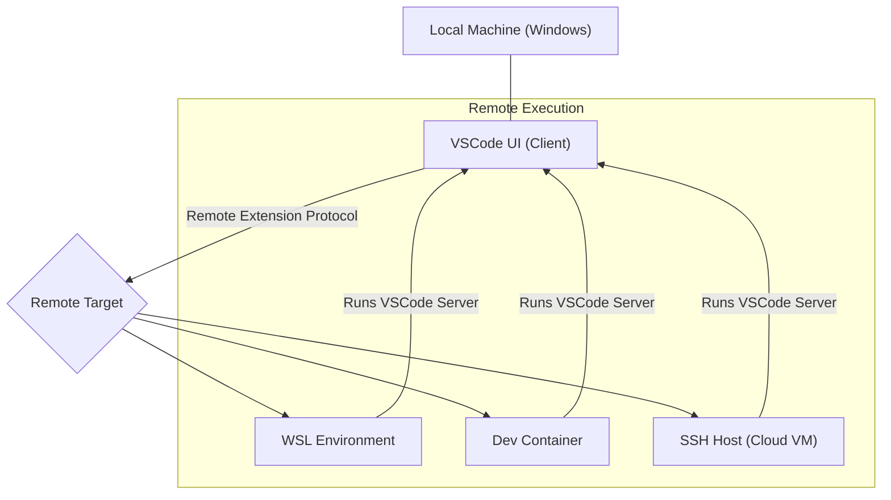
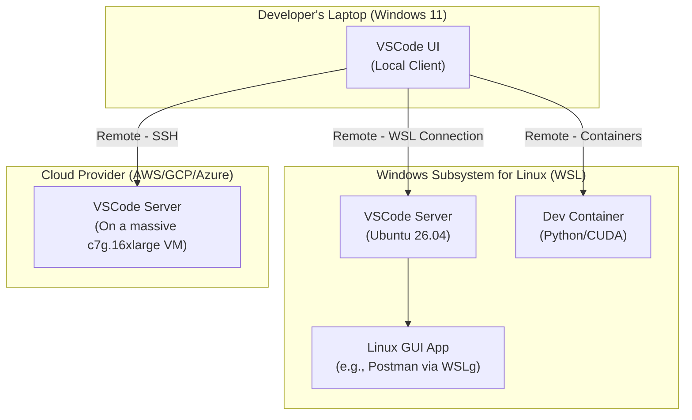

# VSCode Remote Development & WSL: The Ultimate Dev Environment 2026

Welcome to May 2026. For years, developers sought the holy grail: the power and tooling of a native Linux environment combined with the polish and hardware support of a mainstream desktop OS. That search is over. The combination of Visual Studio Code's Remote Development extensions and the Windows Subsystem for Linux (WSL) has matured into an undisputed, best-in-class development environment that offers unparalleled flexibility, performance, and power.

The old debates of "Mac vs. Windows vs. Linux" for development have faded. Today, the conversation is about how you configure your remote targets. This article explores why this combination has become the professional standard and how you can leverage it to build your dream workflow.

### What You'll Get

*   **The Core Concept:** An understanding of VSCode's client-server architecture.
*   **WSL in 2026:** A look at the performance and feature enhancements that make WSL a powerhouse.
*   **The Remote Triumvirate:** Practical uses for the WSL, Dev Containers, and SSH extensions.
*   **Advanced Workflows:** A peek into AI-assisted multi-target debugging and other modern techniques.
*   **Productivity Tips:** Actionable advice for optimizing your setup.

***

## The Core Philosophy: Local Feel, Remote Power

The magic behind VSCode Remote Development is its decoupled, client-server architecture. It's a simple yet profound concept:

*   **The Client:** Your local VSCode instance runs on Windows. This is the UI you interact with—the slick, responsive editor you know and love, complete with your themes, keybindings, and settings.
*   **The Server:** A lightweight, headless VSCode server runs on the remote environment (WSL, a container, or a physical server). This server handles the heavy lifting: language processing, debugging, terminal commands, and file system access.

This separation means your source code and dev tools *never need to be on your local machine*. You get a 100% local-fidelity experience while leveraging the compute resources and environment of a remote target.



***

## Why WSL is the Undisputed King in 2026

What started as a compatibility layer has evolved into a deeply integrated, high-performance virtualization platform. By 2026, WSL is no longer a compromise; it's a feature.

### Unprecedented Performance and Integration

The performance gap between WSL and bare-metal Linux is now negligible for nearly all development workloads. Key advancements include:

*   **Mature Filesystem Performance:** The Plan 9 protocol (`9p`) performance issues of the early 2020s are a distant memory. The `wsl --mount` feature with `ext4` provides near-native IOPS, making operations like `npm install` or Git checkouts incredibly fast.
*   **Dynamic Resource Allocation:** WSL now intelligently shares CPU and memory resources with the Windows host. It consumes minimal resources when idle but can scale instantly to use all available cores when compiling code or running intensive tasks.

> **Info Block:** Remember to keep your project files *inside* the WSL filesystem (`/home/user/projects`) rather than on the Windows mount (`/mnt/c`) to take full advantage of these performance gains.

### The Evolution of WSLg: Beyond Just GUI Apps

WSLg, the built-in system for running Linux GUI applications, is now seamless. It's no longer just for running a simple text editor; it's a core part of the developer workflow.

*   **Full GPU Acceleration:** With enhanced vGPU drivers and mature Wayland integration, running GPU-intensive applications like data science tools, IDEs (if you must!), or even Linux-based browser testing suites feels native.
*   **Polished Windowing & Audio:** HiDPI scaling, window snapping, and audio/microphone passthrough are now fully integrated, making applications like Audacity or GIMP perfectly usable for creative tasks within your Linux environment.

To launch a GUI app, it's as simple as installing it and running the command:
```bash
# Inside your WSL terminal
sudo apt update && sudo apt install gimp -y
gimp
```
And it just works. The app appears in your Windows taskbar like any other.

### Systemd and Full Linux Compatibility

With `systemd` enabled by default in most distributions for years now, WSL offers a complete Linux system experience. This was a game-changer, allowing you to:
*   Run services like `docker` or `postgresql` directly within your WSL instance.
*   Use tools like `snap` or `microk8s` that depend on `systemd` for service management.
*   Perfectly replicate production server environments for higher-fidelity testing.

***

## Mastering the VSCode Remote Triumvirate

Your workflow isn't limited to just one remote target. VSCode lets you seamlessly switch between—or even use multiple—environments simultaneously.

### 1. Developing in WSL

This is the default, go-to workflow for most developers on Windows.

*   **Use Case:** Your primary development environment. Perfect for web development, backend services, scripting, and general-purpose programming.
*   **How it Works:** Open a WSL terminal and type `code .` in your project directory. VSCode handles the rest, installing its server and connecting your UI.
*   **Benefit:** Zero configuration friction and maximum performance for day-to-day tasks.

### 2. Developing in Containers (Dev Containers)

For projects that require specific dependencies or guaranteed reproducibility, Dev Containers are the gold standard.

*   **Use Case:** Onboarding new team members, maintaining legacy projects with specific runtimes, or isolating complex dependency trees.
*   **How it Works:** You define your entire development environment—OS, tools, extensions, and settings—in a `devcontainer.json` file. VSCode builds and connects to a Docker container based on this spec.
*   **Benefit:** A one-click, perfectly reproducible environment for anyone who clones the repository.

Here's a simple `devcontainer.json` for a Node.js project:
```json
{
  "name": "Node.js & TypeScript",
  "image": "mcr.microsoft.com/devcontainers/typescript-node:18",

  "features": {
    "ghcr.io/devcontainers/features/github-cli:1": {}
  },

  "forwardPorts": [3000],

  "postCreateCommand": "npm install",

  "customizations": {
    "vscode": {
      "extensions": [
        "dbaeumer.vscode-eslint",
        "esbenp.prettier-vscode"
      ]
    }
  }
}
```

### 3. Developing over SSH

When you need serious horsepower or need to work on a specific remote machine, the SSH extension is your best friend.

*   **Use Case:** Connecting to a powerful cloud VM for ML model training, managing a production server, or collaborating on a shared development machine.
*   **How it Works:** VSCode uses your local SSH client and config to securely connect to a remote host and automatically deploys its server.
*   **Benefit:** You can edit files and use a full-featured terminal on a machine with 64 cores and 256GB of RAM, all from your lightweight laptop.

***

## A Glimpse at the Architecture

A modern developer might use all three remote targets in a single day, all managed through one VSCode window. This diagram illustrates that powerful, flexible reality.



## Advanced Workflows and Productivity Hacks for 2026

The tooling has advanced beyond simple editing and debugging. By 2026, truly powerful workflows are becoming commonplace.

### AI-Assisted, Multi-Target Debugging

Imagine a microservices application: a React frontend runs in WSL, a Python service runs in a Dev Container, and a Go service runs on a remote server via SSH. The latest VSCode debuggers, supercharged by AI assistants like GitHub Copilot, can trace a request across all three environments from a single debugging session. The AI can analyze logs from all sources simultaneously, pinpointing cross-service failures that were once a nightmare to diagnose.

### Optimizing Your `settings.json`

Fine-tune your VSCode experience with these settings, which are essential in a remote-first world.

| Setting                                     | Description                                                                    |
| ------------------------------------------- | ------------------------------------------------------------------------------ |
| `"remote.SSH.remotePlatform"`               | Pre-defines the OS of SSH hosts to speed up connections.                         |
| `"dev.containers.defaultExtensions"`        | A list of extensions you want installed in *every* Dev Container you open.     |
| `"remote.autoForwardPorts"`                 | Automatically forwards ports detected from remote processes (e.g., a web server). |
| `"workbench.ai.proactiveDebugging"` (future) | An imaginative setting where AI suggests breakpoints based on code changes.     |

### A Final Thought

The VSCode and WSL combination is more than just a set of tools; it's a paradigm shift. It provides a robust, Linux-native development experience without asking developers to sacrifice the hardware, applications, and polish of their preferred desktop OS. It's the ultimate expression of "have your cake and eat it too."

How have you configured your dream dev environment in 2026? Share your setups and tips in the comments below


## Further Reading

- [https://code.visualstudio.com/docs/remote/remote-overview](https://code.visualstudio.com/docs/remote/remote-overview)
- [https://docs.microsoft.com/en-us/windows/wsl/](https://docs.microsoft.com/en-us/windows/wsl/)
- [https://devblogs.microsoft.com/commandline/wsl-updates-2026/](https://devblogs.microsoft.com/commandline/wsl-updates-2026/)
- [https://www.redhat.com/en/blog/vscode-remote-development-wsl-tips](https://www.redhat.com/en/blog/vscode-remote-development-wsl-tips)
- [https://techcommunity.microsoft.com/t5/windows-dev-appconsult/vscode-wsl-advanced-workflows](https://techcommunity.microsoft.com/t5/windows-dev-appconsult/vscode-wsl-advanced-workflows)
