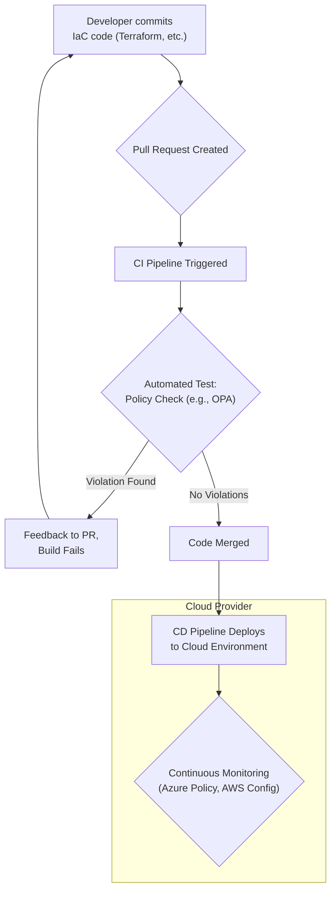

# Cloud Governance with Policy as Code: Ensuring Compliance at Scale

As cloud environments grow in complexity and scale, traditional, manual governance methods are failing. Click-ops and ticket-based approvals simply can't keep pace with the speed of modern development, leading to security gaps, cost overruns, and compliance nightmares. The solution is to treat your governance rules just like you treat your application: as code. This is the core principle of Policy as Code (PaC).

By defining security, compliance, and operational policies in a declarative, version-controlled format, you can automate enforcement across your entire cloud footprint. This article explores how PaC is becoming the cornerstone of effective cloud governance and how you can leverage it today.

### What You'll Get

*   **A Clear Definition:** Understand what Policy as Code (PaC) is and its core principles.
*   **Key Tooling:** An overview of popular PaC tools like Open Policy Agent (OPA), Azure Policy, and AWS Config Rules.
*   **Practical Examples:** Concrete policy examples for security, cost management, and compliance.
*   **Implementation Strategy:** A high-level workflow for integrating PaC into your development lifecycle.
*   **Future Outlook:** A look at where PaC is headed by 2026 in a multi-cloud world.

---

## The Problem: Manual Governance Doesn't Scale

In dynamic cloud environments, infrastructure is provisioned and de-provisioned in minutes. Manual review processes create bottlenecks and are prone to human error.

*   **Inconsistency:** Different teams or individuals apply rules differently, leading to an inconsistent security posture.
*   **Lack of Visibility:** It's difficult to get a real-time, comprehensive view of your compliance status across thousands of resources.
*   **Slows Down Innovation:** Developers wait days for manual approvals, stifling agility and the competitive advantage the cloud is supposed to provide.
*   **Reactive, Not Proactive:** Issues are often found *after* a non-compliant resource has been deployed, making remediation costly and disruptive.

> "Organizations that are not actively maturing their cloud governance by 2026 will face significant compliance challenges and budget overruns. The 'move fast and break things' mantra is unsustainable without automated guardrails." - Industry Analyst Projection

## What is Policy as Code (PaC)?

Policy as Code is the practice of managing and automating policies by defining them in a high-level, declarative language. These policy files are treated like any other piece of code: they are stored in version control (like Git), tested in a pipeline, and deployed automatically.

The core principles are:

*   **Declarative:** You define the *desired state* ("all S3 buckets must be private"), not the procedural steps to get there. The policy engine handles the evaluation logic.
*   **Version-Controlled:** Policies live alongside your application and infrastructure code, providing a clear audit trail and enabling collaboration through pull requests.
*   **Automated:** Policy evaluation is integrated directly into CI/CD pipelines and cloud control planes, providing real-time feedback and enforcement.

## A Tour of Leading PaC Frameworks

While the principles are universal, several tools have emerged to help implement PaC. The choice often depends on whether you need a cloud-agnostic solution or prefer to use native tooling.

### Open Policy Agent (OPA): The Cloud-Native Standard

[Open Policy Agent (OPA)](https://www.openpolicyagent.org/) is an open-source, general-purpose policy engine that has become the de facto standard in the cloud-native ecosystem. It decouples policy decision-making from policy enforcement.

*   **How it works:** Your application queries OPA with a JSON input. OPA evaluates the query against policies written in a language called **Rego** and returns a decision (e.g., allow/deny).
*   **Key Advantage:** It's universal. You can use OPA to enforce policies in Kubernetes, Terraform, CI/CD pipelines, and even microservice APIs.

Here’s a simple Rego policy that denies any Kubernetes ingress that isn't using HTTPS:

```rego
package kubernetes.ingress

deny[msg] {
  input.request.kind.kind == "Ingress"
  rule := input.request.object.spec.rules[_]
  not rule.http
  msg := "Ingress must use HTTPS. No 'http' block is allowed."
}
```

### Cloud-Native Solutions: Azure Policy and AWS Config

Major cloud providers offer powerful built-in PaC services that are tightly integrated into their platforms.

| Feature | AWS Config Rules | Azure Policy |
| :--- | :--- | :--- |
| **Primary Use** | Audit and evaluate configurations of existing AWS resources. | Enforce policies and ensure compliance for Azure resources at scale. |
| **Enforcement** | Primarily detective; identifies non-compliant resources. Can trigger remediation. | Both preventative (deny non-compliant deployments) and detective. |
| **Policy Language**| YAML/JSON templates, AWS Lambda for custom logic. | JSON-based policy definitions. |
| **Scope** | AWS resources. | Azure resources, Azure Arc for on-prem/multi-cloud. |

An **Azure Policy** definition to allow only specific VM sizes might look like this:

```json
{
  "if": {
    "allOf": [
      {
        "field": "type",
        "equals": "Microsoft.Compute/virtualMachines"
      },
      {
        "not": {
          "field": "Microsoft.Compute/virtualMachines/sku.name",
          "in": "[parameters('listOfAllowedSKUs')]"
        }
      }
    ]
  },
  "then": {
    "effect": "deny"
  }
}
```

## Practical PaC Examples in Action

The true power of PaC is realized when you apply it to solve real-world governance challenges.

### ### Enforcing Security Standards

**Goal:** Prevent accidental data exposure by disallowing public S3 buckets or Azure Blob containers.
**Benefit:** Drastically reduces the risk of a common and costly data breach vector. A policy can automatically block any `terraform apply` or ARM template deployment that attempts to create a publicly accessible storage resource.

### ### Managing Costs

**Goal:** Control spending by restricting the deployment of overly expensive VM instance types (e.g., large GPU or memory-optimized machines) to specific resource groups or subscriptions.
**Benefit:** Prevents "bill shock" and ensures engineering teams are using resources efficiently. This can be enforced with a `deny` effect or an `audit` effect to simply flag oversized instances for review.

### ### Ensuring Tagging Compliance

**Goal:** Require all provisioned resources to have specific tags, such as `owner`, `cost-center`, or `environment`.
**Benefit:** Enables accurate cost allocation, simplifies resource management, and improves automation. A policy can fail a deployment if mandatory tags are missing, ensuring clean data from day one.

## Integrating PaC into Your CI/CD Pipeline

The most effective way to implement PaC is to "shift left"—catching and fixing policy violations early in the development lifecycle before they ever reach production.

This workflow provides developers with immediate feedback, turning governance from a barrier into a helpful guardrail.



## Looking Ahead: PaC by 2026

Policy as Code is not a static concept. By 2026, we can expect its role in cloud governance to be even more critical, driven by several key trends:

1.  **Unified Multi-Cloud Governance:** As organizations increasingly adopt multi-cloud strategies, tools like OPA will become essential for defining a single set of policies that can be enforced consistently across AWS, Azure, GCP, and Kubernetes.
2.  **GitOps Integration:** PaC is a natural fit for GitOps. The Git repository will be the single source of truth for not just the application and infrastructure state, but also the governance rules that control them.
3.  **AI-Assisted Policy:** Expect to see AI and machine learning models that can analyze cloud usage patterns and suggest new policies to optimize cost or enhance security. They might even help generate complex policy code from natural language prompts.

## Final Thoughts

Policy as Code transforms governance from a manual, reactive chore into an automated, proactive, and collaborative process. By embedding policy checks directly into developer workflows and cloud control planes, you can achieve security and compliance at scale without sacrificing speed.

It’s time to stop chasing compliance issues and start preventing them.

How is your organization approaching policy enforcement in the cloud? Share your strategies and challenges in the discussion below


## Further Reading

- [https://www.openpolicyagent.org/docs/](https://www.openpolicyagent.org/docs/)
- [https://docs.microsoft.com/en-us/azure/governance/policy/overview](https://docs.microsoft.com/en-us/azure/governance/policy/overview)
- [https://aws.amazon.com/config/details/](https://aws.amazon.com/config/details/)
- [https://www.cncf.io/blog/policy-as-code-best-practices-2026](https://www.cncf.io/blog/policy-as-code-best-practices-2026)
- [https://www.gartner.com/en/articles/cloud-governance-trends-2026](https://www.gartner.com/en/articles/cloud-governance-trends-2026)
