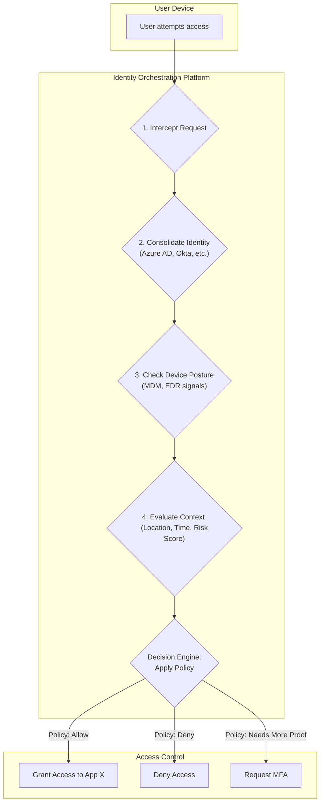
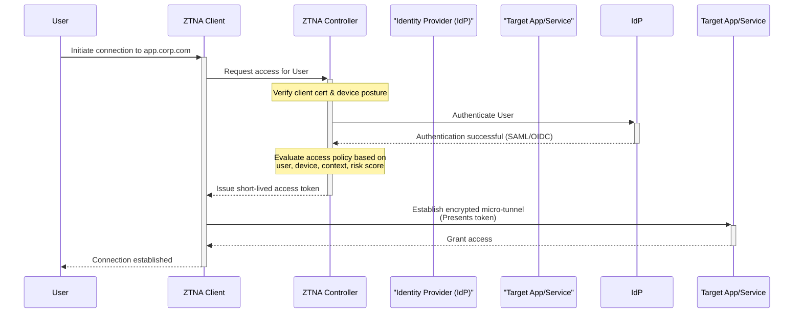

# Zero Trust Security: Next-Gen Tooling for the Distributed Enterprise

The corporate perimeter is an artifact of a bygone era. In today's distributed enterprise—spanning multiple clouds, countless SaaS applications, and a global remote workforce—the idea of a secure internal network is obsolete. This reality has propelled Zero Trust from a theoretical framework to a foundational security strategy. As of May 2026, we are well into the second wave of adoption, driven by a new generation of tooling designed for the complexities of modern IT.

This article dives into the evolution of the "never trust, always verify" model, exploring the advanced tooling that makes a true Zero Trust architecture not just possible, but practical. We'll move beyond the buzzwords to examine the platforms and technologies enabling granular, context-aware security for the modern enterprise.

### What You'll Get

*   **Core Concepts:** A refresher on the paradigm shift from perimeter-based security to Zero Trust micro-perimeters.
*   **Modern Pillars:** An overview of the key principles driving Zero Trust in 2026: granular access, continuous verification, and behavioral analytics.
*   **Tooling Deep Dive:** A breakdown of next-gen tools, including ZTNA 2.0, identity orchestration, and AI-driven security platforms.
*   **Practical Insights:** A workflow diagram and a policy-as-code example to illustrate how these components work together.
*   **Future Outlook:** A look at the implementation challenges and strategic benefits of a mature Zero Trust posture.

---

## The Paradigm Shift: From Moats to Micro-Perimeters

For decades, security was modeled after a medieval castle: a strong perimeter (the moat and walls) with implicit trust for everything inside. This "castle-and-moat" approach is fundamentally broken. Once an attacker breaches the firewall or compromises a user's credentials, they often have broad access to move laterally across the internal network.

Zero Trust inverts this model. It assumes no user or device is inherently trustworthy, whether inside or outside the old network perimeter.

> **Zero Trust Principle:** Never trust, always verify. Every access request must be fully authenticated, authorized, and encrypted before being granted. This verification is not a one-time event but a continuous process.

This creates a "micro-perimeter" of one around every user, device, and application workload. Access is granted on a least-privilege, session-by-session basis, dramatically reducing the attack surface.

## Core Pillars of Modern Zero Trust (circa 2026)

A mature Zero Trust strategy is built on three interconnected pillars, enabled by sophisticated tooling.

### Granular Access & Micro-segmentation

The goal is to stop lateral movement. Instead of granting access to entire network segments, modern Zero Trust enforces access to specific applications or even individual API endpoints.

*   **From Networks to Apps:** Access policies are tied to application identity, not IP addresses. A user is granted access to `billing.api`, not the entire `10.0.2.0/24` subnet where it resides.
*   **Identity-Aware Proxies:** Traffic is brokered through intelligent proxies that inspect and log all requests, ensuring only authorized users can connect to authorized resources.
*   **Machine-to-Machine Security:** This granularity extends to workloads and APIs. Service-to-service communication is secured using mutual TLS (mTLS) and short-lived certificates, managed by service mesh or workload identity platforms.

### Continuous Verification & Identity Orchestration

Authentication is no longer a single checkpoint at the start of a session. It's a continuous, dynamic evaluation of trust.

*   **Dynamic Trust Signals:** Access decisions are based on a rich set of real-time signals, including:
    *   **User Identity:** Verified via a strong Identity Provider (IdP).
    *   **Device Posture:** Health checks from EDR and MDM tools (e.g., OS version, disk encryption, running processes).
    *   **Context:** Geolocation, time of day, and network heuristics.
*   **Identity Orchestration:** Modern platforms act as a central control plane, integrating signals from disparate systems (Azure AD, Okta, CrowdStrike, Jamf) to make a unified access decision. This abstracts away the complexity of a multi-vendor environment.

### Advanced Threat Intelligence & Behavioral Analytics

You can't verify what you can't see. AI and machine learning are now crucial for establishing behavioral baselines and detecting anomalies that static rules would miss.

*   **User and Entity Behavior Analytics (UEBA):** AI models learn the normal patterns of every user and service account. An accountant suddenly trying to access source code repositories at 3 AM from an unusual location is an immediate red flag.
*   **Automated Risk Scoring:** These signals feed into a dynamic risk score for each access request. A high-risk score can trigger automated responses, such as requiring step-up authentication (MFA), limiting access to non-sensitive data, or terminating the session entirely.

## Next-Generation Zero Trust Tooling

The market has matured beyond simple VPN replacements. Today's tools form an integrated security fabric that enforces Zero Trust principles consistently across the enterprise.

### Zero Trust Network Access (ZTNA) 2.0

ZTNA has evolved significantly. The initial wave (ZTNA 1.0) focused on providing application-specific access for remote users. ZTNA 2.0 delivers true Zero Trust for all users and applications, regardless of location.

| Feature | ZTNA 1.0 (Legacy VPN Replacement) | ZTNA 2.0 (True Zero Trust) |
| :--- | :--- | :--- |
| **Access Principle** | "Allow and ignore" | "Deny by default" |
| **Scope** | Remote users accessing private apps | All users, apps, and services (on-prem & cloud) |
| **Inspection** | Limited to initial connection | Continuous L4-L7 traffic inspection |
| **Policy Granularity** | Based on user/group identity | Context-aware: user, device, app, content, risk |
| **Security Focus**| Primarily connectivity | Connectivity + Threat & Data Protection |

ZTNA 2.0 platforms are core to Secure Service Edge (SSE) frameworks, integrating ZTNA with Cloud Access Security Brokers (CASB) and Secure Web Gateways (SWG) for consistent policy enforcement.

### Identity & Access Orchestration Platforms

These platforms serve as the brain of a Zero Trust architecture. They connect identity providers, security tools, and enforcement points to create and apply dynamic, fine-grained access policies.

Here is a simplified flow of how an orchestration engine processes an access request:



This dynamic decision-making is often expressed as "policy-as-code," allowing for version-controlled, auditable security rules.

```yaml
# Example Dynamic Access Policy (in pseudo-YAML)
- policy: allow_finance_app_access
  identity:
    groups: [finance, auditors]
    risk_score: < 20
  device:
    posture: [compliant, healthy]
    os: [Windows 11, macOS 15]
    edr_status: active
  context:
    location: trusted_geo # e.g., US, UK
    time_of_day: business_hours
  action: allow
  session:
    reauth_frequency: 4_hours
```

### Behavioral Analytics & Deception Tech

This category focuses on the "verify" aspect.
*   **AI-Powered Monitoring:** These tools continuously analyze telemetry from endpoints, networks, and cloud services to detect suspicious activity. They are critical for identifying compromised accounts or insider threats.
*   **Deception Technology:** As a proactive measure, deception tools create decoys (fake file shares, databases, or credentials) scattered across the environment. Any interaction with these decoys is a high-fidelity alert of an attacker's presence, providing valuable time for security teams to respond.

## Putting It All Together: A Practical Workflow

This diagram illustrates how these components interact during a typical user access request in a modern Zero Trust environment.



## The Road Ahead

Adopting Zero Trust is a journey, not a destination. The primary challenges are no longer technological but strategic and cultural. Organizations must grapple with integrating new tools with legacy systems and shifting the security mindset from one of implicit trust to explicit verification.

However, the benefits are clear: a drastically reduced attack surface, improved compliance and visibility, secure remote access, and a more resilient security posture fit for the distributed, multi-cloud world.

Zero Trust is the new standard for enterprise security. The tooling has matured, and the frameworks, such as the one outlined by [NIST in SP 800-207](https://www.nist.gov/publications/zero-trust-architecture), provide a clear path forward.

What are the biggest hurdles you're facing in your Zero Trust implementation? Share your experiences in the comments below.


## Further Reading

- [https://www.nist.gov/publications/zero-trust-architecture](https://www.nist.gov/publications/zero-trust-architecture)
- [https://www.paloaltonetworks.com/cyber-security-insights/what-is-zero-trust](https://www.paloaltonetworks.com/cyber-security-insights/what-is-zero-trust)
- [https://www.cloudflare.com/learning/security/what-is-zero-trust/](https://www.cloudflare.com/learning/security/what-is-zero-trust/)
- [https://www.gartner.com/en/market-guide/zero-trust-network-access-2026](https://www.gartner.com/en/market-guide/zero-trust-network-access-2026)
- [https://techcrunch.com/2026/zero-trust-security-trends](https://techcrunch.com/2026/zero-trust-security-trends)
