# Platform Engineering & IDPs: Accelerating Developer Experience in 2026

The year is 2026. The cloud-native landscape is a sprawling metropolis of microservices, serverless functions, and complex infrastructure. For developers, navigating this ecosystem can feel like a quest through a labyrinth without a map. The cognitive load is immense, and time spent on boilerplate configuration, security scans, and infrastructure wrangling is time not spent on building features.

Enter Platform Engineering. This discipline isn't just a new name for DevOps; it's a fundamental shift towards treating your internal platform as a product, with developers as your customers. The flagship product of any modern platform team is the Internal Developer Platform (IDP). This article explores the symbiotic relationship between platform engineering and IDPs, and how together they are set to redefine developer experience.

### What You'll Get

*   **A Clear Definition:** Understand what an IDP is and why it's more than just a toolchain.
*   **Core Concepts:** Learn about "golden paths," self-service, and unified control planes.
*   **Practical Examples:** See how IDPs streamline common developer workflows.
*   **Architectural Insight:** A high-level diagram illustrating the IDP flow.
*   **Future Outlook:** A look at the key components and principles driving IDP adoption towards 2026.

---

## The Core Challenge: Escalating Cognitive Load

In the modern software development lifecycle, a developer's responsibilities have expanded dramatically. They are often expected to understand:

*   **Infrastructure as Code:** Terraform, Pulumi, or CloudFormation.
*   **Containerization:** Docker, Kubernetes manifests, Helm charts.
*   **CI/CD:** Jenkinsfiles, GitHub Actions, GitLab CI syntax.
*   **Observability:** Prometheus queries, Grafana dashboards, Jaeger traces.
*   **Security:** Container scanning, dependency checks, IAM policies.

This explosion of required knowledge is a direct tax on productivity and innovation. The goal of platform engineering is to abstract this complexity away, allowing developers to focus on what they do best: writing application code.

> **Platform as a Product:** The most successful platform teams operate with a product mindset. They conduct user research (with their developers), build roadmaps, and measure success based on adoption and developer satisfaction. The IDP is the manifestation of this product.

## The IDP: The Platform Team's Central Product

An Internal Developer Platform (IDP) is a set of tools, services, and automated workflows curated by a platform team, presented to developers through a unified, self-service interface. It's the "paved road" or "golden path" that makes it easy for developers to do the right thing, from code inception to production deployment.

An IDP is not a single off-the-shelf product but rather a composed system, often built around a service catalog like [Backstage](https://backstage.io/). It integrates your organization's existing tools into a cohesive whole.

### Core Pillars of a Modern IDP

*   **Self-Service Capabilities:** Developers can provision infrastructure, create new services, or set up a CI/CD pipeline without filing a ticket and waiting for another team.
*   **Golden Paths:** Pre-configured, best-practice templates and workflows for common tasks. This ensures consistency, security, and compliance by default.
*   **Feedback Loops:** The platform provides clear, immediate feedback on build status, deployment health, and performance, all in one place.

## How IDPs Accelerate Developer Experience

By abstracting away the underlying complexity, IDPs directly reduce cognitive load and accelerate delivery. Let's look at how this works in practice.

### Golden Paths: From `git push` to Production

Imagine a developer wants to create a new microservice. The "golden path" provided by an IDP transforms this multi-day, multi-tool process into a few clicks.

Here is a simplified flow diagram comparing the traditional approach with an IDP-powered golden path.

```mermaid
graph TD
    subgraph "Traditional Workflow (High Cognitive Load)"
        A["1. Create Jira Ticket<br/>for new repo"] --> B["2. Wait for Ops<br/>to create repo"];
        B --> C["3. Manually configure<br/>CI/CD pipeline"];
        C --> D["4. Request test database<br/>via another ticket"];
        D --> E["5. Write Terraform for<br/>cloud resources"];
        E --> F["6. Submit PR, wait for<br/>infra team review"];
        F --> G["7. Finally, deploy service"];
    end

    subgraph "IDP Golden Path (Low Cognitive Load)"
        H["1. Developer selects<br/>'Create New Service' in IDP"] --> I["2. Fills out a simple form<br/>(service name, owner)"];
        I --> J["3. IDP automatically:<br/>- Scaffolds repo from template<br/>- Creates CI/CD pipeline<br/>- Provisions dev database<br/>- Sets up monitoring dashboard"];
        J --> K["4. Developer can `git push`<br/>and deploy immediately"];
    end
```



This streamlined process not only saves days of effort but also embeds security, compliance, and architectural best practices from the very beginning.

### Automated Provisioning and Self-Service

The power of an IDP comes from giving developers autonomy within safe, pre-defined boundaries. Instead of learning the intricacies of a cloud provider's IAM policies, they can use the IDP to request what they need.

| Task | Before IDP | With IDP (Self-Service) |
| :--- | :--- | :--- |
| **Provisioning a Database** | File ticket, wait 1-3 days for DBA team. | Select "PostgreSQL (Small)" from a dropdown, get credentials in minutes. |
| **Setting up CI/CD** | Copy/paste a YAML file from another project, hope it works. | The pipeline is auto-generated from a secure, maintained template. |
| **Accessing Logs** | Log into 3 different tools for app logs, ingress logs, and traces. | View all relevant logs for your service in a single, unified dashboard. |

### Unified Dashboards and Ownership

A key feature of many IDPs is the **software catalog**. It provides a single pane of glass to view all services, their owners, documentation, build status, and dependencies. This solves the "who owns this?" problem that plagues many large organizations.

Tools like Backstage use a simple manifest file in each repository to populate the catalog.

```yaml
# catalog-info.yaml
apiVersion: backstage.io/v1alpha1
kind: Component
metadata:
  name: user-profile-service
  description: Handles user profile data and authentication.
  annotations:
    github.com/project-slug: my-org/user-profile-service
spec:
  type: service
  lifecycle: production
  owner: team-alpha
  system: customer-identity
  providesApis:
    - user-profile-api
```

This simple file makes the service discoverable and links it directly to the team that owns it, dramatically improving accountability and collaboration.

## Building Your IDP: Key Components in 2026

Building an IDP is a journey, not a destination. By 2026, successful platforms will be built on composable, API-driven components.

*   **Developer Portal / Service Catalog:** The user interface of your platform. **Examples:** [Spotify's Backstage](https://backstage.io/), [Cortex](https://www.cortex.io/), or homegrown solutions.
*   **Standardized CI/CD Templates:** Reusable pipeline definitions for different application types (e.g., Go service, Python Lambda, React frontend).
*   **Infrastructure as Code (IaC) Modules:** Curated and versioned Terraform or Pulumi modules that developers can consume without needing to become experts.
*   **Configuration Management:** A standardized way to manage environment-specific configurations and secrets.
*   **Observability Stack:** A cohesive integration of logging, metrics, and tracing that is automatically configured for new services.

As stated by the team at [PlatformEngineering.org](https://platformengineering.org/blog/what-is-an-internal-developer-platform), an IDP enables self-service for developers while reducing the configuration-related setup and maintenance work for the entire engineering organization.

## Conclusion: The Future is Composable and Self-Service

The symbiotic relationship between a platform engineering team and a well-designed IDP is the engine of developer velocity. The platform team builds the paved road, and the IDP is the vehicle that lets developers travel on it at high speed, safely and efficiently.

By 2026, organizations that fail to invest in their developer experience will struggle to attract and retain top talent. Those that embrace the "platform as a product" mindset will empower their developers to build better software, faster. They will trade the friction of ticket-based operations for the flow of automated, self-service workflows.

What about you? If you are using or building an IDP, what are the most valuable features you've implemented? Share your thoughts


## Further Reading

- [https://platformengineering.org/blog/idp-guide](https://platformengineering.org/blog/idp-guide)
- [https://www.infoq.com/articles/internal-developer-platforms-2026/](https://www.infoq.com/articles/internal-developer-platforms-2026/)
- [https://www.oreilly.com/library/view/building-internal-developer-platforms/](https://www.oreilly.com/library/view/building-internal-developer-platforms/)
- [https://developer.netflix.com/blog/platform-engineering-culture](https://developer.netflix.com/blog/platform-engineering-culture)
- [https://techcrunch.com/2026/developer-experience-trends](https://techcrunch.com/2026/developer-experience-trends)
