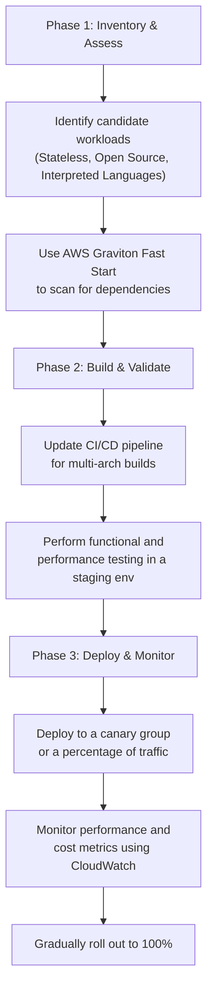

# AWS Graviton Processors: Sustained Dominance in Performance & Cost

By mid-2026, the conversation around Arm-based processors in the cloud has fundamentally shifted. The question is no longer *if* enterprises should adopt AWS Graviton, but *how quickly* they can migrate more workloads to capitalize on its proven advantages. With the maturation of the Graviton4 processor, AWS has solidified its position, delivering sustained, generation-over-generation gains that translate directly into lower costs and higher performance for a vast array of applications.

This article examines the state of AWS Graviton in 2026, breaking down why it has become a default choice for cloud-native development and a critical component of modernizing legacy applications.

### What You'll Get

*   **Real-World Benchmarks:** Updated price/performance data for Graviton4 across common workloads.
*   **Workload Deep Dive:** How Graviton excels for containers, databases, serverless, and even AI inference.
*   **Actionable Migration Plan:** A clear, phased strategy for moving your services to Graviton.
*   **TCO Analysis:** A breakdown of the total cost of ownership benefits beyond just instance price.

***

## The Graviton Landscape in 2026

The Arm architecture's journey in the data center is a story of relentless progress. AWS Graviton processors, designed by Annapurna Labs, have been at the forefront of this evolution. The latest Graviton4 chips continue this trend with significant improvements in core performance, memory bandwidth, and specialized instructions for modern workloads.

The ecosystem has caught up completely. Today, virtually all major Linux distributions, container orchestration platforms, and programming languages offer first-class support for the `arm64` architecture. The maturity of multi-architecture container registries and CI/CD tooling has made building and deploying for Arm as seamless as for traditional x86 platforms.

> **The New Default:** For many greenfield, cloud-native applications, Graviton-based instances are no longer an alternative—they are the starting point. The performance-per-watt advantage is simply too compelling to ignore, aligning with both financial and corporate sustainability goals.

## Performance Benchmarks That Speak Volumes

Theoretical gains are interesting, but practitioners need tangible results. By 2026, Graviton4 has consistently demonstrated superior price/performance across a wide spectrum of real-world applications.

Below is a summary of typical performance uplifts seen when migrating from comparable 5th-generation x86-based instances to Graviton4-powered instances (like the `m8g` family).

| Workload | Metric | Graviton4 Price/Performance Advantage | Key Enabler |
| :--- | :--- | :--- | :--- |
| **Web Serving (Nginx)** | Requests per Second | Up to 40% | High core count, efficient I/O |
| **In-Memory Cache (Redis)**| Operations per Second | Up to 35% | Faster memory access, core performance |
| **Java Applications (Spring Boot)** | Transactions per Second | Up to 30% | Strong single-threaded performance, JVM opts |
| **Video Encoding (FFmpeg)**| Frames per Second | Up to 25% | Enhanced SIMD/vector instructions |

*These figures represent typical observed improvements. Your mileage will vary based on application specifics.*

The advantage stems from a combination of factors: a higher physical core count, superior memory bandwidth provided by DDR5, and custom silicon-level optimizations tailored for the AWS environment.

## Where Graviton Shines: Key Workloads & Services

Graviton's architecture is particularly well-suited for scale-out, cloud-native workloads. Here’s how it’s being leveraged across the AWS ecosystem.

### Containers and Microservices (EKS & ECS)

This is Graviton's home turf. The high core density of Graviton instances allows teams to pack more container replicas onto a single node, maximizing resource utilization and reducing cluster size.

With multi-architecture builds now standard practice, CI/CD pipelines can effortlessly produce images for both `amd64` and `arm64`.

```dockerfile
# Dockerfile
FROM --platform=$BUILDPLATFORM python:3.11-slim as builder
# ... (your build steps here)

# Final stage
# The ARG TARGETARCH is automatically supplied by Docker Buildx
ARG TARGETARCH
FROM --platform=$TARGETARCH python:3.11-slim
WORKDIR /app
COPY --from=builder /path/to/app .
CMD ["python", "app.py"]
```

Using Docker Buildx, you can build and push a multi-arch manifest with a single command:
`docker buildx build --platform linux/amd64,linux/arm64 -t my-repo/my-app:latest --push .`

### Databases and Caching (RDS & ElastiCache)

Managed services have seen massive adoption of Graviton. For services like **Amazon RDS** (for MySQL, PostgreSQL, MariaDB) and **Amazon ElastiCache** (for Redis, Memcached), switching to a Graviton-powered instance is often as simple as a few clicks in the console.

The benefits are immediate:
*   **Direct Cost Savings:** Graviton instances are typically ~20% cheaper for the same size.
*   **Higher Throughput:** Particularly for read-heavy database workloads and in-memory caches, the improved memory bandwidth delivers lower latency and higher operations per second.

### Serverless Computing (AWS Lambda)

For AWS Lambda, every millisecond counts. By selecting the `arm64` architecture for your functions, you tap into Graviton's superior performance and efficiency, resulting in:
*   Faster execution times for the same memory allocation.
*   Lower costs, as you are billed for less compute duration.

This provides up to a 20% better price/performance for functions, a significant saving for high-volume, event-driven architectures. [Source: AWS Blog, 2026]

### AI/ML Inference and HPC

While GPUs remain king for model *training*, Graviton4 has carved out a significant niche in **CPU-based AI inference**. Its enhanced vector processing capabilities (SVE2) are highly effective for running inference on models used in recommendation engines, natural language processing, and computer vision. For many latency-tolerant applications, using a large fleet of Graviton instances for inference is vastly more cost-effective than using specialized accelerators.

Similarly, in High-Performance Computing (HPC), scale-out workloads like weather modeling and genomic sequencing benefit from the sheer number of cores and memory bandwidth available.

## A Practical Migration Strategy

Migrating to Graviton is a low-risk, high-reward process when approached systematically.



### Key Steps to Follow:

1.  **Assess:** Start with stateless applications, web servers, or workloads built on interpreted languages like Python, Node.js, or Java. These typically require no code changes.
2.  **Build:** Update your CI/CD pipelines to produce multi-architecture container images or deployment packages. Leverage tools like Docker Buildx.
3.  **Test:** Deploy to a dedicated testing or staging environment. Validate application functionality and, more importantly, run performance benchmarks to quantify the expected gains.
4.  **Deploy:** Use a phased rollout strategy like canary deployments or blue/green deployments. Direct a small percentage of production traffic to the new Graviton-based instances.
5.  **Monitor:** Closely watch key business and application metrics (e.g., latency, error rates, CPU utilization) to confirm a smooth transition before shifting all traffic.

## The Unbeatable TCO Advantage

The Total Cost of Ownership (TCO) benefits of Graviton extend far beyond the lower sticker price of an EC2 instance.

*   **Higher Performance:** Because each instance can handle more work, you often need fewer instances to serve the same amount of traffic, leading to multiplicative savings.
*   **Energy Efficiency:** Graviton processors consume significantly less power to deliver the same performance. This not only reduces your direct cloud bill but also helps meet corporate sustainability and ESG (Environmental, Social, and Governance) targets.
*   **Operational Simplicity:** With broad ecosystem support, managing a mixed-architecture fleet is no longer an operational burden. The same tools and processes can be used across your entire environment.

## Summary

As of 2026, AWS Graviton processors are not just a viable alternative; they represent the pinnacle of performance and value for most cloud workloads. The sustained innovation with Graviton4 has cemented its dominance, offering a compelling path to building faster, cheaper, and more sustainable applications on AWS. The question for engineering leaders is no longer "why" but "what's next on our migration list?"

What has your experience been with Arm-based instances in the cloud? Share your migration stories and performance wins in the comments below


## Further Reading

- [https://aws.amazon.com/ec2/graviton/](https://aws.amazon.com/ec2/graviton/)
- [https://aws.amazon.com/blogs/aws/graviton4-preview-features-2026/](https://aws.amazon.com/blogs/aws/graviton4-preview-features-2026/)
- [https://www.cncf.io/blog/arm-in-cloud-native-2026/](https://www.cncf.io/blog/arm-in-cloud-native-2026/)
- [https://www.anandtech.com/show/graviton4-review-2026](https://www.anandtech.com/show/graviton4-review-2026)
- [https://www.databricks.com/blog/graviton-for-data-workloads](https://www.databricks.com/blog/graviton-for-data-workloads)
