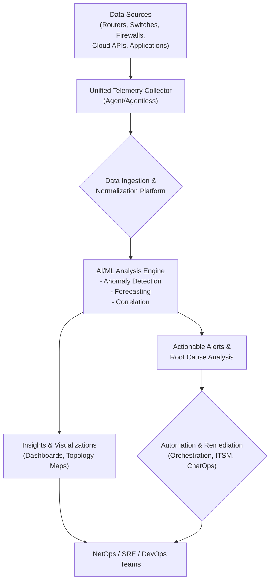

# AI-Powered Network Observability: Predicting and Preventing Outages

In the landscape of 2026, the sheer complexity and dynamism of our digital infrastructures have rendered traditional network monitoring obsolete. The era of static thresholds, manual log sifting, and reactive firefighting is over. Today, the leading organizations are not just observing their networks; they are anticipating their needs and preventing failures before they impact users. This shift is powered by one transformative force: Artificial Intelligence.

This article explores the current state of AI-powered network observability, moving beyond the hype to provide a practitioner's view of how machine learning is fundamentally changing how we manage network health, performance, and reliability.

### What You'll Get

*   **The Shift:** A clear breakdown of why traditional monitoring fails in modern cloud-native environments.
*   **The Core Engine:** An explanation of the key AI/ML techniques analyzing logs, metrics, and traces.
*   **The Architecture:** A high-level diagram of a modern AI-driven observability pipeline.
*   **The Payoff:** Concrete examples of predictive outage prevention and intelligent root cause analysis.
*   **The Roadmap:** A look at integration challenges and the tangible steps toward a proactive operational model.

---

## The Obsolescence of Reactive Monitoring

For decades, network operations centered on a simple, reactive loop: a metric (like CPU utilization or latency) crosses a predefined static threshold, an alert fires, and an engineer investigates. This model is no longer tenable.

The reasons for its failure are clear:
*   **Data Overload:** The volume, velocity, and variety of telemetry data from microservices, containers, and multi-cloud environments are impossible for humans to parse manually.
*   **Dynamic Environments:** Ephemeral infrastructure means "normal" is a constantly shifting baseline. A static alert threshold is either too noisy or misses subtle, emerging problems.
*   **Interconnected Complexity:** A single user-facing issue can stem from a cascading failure across dozens of services. Manually tracing this path during an outage is a high-pressure, time-consuming nightmare.

> By 2026, Gartner predicts that enterprises leveraging AIOps for network automation will experience 60% fewer network-induced outages. This underscores the move from a "fail-and-fix" to a "predict-and-prevent" paradigm.

## The Core of AI-Powered Observability

AI-powered observability isn't magic; it's the application of sophisticated machine learning models to the rich telemetry data your network already produces. It hinges on analyzing the three pillars of observability in concert.

### The Three Pillars of Data
1.  **Metrics:** Time-series numerical data (e.g., bandwidth, latency, error rates). AI uses this to establish dynamic baselines and forecast future states.
2.  **Logs:** Unstructured or semi-structured text-based records of events. AI models excel at clustering log messages to detect novel error patterns or security threats.
3.  **Traces:** A detailed view of a request's journey through multiple services. AI analyzes trace data to pinpoint performance bottlenecks and identify anomalous service dependencies.

### Key AI/ML Techniques in Action
*   **Anomaly Detection:** Unsupervised learning models (like Isolation Forests or autoencoders) learn what "normal" network behavior looks like across thousands of metrics simultaneously. They can then flag "unknown unknowns"—subtle deviations that precede a major failure but wouldn't trigger a static alert.
*   **Predictive Analytics:** Time-series forecasting algorithms (like ARIMA or LSTMs) analyze historical metric data to predict future trends. This can warn you that a database will run out of connections in three hours or that a link will be saturated by peak traffic tomorrow morning.
*   **Causal Inference & Correlation:** This is the most critical capability. Instead of just showing you 50 simultaneous alerts, AIOps platforms analyze the relationships between events. They determine the most likely root cause, separating symptom from source and drastically reducing Mean Time to Resolution (MTTR).

## A High-Level Architecture

The modern AI-driven observability pipeline transforms raw data into actionable intelligence. The flow is designed for speed, scale, and accuracy, moving from data collection to automated remediation.


This architecture centralizes data analysis, allowing the AI engine to have a complete view of the environment. This holistic perspective is what enables it to connect a sudden spike in application latency (Trace) to a new flood of error messages on a specific switch (Log) and a subtle change in its CPU pattern (Metric).

## From Insight to Action: Real-World Applications

Theory is good, but value is demonstrated through application. Here’s how these systems are preventing outages in 2026.

### Predictive Outage Prevention
Imagine a scenario: a fiber link is subtly degrading. The bit error rate is increasing by a fraction of a percent each hour—far too low to trigger a traditional alert. An AI model, however, recognizes this pattern as a precursor to a link failure.

Instead of a sudden, catastrophic outage, the system generates a predictive alert:
*   **What:** Link between `core-rtr-01:port-4` and `edge-rtr-03:port-2` has a 95% probability of failure within the next 6 hours.
*   **Why:** Sustained increase in CRC errors and packet discards, matching patterns of previously observed hardware failures.
*   **Action:** An automated workflow is triggered. It gracefully drains traffic from the link, shifts it to a redundant path, and opens a priority ticket with the field operations team to replace the optic. **No downtime occurs.**

### Intelligent Root Cause Analysis (RCA)
The "war room" is a thing of the past. When an unpredicted, complex issue arises, intelligent RCA provides immediate clarity. Instead of engineers from different teams chasing their own dashboards, the AIOps platform presents a single, correlated finding.

Here's a sample JSON output from such a system:
```json
{
  "incident_id": "INC-20260515-001",
  "title": "Checkout API Latency Exceeds SLA",
  "start_time": "2026-05-15T14:32:00Z",
  "business_impact": "High (Affects 75% of e-commerce transactions)",
  "root_cause": {
    "entity": "k8s-pod:cart-db-f8c9d7f4b-xyz12",
    "finding": "Log volume anomaly detected: 'Connection Pool Exhausted' errors increased by 5000%.",
    "confidence_score": 0.98,
    "correlated_events": [
      "Metric anomaly: Active database connections saturated on `pg-cart-primary`.",
      "Trace anomaly: p99 latency increase in DB query spans from `checkout-service`."
    ]
  },
  "recommended_action": "Scale up the database connection pool for the cart service."
}
```
This instantly directs the SRE team to the exact pod and the specific problem, turning a multi-hour investigation into a five-minute fix.

## The Integration Challenge and Path Forward

Implementing an AI-powered observability solution isn't just about deploying a new tool; it's about integrating it into your existing ecosystem and workflows. The goal is not to rip and replace but to augment.

The most effective platforms act as a "manager of managers," ingesting data from your current tools like Prometheus, Splunk, or cloud-native services (e.g., AWS CloudWatch). This allows you to gain advanced insights without disrupting established data collection methods.

Here's how the operational approach evolves:

| Capability | Traditional Approach | AI-Augmented Approach |
| :--- | :--- | :--- |
| **Alerting** | Static, manually-tuned thresholds. | Dynamic baselining and adaptive thresholds. |
| **Analysis** | Manual correlation across multiple tools. | Automated correlation and causal inference. |
| **Troubleshooting**| War rooms, tribal knowledge, guesswork. | Data-driven root cause analysis. |
| **Capacity Planning** | Reactive, based on past utilization. | Proactive, based on ML forecasting. |

## The Future is Proactive

As we stand in mid-2026, AI-powered observability is no longer an emerging technology but a competitive necessity. By leveraging machine learning to analyze the vast streams of network data, organizations are finally breaking free from the reactive cycle of network management. They are predicting failures, automating remediation, and ensuring the resilience required to power our digital world.

The journey requires a commitment to data quality, cross-team collaboration, and a willingness to trust automated insights. The results, however, are undeniable: more reliable services, more efficient teams, and a fundamental shift from fighting fires to preventing them entirely.

---

We want to hear from you. **How are you leveraging AI in your network operations today, and what are your plans for the next couple of years?** Share your experiences and challenges in the comments below.


## Further Reading

- [https://www.splunk.com/en_us/data-solutions/aiops/network-observability.html](https://www.splunk.com/en_us/data-solutions/aiops/network-observability.html)
- [https://www.dynatrace.com/news/industry-blog/ai-observability-2026/](https://www.dynatrace.com/news/industry-blog/ai-observability-2026/)
- [https://www.gartner.com/en/articles/aiops-platforms-for-network-2026](https://www.gartner.com/en/articles/aiops-platforms-for-network-2026)
- [https://www.cisco.com/c/en/us/solutions/ai-ml/ai-network-analytics.html](https://www.cisco.com/c/en/us/solutions/ai-ml/ai-network-analytics.html)
- [https://www.infoq.com/articles/ai-driven-network-management](https://www.infoq.com/articles/ai-driven-network-management)
