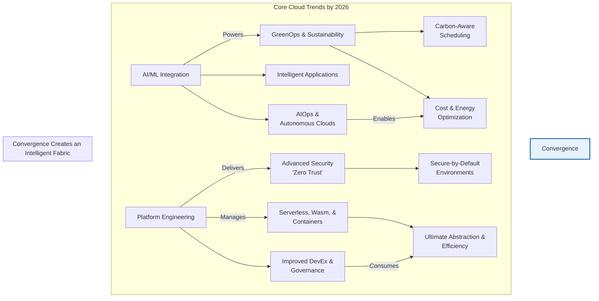

# The Future of Cloud: AI, Green, and Beyond – A 2026 Vision

The cloud is no longer just a destination for our applications; it's a dynamic, intelligent fabric that powers modern innovation. As we look toward 2026, the trajectory of cloud computing is bending sharply. We're moving beyond basic infrastructure-as-a-service (IaaS) and into an era of autonomous, sustainable, and deeply integrated platforms. This isn't an incremental shift; it's a fundamental re-imagining of what the cloud can and should be.

For engineers, architects, and leaders, understanding these trends is not optional. It's essential for building resilient, efficient, and forward-looking systems. Let's explore the convergent forces that will define the cloud of 2026.

### What You'll Get

*   **Actionable Insights:** A breakdown of the five key trends shaping the cloud's future.
*   **Visual Architecture:** A Mermaid diagram illustrating how these trends interconnect.
*   **Practical Examples:** Code snippets and tables to ground concepts in reality.
*   **Forward-Looking Perspective:** A glimpse into the next decade of cloud innovation.

---

## AI as the Cloud's New Brain

By 2026, Artificial Intelligence will be less of a workload *on* the cloud and more of the intelligence *of* the cloud. This integration operates on two primary levels: AI-powered cloud management and the rise of AI-native application platforms.

### AIOps: From Reactive to Predictive

AIOps is maturing from a buzzword into a core operational paradigm. Instead of engineers writing complex rules to handle failures, AI models will manage cloud infrastructure with unprecedented autonomy.

*   **Predictive Scaling:** Models will analyze historical traffic, marketing calendars, and even external events to predict load and scale resources *before* a spike occurs.
*   **Autonomous Anomaly Detection:** AI will identify subtle deviations in performance metrics that signal an impending outage, often invisible to human operators.
*   **Self-Healing Infrastructure:** Upon detecting an issue, AIOps platforms will automatically execute remediation runbooks, from restarting a service to re-routing traffic across regions.

> "The goal of AIOps is not just to alert humans faster but to create systems that require less human intervention altogether. By 2026, a 'no-ops' environment for routine tasks will be achievable for many organizations."

### AI-Native Development

Cloud providers are abstracting the complexity of building and deploying AI models. This "AI-as-a-service" layer will become as fundamental as virtual machines are today.

*   **Foundation Model APIs:** Access to powerful, pre-trained large language models (LLMs) and diffusion models will be a simple API call away.
*   **Vector Databases:** These specialized databases, crucial for AI-powered search and retrieval-augmented generation (RAG), will be a standard, managed cloud offering.
*   **Integrated MLOps Toolchains:** End-to-end platforms for data ingestion, training, deployment, and monitoring will be deeply integrated into cloud consoles.

## Green Cloud: Sustainability as a First-Class Citizen

The massive energy consumption of data centers has made sustainability an urgent priority. By 2026, "GreenOps" will be a formal discipline focused on optimizing for carbon efficiency alongside cost and performance. This is driven by regulatory pressure, customer demand, and rising energy costs.

### Carbon-Aware Workload Orchestration

The next generation of schedulers (like Kubernetes) will be location-aware, not just for latency, but for carbon intensity.

*   **Follow the Sun, Follow the Wind:** Non-critical batch jobs will be automatically scheduled to run in regions where renewable energy is most plentiful at that moment.
*   **Carbon Intensity APIs:** Cloud providers will offer real-time APIs that report the carbon intensity (gCO2eq/kWh) of each data center region, enabling automated, green decision-making.

Here is a hypothetical policy-as-code snippet defining a carbon-aware deployment strategy:

```yaml
# A hypothetical GreenOps policy using a custom controller
apiVersion: greenops.policy/v1
kind: DeploymentConstraint
metadata:
  name: deploy-batch-processor-greenly
spec:
  workloadSelector:
    app: nightly-data-cruncher
  strategy:
    type: "LowestCarbonIntensity"
    allowedRegions:
      - "eu-west-1"   # Ireland (Wind)
      - "us-west-2"   # Oregon (Hydro)
      - "ca-central-1"  # Quebec (Hydro)
    maxCarbonIntensity: 45 # gCO2eq/kWh
    fallbackStrategy: "LowestCost"
```

### Measuring and Reporting

You can't optimize what you can't measure. Tools like the [Cloud Carbon Footprint](https://www.cloudcarbonfootprint.org/) will become standard, integrated directly into cloud billing and monitoring dashboards to provide granular, per-service emissions data.

## The Evolution of Compute: Serverless, Containers, and Wasm

The drive for developer velocity and operational efficiency continues to push abstraction forward. By 2026, the lines between compute paradigms will blur, with a focus on matching the right tool to the right job.

| Feature | Traditional Cloud (c. 2020) | Future Cloud (c. 2026) |
| :--- | :--- | :--- |
| **Management** | Manual/Scripted Ops | AIOps, Autonomous Systems |
| **Sustainability**| Afterthought / PUE-focused | Core Metric / GreenOps |
| **Security** | Perimeter-based | Zero Trust, Identity-centric |
| **Developer Exp.**| Complex IaC, TicketOps | Platform Engineering, IDPs |
| **Unit of Compute** | VMs, Containers | Serverless Functions, Wasm |

*   **Serverless First:** For event-driven and stateless workloads, serverless functions (e.g., AWS Lambda, Google Cloud Functions) will be the default choice, offering zero-admin overhead and perfect scalability.
*   **Containers for Complexity:** Kubernetes will remain the standard for orchestrating complex, stateful applications, but it will be consumed via higher-level platforms.
*   **The Rise of WebAssembly (Wasm):** Wasm is emerging as a secure, high-performance, and language-agnostic compute primitive. Its lightweight sandboxing and near-native speed make it ideal for edge computing, plugins, and multi-tenant serverless platforms where traditional containers are too heavy.

## Security by Default: The Zero Trust Mandate

The concept of a secure network perimeter is obsolete. By 2026, **Zero Trust Architecture (ZTA)** will be the default security model for any new cloud deployment. It operates on a simple but powerful principle: *never trust, always verify*.

*   **Identity as the Perimeter:** Access controls will be based on strong, continuously verified identity (of users, devices, and services), not network location.
*   **Micro-segmentation:** Granular network policies will prevent lateral movement, ensuring that even if one service is compromised, the blast radius is contained.
*   **Continuous Authorization:** Every single request will be authenticated and authorized, moving away from session-based trust. This is enforced at the service mesh layer (e.g., Istio, Linkerd) or via cloud-native controls.

## Platform Engineering: The Cloud as a Product

The sheer complexity of the modern cloud stack is overwhelming for many development teams. **Platform Engineering** is the answer. This internal discipline treats your organization's cloud infrastructure as a product, consumed by developers via an **Internal Developer Platform (IDP)**.

An IDP provides a "golden path" for developers, offering a curated set of tools and automated workflows for:
*   Provisioning infrastructure
*   Setting up CI/CD pipelines
*   Managing application configurations
*   Enforcing security and compliance policies

The goal is to increase developer velocity and cognitive load by abstracting away the underlying complexity of Kubernetes, IAM policies, and cloud networking.

## Convergence: The Intelligent Cloud Fabric

These trends are not independent; they are deeply interconnected, creating a powerful flywheel effect.

*   **Platform Engineering** delivers **Zero Trust** environments by default.
*   **AIOps** powers the automation within the IDP and makes **GreenOps** decisions.
*   The platform offers developers a choice of **Serverless** or **Containerized** compute, optimized for their specific workload.

This convergence transforms the cloud from a collection of services into a cohesive, intelligent, and self-optimizing platform.



## Beyond 2026: The Next Decade

Looking further ahead, we can imagine a cloud that is almost entirely autonomous. Sovereign clouds will gain traction for data residency, while edge and space-based computing will extend the cloud's reach. The ultimate goal remains the same: to make the power of distributed computing accessible, efficient, and secure, allowing builders to focus on creating value, not managing infrastructure.

The cloud of 2026 will be smarter, greener, and more developer-centric than ever before. Preparing for this future means embracing automation, prioritizing sustainability, and investing in a seamless developer experience today.

**What are your boldest predictions for the cloud in 2026 and beyond? Share them in the comments!**


## Further Reading

- [https://www.gartner.com/en/articles/top-strategic-cloud-trends-2026](https://www.gartner.com/en/articles/top-strategic-cloud-trends-2026)
- [https://www.forbes.com/sites/forbestechcouncil/future-of-cloud-computing-2026/](https://www.forbes.com/sites/forbestechcouncil/future-of-cloud-computing-2026/)
- [https://www.accenture.com/us-en/insights/cloud/cloud-strategy-future](https://www.accenture.com/us-en/insights/cloud/cloud-strategy-future)
- [https://www.cncf.io/blog/cloud-native-landscape-outlook-2026](https://www.cncf.io/blog/cloud-native-landscape-outlook-2026)
- [https://aws.amazon.com/blogs/aws/future-of-cloud-innovation-2026/](https://aws.amazon.com/blogs/aws/future-of-cloud-innovation-2026/)
