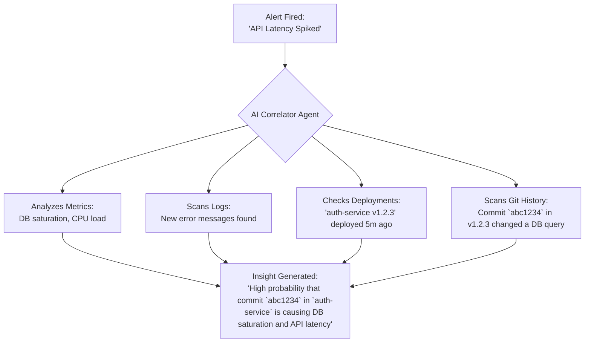

# Platform Engineering: The AI-Driven Future of Developer Experience

Platform engineering has one primary goal: to reduce the cognitive load on developers and accelerate software delivery. We've built internal developer platforms (IDPs), curated golden paths, and standardized toolchains. But the next evolutionary leap isn't just more tooling; it's infusing the entire platform with intelligence. AI is transforming platform engineering from a provider of *self-service* tools into a proactive, AI-driven partner for development teams.

This isn't a far-off vision. It's the practical future of developer experience (DevEx), where platforms anticipate needs, automate complex tasks, and provide insights instead of just data.

### What You'll Get

*   **A Clear Breakdown:** How AI is enhancing the core pillars of platform engineering: self-service, observability, and incident management.
*   **Practical Examples:** Concrete use cases, from conversational infrastructure requests to automated root cause analysis.
*   **A High-Level View:** A Mermaid diagram illustrating an AI-driven incident response flow.
*   **Future-Ready Skills:** A look at how the platform engineer's role will evolve by 2026.

## From Self-Service Catalogs to AI-Assisted Portals

Today's developer portals, often built on frameworks like [Backstage](https://backstage.io/), are excellent for providing a "paved road" experience. Developers can scaffold a new service from a template with a few clicks. While effective, this is a fundamentally reactive process. The developer must know what they want and navigate a static catalog.

AI turns this model on its head, enabling a conversational and context-aware experience.

### Generative Scaffolding

Imagine a developer interacting with their platform via a command-line interface or a Slack bot, using natural language to define their needs.

> "I need a new Go microservice for processing user avatars. It requires a 50GB S3-compatible object store, a Redis cache, and a CI/CD pipeline that deploys to the staging environment. Ensure it's instrumented for Prometheus and has SOC 2 compliance controls."

An AI agent, powered by a Large Language Model (LLM) trained on your organization's standards, translates this request directly into action. It doesn't just fill out a template; it *generates* the necessary configurations.

```terraform
# Generated by PlatformAI_Bot
resource "aws_s3_bucket" "avatar_storage" {
  bucket = "user-avatars-prod-1a2b3c4d"
  # ... SOC 2 compliance settings automatically applied
}

resource "aws_elasticache_cluster" "service_cache" {
  cluster_id           = "avatar-service-redis"
  engine               = "redis"
  node_type            = "cache.t3.small"
  # ... configured based on service needs
}

# ... additional resources for IAM roles, ECR repo, and CI/CD webhook
```

This approach drastically reduces the time from idea to running code and ensures every new component adheres to organizational best practices without the developer needing to memorize them.

### Dynamic Golden Paths

Static "golden paths" are useful, but they can't account for every use case. AI allows for *dynamic golden paths* that adapt based on context. The platform's AI can analyze:
*   **Project Context:** Is this a high-traffic Tier-1 service or an internal batch job?
*   **Team History:** What technology stacks has this team successfully operated in the past?
*   **Organizational Patterns:** Which database solutions have proven most cost-effective for similar workloads across the company?

The platform then recommends an optimal, tailored path, moving beyond one-size-fits-all templates.

## Intelligent Observability: From Dashboards to Insights

Developers are drowning in observability data—metrics, logs, traces. The challenge is no longer data collection but data *interpretation*. AI-driven observability, often called AIOps, sifts through this noise to find the signal.

> As stated by Google, a key goal of platform engineering is enabling "self-service capabilities for developers." AI elevates this by making the services themselves smarter and more autonomous. [Read more on Google Cloud's Blog](https://cloud.google.com/blog/products/application-development/what-is-platform-engineering).

### Proactive Anomaly Detection

Traditional monitoring relies on predefined thresholds (e.g., "alert when CPU > 90%"). This is brittle and often leads to alert fatigue.

AI models learn the normal "rhythm" of your systems, including seasonality (like lower traffic on weekends). They can then detect subtle deviations that signal an impending problem *before* it breaches a static threshold. For example, it might flag a minor but persistent increase in database query latency that a human looking at a dashboard would easily miss.

### Automated Root Cause Analysis

When an incident occurs, the most time-consuming task is often correlating data from disparate sources to find the root cause. An AI agent can do this in seconds.

Here is a simplified flow of how an AI might assist in diagnosing an issue:



This doesn't replace the engineer but empowers them with a high-confidence starting point, turning hours of manual investigation into minutes.

## The End of Toil: Proactive Incident Management

AI's biggest impact on operational excellence will be in automating incident response. This moves teams from a reactive posture to a proactive and, eventually, a predictive one.

### AI-Powered Executable Runbooks

Static runbooks in a wiki are better than nothing, but they become outdated and require manual execution under pressure. The future is executable runbooks driven by AI.

When an alert for a known issue fires (e.g., a full disk on a database node), an AI agent can:
1.  **Triage:** Confirm the alert is not a false positive by running diagnostic checks.
2.  **Execute:** Trigger a pre-approved, automated workflow to remediate the issue (e.g., run a log cleanup script, expand the persistent volume).
3.  **Validate:** Verify that the remediation was successful and the system has returned to a healthy state.
4.  **Report:** Document all actions taken in the incident ticket automatically.

Human intervention is only required if the automated remediation fails or if it's a novel, unclassified issue.

## Preparing for the AI-Driven Platform: What's Next?

Transitioning to an AI-driven platform won't happen overnight. It requires a strategic focus on data, APIs, and skills.

### Adapting Your Existing Platform

*   **Start with Data:** You can't have AI without good data. Prioritize centralized and structured logging, consistent metric tagging, and distributed tracing.
*   **Embrace APIs:** Your platform's capabilities must be exposed via clean, well-documented APIs. AI agents will interact with these APIs to provision resources, run diagnostics, and perform remediations.
*   **Experiment Small:** Begin by integrating a single AI-powered tool. A great starting point is an intelligent log analysis service that can cluster unknown errors or detect security anomalies.

### Skills for 2026: The New Platform Engineer

The role of the platform engineer is shifting from a hands-on builder to a strategic enabler of an intelligent system. The focus moves from writing YAML to designing and training the systems that write YAML.

| Traditional Skill | AI-Enhanced Skill |
| :----------------- | :------------------ |
| YAML/IaC Engineering | Prompt Engineering & IaC Generation Oversight |
| Dashboard Creation | AIOps Model Training & Anomaly Detection Tuning |
| Manual Runbook Writing | Designing & Implementing Automated Workflows |
| Reactive Ticket Support | Training & Maintaining AI Support Agents |

The core disciplines of reliability, security, and infrastructure management remain, but they will be executed through the leverage of AI.

## Conclusion

AI is not here to replace platform engineers. It's here to supercharge them. By automating toil, surfacing deep insights, and creating a truly seamless developer experience, AI is the force multiplier that will allow platform teams to deliver on their core promise at an unprecedented scale.

The journey begins by treating your platform not just as a collection of tools, but as an intelligent system capable of learning and evolving. The organizations that start building this future today will be the ones that lead tomorrow.


## Further Reading

- [https://cloud.google.com/blog/topics/developers-practitioners/what-platform-engineering-and-why-it-matters-2026](https://cloud.google.com/blog/topics/developers-practitioners/what-platform-engineering-and-why-it-matters-2026)
- [https://martinfowler.com/articles/platform-engineering-the-emerging-discipline.html](https://martinfowler.com/articles/platform-engineering-the-emerging-discipline.html)
- [https://www.cncf.io/blog/2026/05/ai-in-cloud-native-platforms-future-vision/](https://www.cncf.io/blog/2026/05/ai-in-cloud-native-platforms-future-vision/)
- [https://www.forrester.com/report/the-rise-of-intelligent-platforms-in-2026/](https://www.forrester.com/report/the-rise-of-intelligent-platforms-in-2026/)
- [https://www.infoq.com/articles/ai-enabled-platform-engineering/](https://www.infoq.com/articles/ai-enabled-platform-engineering/)
