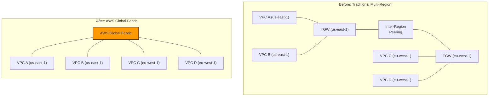
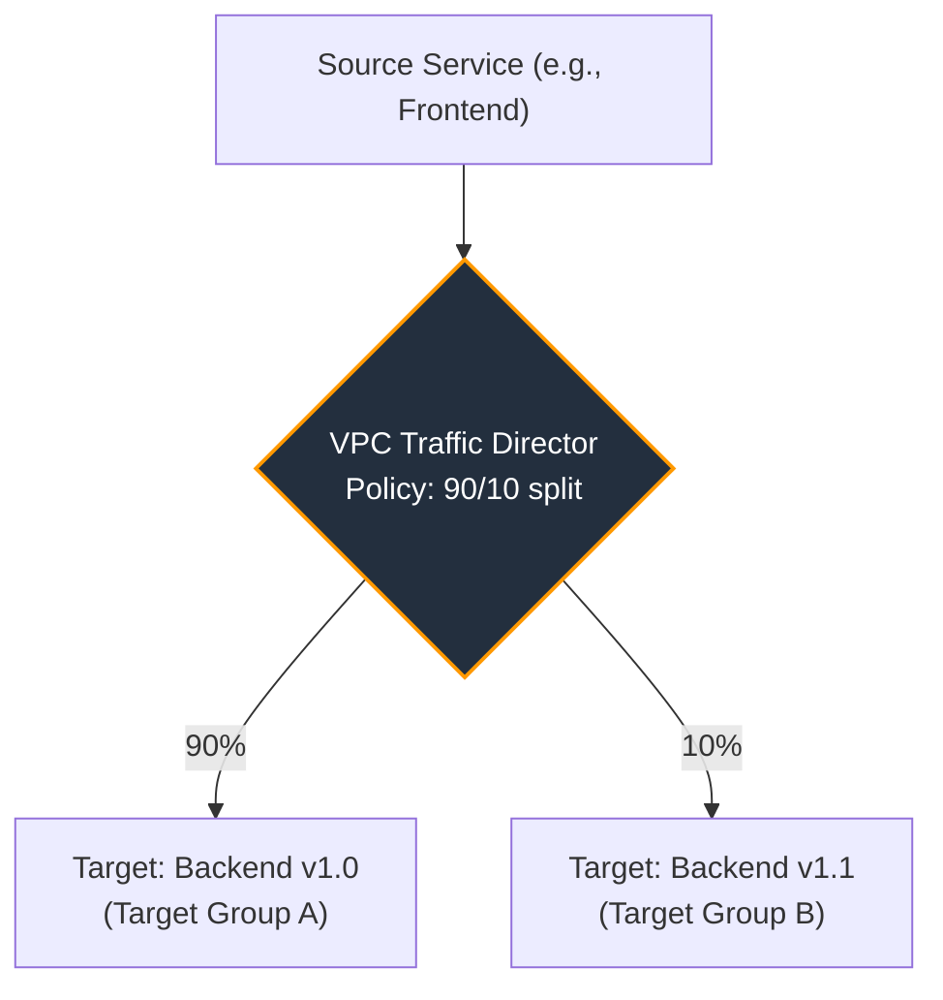

# AWS re:Invent 2025 Retrospective: Game-Changing Networking Services

Another AWS re:Invent has come and gone, leaving a trail of service announcements that will shape cloud architectures for years. While AI and serverless once again took center stage, the unsung hero of 2025 was networking. AWS delivered a trio of services that signal a major shift: moving from providing complex networking *primitives* to offering fully managed, intelligent networking *platforms*. This year, the focus was squarely on simplification, global scale, and deep traffic intelligence.

Let's dissect the most impactful networking announcements from Las Vegas and explore what they mean for you.

### What You'll Get

*   **Analysis of AWS Global Fabric:** The new service for seamless multi-region connectivity.
*   **Deep Dive into AWS Direct Link:** A simplified approach to hybrid cloud integration.
*   **Introduction to VPC Traffic Director:** For intelligent, policy-based traffic management inside your VPCs.
*   **Architectural diagrams** and discussion of the real-world implications for enterprise cloud strategy.

## AWS Global Fabric: Unifying the Multi-Region Cloud

For years, building a robust, multi-region architecture meant stitching together multiple Transit Gateways (TGWs) with inter-region peering. While functional, this approach introduced routing complexity, regional management overhead, and potential performance bottlenecks.

AWS Global Fabric addresses this head-on. It's a managed, global network service that provides a single logical control plane and data plane across all your chosen AWS Regions. Think of it as one giant, planet-scale Transit Gateway.

### Key Features
*   **Single Routing Domain:** All VPCs attached to the Global Fabric, regardless of region, share a single, unified routing table. This eliminates complex inter-TGW peering configurations.
*   **Centralized Policies:** Network policies, firewall rules (via Network Firewall), and routing decisions are managed from one central point and propagated globally.
*   **Optimized AWS Backbone:** Traffic automatically routes over the most efficient path on the AWS global backbone, reducing latency for inter-region communication.
*   **Simplified Attachments:** Connect VPCs, Direct Connect Gateways, and Site-to-Site VPNs to the Fabric just once to grant them global reachability.

### Architectural Impact

Global Fabric fundamentally simplifies building active-active, multi-region applications and disaster recovery postures. The operational burden of managing disparate regional networks melts away, allowing teams to focus on application logic rather than BGP route propagation.

> This is a game-changer for global enterprises. The concept of a "regional network" is being abstracted away in favor of a single, borderless cloud network.

Here's how the architecture evolves:



## AWS Direct Link: Simplifying the Hybrid Connection

While AWS Direct Connect offers powerful, dedicated connectivity to on-premises data centers, it comes with a steep learning curve involving BGP, VIFs, and router configurations. AWS Direct Link is a new, opinionated service designed to abstract away this complexity for the 80% use case.

Direct Link is a managed service that pairs a physical or virtual on-premises appliance with a simplified AWS console experience. The goal is to make establishing a private, redundant hybrid connection as easy as setting up a VPN, but with the reliability of a dedicated circuit.

### How It Works
1.  **Deploy Appliance:** Deploy the AWS-provided virtual appliance on your hypervisor or order a pre-configured physical appliance.
2.  **Claim in Console:** Use a simple claim code in the AWS console to associate the appliance with your account.
3.  **Define Connections:** Specify your on-premises IP ranges and the VPCs you want to connect to.
4.  **Auto-Configuration:** Direct Link automatically configures BGP, establishes redundant paths (if available), and sets up the necessary VIFs on a managed Direct Connect connection.

Here's how it compares to the traditional Direct Connect model:

| Feature | AWS Direct Connect | AWS Direct Link |
| :--- | :--- | :--- |
| **Control** | Full BGP, VIF, and routing control | Managed, automated |
| **Complexity** | High (Requires network expertise) | Low (Wizard-driven setup) |
| **Target Use Case** | Complex, multi-VPC, custom routing | Simple, reliable VPC connectivity |
| **Speed** | 1 Gbps - 100 Gbps | Up to 10 Gbps (initially) |

For many organizations, Direct Link will become the default choice, reserving the full power of Direct Connect for specialized networking requirements.

```bash
# Imagined CLI command for the new service
$ aws networkfabric create-direct-link \
    --appliance-id dla-0123456789abcdef \
    --name "main-datacenter-link" \
    --vpc-attachments vpc-1a2b3c,vpc-4d5e6f \
    --on-prem-cidrs "10.10.0.0/16"
```

## VPC Traffic Director: Intelligent In-VPC Routing

AWS has powerful tools for managing traffic *into* a VPC (like Application Load Balancers and Route 53). However, managing traffic *between services inside* a VPC has always required more complex solutions like service meshes (e.g., Istio) or custom application logic.

VPC Traffic Director is a new, managed VPC capability that brings intelligent, policy-based routing to the infrastructure layer. It allows you to define sophisticated traffic management rules that are enforced directly by the VPC network fabric, without requiring sidecar proxies.

### Core Capabilities
*   **Percentage-Based Splitting:** Direct a precise percentage of traffic to different service versions for canary deployments. (e.g., `send 5% of traffic to v2, 95% to v1`).
*   **Header-Based Routing:** Route traffic based on HTTP headers or other request metadata, perfect for A/B testing or routing internal-only requests.
*   **Tag-Based Targeting:** Define routing policies based on EC2 instance tags, allowing for dynamic infrastructure updates without changing routing rules.
*   **Automated Failover:** Define health checks and have Traffic Director automatically reroute traffic away from unhealthy targets across different Availability Zones.

This service lives between your application instances and your load balancers or other services, intercepting and directing traffic according to your policies.



VPC Traffic Director doesn't replace service meshes entirely—which still offer richer L7 features like mTLS and detailed observability—but it provides a powerful, native solution for the most common traffic management patterns, significantly reducing operational complexity.

## The Bigger Picture: A More Abstracted Network

Taken together, Global Fabric, Direct Link, and VPC Traffic Director represent a clear trend: **AWS is abstracting the network**. The focus is shifting from configuring individual components to defining intent.

-   **You want a global network?** Use Global Fabric.
-   **You want a simple on-prem link?** Use Direct Link.
-   **You want to canary a new release?** Use VPC Traffic Director.

This higher level of abstraction boosts operational efficiency, reduces the likelihood of misconfiguration, and empowers smaller teams to build architectures that were once the exclusive domain of large, specialized networking groups.

## Conclusion: What's Your Move?

The announcements from re:Invent 2025 are more than just new features; they are a new way of thinking about cloud networking. By providing managed platforms that handle the undifferentiated heavy lifting of routing, peering, and traffic policy, AWS is freeing architects and engineers to deliver business value faster.

The era of manually configuring BGP across a dozen regions may be coming to a close. A new era of intent-based, globally aware networking is here.

How will these announcements reshape your cloud networking strategy for 2026 and beyond?


## Further Reading

- [https://aws.amazon.com/blogs/aws/reinvent2025-networking-recap/](https://aws.amazon.com/blogs/aws/reinvent2025-networking-recap/)
- [https://docs.aws.amazon.com/whitepapers/aws-global-network-architecture.pdf](https://docs.aws.amazon.com/whitepapers/aws-global-network-architecture.pdf)
- [https://www.gartner.com/en/articles/2026-cloud-networking-trends](https://www.gartner.com/en/articles/2026-cloud-networking-trends)
- [https://www.techcrunch.com/2025/12/aws-networking-innovations/](https://www.techcrunch.com/2025/12/aws-networking-innovations/)
- [https://acloudguru.com/blog/re-invent-2025-deep-dive-networking](https://acloudguru.com/blog/re-invent-2025-deep-dive-networking)
