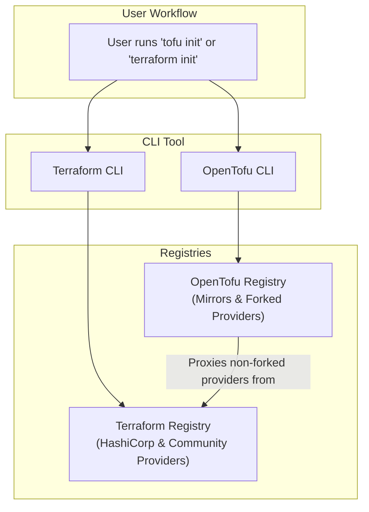

# OpenTofu vs. Terraform: Feature Parity and the Road Ahead for IaC

It's May 2026, and the dust has largely settled since HashiCorp's BSL license change for Terraform. The community-driven fork, OpenTofu, now managed by the Linux Foundation, has evolved from a simple alternative into a robust Infrastructure as Code (IaC) tool with its own distinct trajectory. The question for practitioners is no longer *if* OpenTofu is a viable alternative, but *when* and *why* to choose it over Terraform.

This article dives into the current state of both tools. We'll compare core features, analyze recent innovations, and explore the diverging paths of their ecosystems to help you make an informed decision for your projects.

### What You'll Get

*   **Current Feature Comparison:** A side-by-side look at where the tools stand on parity in May 2026.
*   **Analysis of Recent Releases:** What OpenTofu's `v2026.5.0` and Terraform's latest roadmap reveal about their priorities.
*   **Ecosystem & Adoption Trends:** A breakdown of community health, provider registries, and enterprise usage patterns.
*   **A Clear Decision Framework:** Actionable guidance on which tool to choose for specific use cases.
*   **Future Outlook:** A look at the road ahead for open-source IaC.

## The State of Parity: Core IaC Features

At their core, OpenTofu and Terraform remain remarkably similar, which was the initial goal of the fork. Both use the HashiCorp Configuration Language (HCL), manage state, and interact with a vast ecosystem of providers. However, subtle but important differences have emerged.

| Feature | OpenTofu | Terraform | Notes |
| :--- | :--- | :--- | :--- |
| **HCL Syntax** | Fully compatible | The standard | Minor Tofu-specific functions are being introduced, but core syntax is identical. |
| **State Management** | All standard backends | All standard backends | OpenTofu has introduced *client-side state encryption* as a key differentiator. |
| **Provider Ecosystem** | OpenTofu Registry (proxies TF) | Terraform Registry (official) | Tofu maintains compatibility, but new HashiCorp-owned providers are BSL. |
| **Licensing** | Mozilla Public License v2.0 (MPL 2.0) | Business Source License 1.1 (BSL) | This remains the fundamental philosophical and legal divide. |
| **Core CLI** | Drop-in replacement | Familiar `plan`/`apply` workflow | Command-line flags and outputs are nearly identical for most common operations. |

## Recent Innovations: Diverging Paths

The true divergence is visible in the latest releases and roadmaps. Each project is now catering to the priorities of its stewards—the open-source community for Tofu and HashiCorp's enterprise customers for Terraform.

### OpenTofu's Community-Driven Momentum (v2026.5.0)

As detailed in their [Q2 2026 report](https://opentofu.org/blog/2026/05/state-of-opentofu-q2-report), OpenTofu's development is focused on features frequently requested by the community. The latest release, `v2026.5.0`, highlights this:

*   **Client-Side State Encryption:** You can now encrypt state files *before* they are sent to the backend. This is a massive security win, especially for teams using shared backends like S3. The state file itself is unreadable without the client's key.
*   **Enhanced Testing Framework:** The `tofu test` command now includes more advanced mocking and assertion capabilities, reducing the need for external tooling and boilerplate code to validate modules.
*   **Dynamic Provider-Defined Functions:** Providers can now expose their own custom functions within HCL, allowing for more powerful and expressive configurations without waiting for changes to the core binary.

Here's an example of how a provider might expose a function:

```hcl
# Example of a hypothetical provider-defined function
resource "aws_instance" "example" {
  ami           = "ami-0c55b159cbfafe1f0"
  instance_type = "t2.micro"

  // This function is defined by the AWS provider, not Tofu core
  // It might perform a real-time price check or validation.
  lifecycle {
    precondition {
      condition     = provider::aws.is_instance_type_available_in_region(self.instance_type, "us-west-2")
      error_message = "The selected instance type is not available or cost-effective in us-west-2."
    }
  }
}
```

### Terraform's Enterprise-Focused Roadmap

HashiCorp's [2026 Terraform roadmap](https://www.hashicorp.com/blog/terraform-roadmap-2026-vision) shows a clear focus on integrating Terraform deeper into its commercial ecosystem.

*   **Deeper HCP Integration:** Tighter coupling with HCP (HashiCorp Cloud Platform) for features like continuous validation, drift detection as-a-service, and managed state across federated environments.
*   **AI-Assisted Workflows:** A new "HCP Autopilot" feature aims to use AI to suggest fixes for failed plans, optimize configurations for cost, and generate boilerplate module code directly within the HCP UI.
*   **Advanced Policy as Code:** Sentinel, HashiCorp's policy-as-code framework, is receiving significant investment with more granular controls and integrations with security compliance frameworks like SOC 2 and HIPAA.

## Ecosystem and Adoption: A Tale of Two Registries

The provider and module ecosystem is where the split is most tangible. While OpenTofu can use most providers from the original Terraform Registry, the relationship is now one of a proxy, not a native peer.

This diagram illustrates the provider resolution flow for both tools:



> **A Note on Enterprise Adoption**
> According to recent analysis, a clear pattern has emerged. Startups, scale-ups, and companies with strong open-source mandates or sensitivity to license changes are increasingly standardizing on OpenTofu. Conversely, large enterprises with existing multi-year support contracts and deep investments in the HashiCorp ecosystem (Vault, Consul, HCP) are largely staying with Terraform. [Source: InfoQ](https://www.infoq.com/news/2026/05/opentofu-enterprise-adoption/)

## Decision Framework: When to Choose OpenTofu

Your choice depends less on core functionality and more on your organization's philosophy, security needs, and existing technology stack.

### Choose OpenTofu if:

*   **You require an OSI-approved open-source license.** This is the primary driver for many adopters.
*   **Client-side state encryption is a critical security requirement.** Tofu's native implementation is a significant advantage.
*   **You want to avoid potential vendor lock-in** with the broader HashiCorp commercial ecosystem.
*   **Your team values contributing to and being guided by a community-first project** under the Linux Foundation's governance.

### Stick with Terraform if:

*   **You are heavily invested in HCP, Sentinel, or other HashiCorp enterprise products.** The integrations are seamless and a core part of the value proposition.
*   **You require enterprise-grade, 24/7 support directly from the original creators.**
*   **Your organization is conservative** and prefers to stick with the commercially-backed incumbent.
*   **Upcoming proprietary features like AI-assisted workflows** are critical to your team's roadmap.

## The Future is Competitive, and That's a Good Thing

The fork of OpenTofu from Terraform has ultimately been a net positive for the IaC community. It has injected a healthy dose of competition, forcing both projects to innovate and be more responsive to their respective user bases.

OpenTofu is rapidly proving that a community-governed project can achieve feature velocity and address long-standing user requests. At the same time, Terraform continues to push the boundaries of what enterprise-grade IaC can offer within a tightly integrated commercial platform.

The road ahead is no longer about a single, monolithic IaC tool. It's about a choice between two powerful, highly capable tools, each with a distinct philosophy and vision. The best tool is the one that aligns with *your* team's principles, processes, and technical needs.

What's your take? Has your team migrated, or are you sticking with Terraform? Share your experiences and rationale in the comments below.


## Further Reading

- [https://opentofu.org/blog/2026/05/state-of-opentofu-q2-report](https://opentofu.org/blog/2026/05/state-of-opentofu-q2-report)
- [https://www.hashicorp.com/blog/terraform-roadmap-2026-vision](https://www.hashicorp.com/blog/terraform-roadmap-2026-vision)
- [https://www.infoq.com/news/2026/05/opentofu-enterprise-adoption/](https://www.infoq.com/news/2026/05/opentofu-enterprise-adoption/)
- [https://github.com/opentofu/opentofu/releases/tag/v2026.5.0](https://github.com/opentofu/opentofu/releases/tag/v2026.5.0)
- [https://medium.com/@devops-insights/iac-landscape-2026-terraform-opentofu-comparison](https://medium.com/@devops-insights/iac-landscape-2026-terraform-opentofu-comparison)
