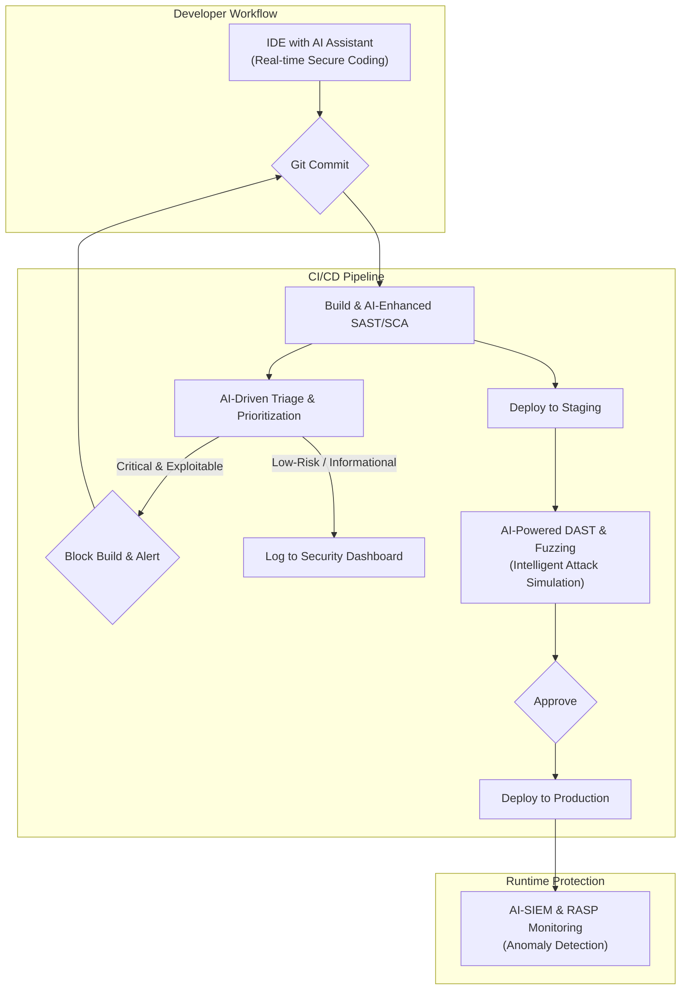

# DevSecOps 2.0: Integrating AI into Your Security Pipeline

DevSecOps has successfully shifted security left, embedding automated checks into the CI/CD pipeline. But as development velocity accelerates and threat landscapes grow more complex, simple automation is no longer enough. We're entering the era of DevSecOps 2.0, where Artificial Intelligence (AI) moves us from a reactive to a predictive and autonomous security posture.

This isn't about replacing human expertise; it's about augmenting it. AI can sift through the noise, identify complex patterns, and empower engineers to focus on what truly matters. By integrating intelligence directly into the developer workflow, we can build more secure software, faster.

### What You'll Get

*   **A clear definition** of the shift from automated (1.0) to intelligent (2.0) DevSecOps.
*   **Practical applications** of AI in threat modeling, code analysis, and remediation.
*   **An architectural diagram** and steps for integrating AI into your CI/CD pipeline.
*   **A breakdown** of key AI security tools and critical ethical considerations.

## The Evolution: From Automation to Intelligence

The journey of DevSecOps can be viewed in two distinct phases. Understanding this evolution is key to appreciating the value AI brings to the table.

### DevSecOps 1.0: The Age of Automation

The first wave of DevSecOps was revolutionary. It was defined by integrating security scanning tools directly into the pipeline.

*   **Core Principle:** Automate everything. If a human does it repeatedly, script it.
*   **Key Tools:** SAST (Static Application Security Testing), DAST (Dynamic Application Security Testing), and SCA (Software Composition Analysis) tools became standard pipeline stages.
*   **Primary Goal:** Find vulnerabilities earlier in the lifecycle. "Shift Left" was the mantra.
*   **Limitation:** This approach often leads to **alert fatigue**. Developers are flooded with findings, many of which are false positives or low-priority, making it difficult to focus on critical risks.

### DevSecOps 2.0: The Age of Intelligence

DevSecOps 2.0 leverages AI and Machine Learning (ML) to overcome the limitations of pure automation. It’s about making the pipeline not just automated, but *smart*.

*   **Core Principle:** Augment human intuition with data-driven intelligence.
*   **Key Capability:** Moving beyond finding vulnerabilities to *predicting* them, *prioritizing* them with business context, and even *automating their remediation*.
*   **Primary Goal:** Reduce noise, accelerate remediation, and enable security to scale with development.

## Core Pillars of AI-Driven DevSecOps

AI is transforming several key areas of the software development lifecycle. Here are the four most impactful pillars of this new paradigm.

### Predictive Threat Modeling

Traditional threat modeling is a manual, time-consuming process that often struggles to keep pace with agile development. AI can analyze application architecture, code dependencies, and historical threat data to automatically generate and update threat models, identifying potential attack vectors before a single line of vulnerable code is written.

### Intelligent Vulnerability Prioritization

The single biggest challenge with traditional scanners is the sheer volume of alerts. AI excels at contextualization. An AI-powered security platform can ask critical questions:

*   Is this vulnerable code actually reachable by an external user?
*   Does this flaw exist in a critical business service or a non-essential internal tool?
*   Are there known exploits for this CVE in the wild?

By answering these, AI can transform a flat list of 1,000 vulnerabilities into a prioritized list of the 10 that require immediate attention.

### Autonomous Remediation and Patching

Identifying a problem is only half the battle. The next frontier is autonomous remediation. AI-powered tools can now generate code suggestions to fix identified vulnerabilities.

For example, when a vulnerable dependency is found, the system can not only recommend an update but also generate a pull request with the patched version, run all the necessary tests to ensure no breaking changes, and present it to a developer for final approval.

```java
// Vulnerable Code (e.g., potential for SQL Injection)
String query = "SELECT * FROM users WHERE username = '" + user.getName() + "'";
Statement statement = connection.createStatement();
ResultSet results = statement.executeQuery(query);

// AI-Suggested Secure Code
String query = "SELECT * FROM users WHERE username = ?";
PreparedStatement statement = connection.prepareStatement(query);
statement.setString(1, user.getName());
ResultSet results = statement.executeQuery();
```

### Smart Compliance and Policy Enforcement

Compliance frameworks like PCI DSS, HIPAA, or GDPR are complex and difficult to translate into technical controls. AI can analyze these regulatory texts and help generate Policy-as-Code (PaC) rules. During the CI/CD pipeline, it can intelligently scan for deviations from these policies in both application code and infrastructure-as-code (IaC) configurations.

## Integrating AI into Your CI/CD Pipeline

Here is a high-level view of how AI can be embedded at various stages of a modern CI/CD pipeline.



**Practical Integration Steps:**

1.  **Pre-Commit (The IDE):** Start with AI code assistants like **GitHub Copilot** or **Snyk Code**. These tools provide real-time security feedback and suggest secure coding patterns directly to the developer as they type, preventing many vulnerabilities from ever being committed.
2.  **Commit/Build (CI):** Augment your existing SAST and SCA scanners. Use a tool that applies an AI layer to analyze the results. This layer prioritizes findings based on context, reachability, and exploitability, ensuring that developers only receive actionable, high-impact alerts.
3.  **Test/Deploy (CD):** In your staging environment, deploy AI-powered DAST or Interactive Application Security Testing (IAST) tools. These modern scanners use AI to learn the application's business logic, allowing them to conduct more sophisticated tests that mimic real-world attackers, finding complex flaws that traditional scanners miss.
4.  **Monitor/Operate (Runtime):** In production, feed application logs and performance metrics into an AI-powered monitoring platform (like a modern SIEM or observability tool). The AI establishes a baseline of normal behavior and can instantly detect anomalies that indicate a potential breach, such as unusual API calls or data exfiltration patterns.

## Tooling and Ethical Considerations

Adopting AI in your security practice requires choosing the right tools and being aware of the new risks that AI itself can introduce.

### The AI Security Toolchain

| Category | Example Tools | AI's Primary Role |
| --- | --- | --- |
| **AI Code Assistants** | GitHub Copilot, AWS CodeWhisperer | Real-time vulnerability suggestion and secure coding patterns. |
| **Intelligent SAST/SCA** | Snyk, Mend.io, Veracode | Context-aware vulnerability prioritization, reducing false positives. |
| **AI-Powered DAST** | Invicti, StackHawk, Wallarm | Smarter application crawling, identifying complex business logic flaws. |
| **Autonomous Pen Testing**| Pentera, Horizon3.ai | Simulating real-world attack paths to find exploitable weaknesses. |
| **Security Operations** | Datadog, Splunk, CrowdStrike | Anomaly detection in logs and metrics, predictive threat hunting. |

### Ethical Guardrails and AI Risks

Integrating AI is not without its challenges. The [OWASP AI Security Top Ten](https://owasp.org/www-project-top-ten-for-large-language-model-applications/) highlights several new risks that organizations must manage.

*   **Model Poisoning:** Malicious actors could intentionally feed bad data to your security AI's training model, teaching it to ignore specific types of vulnerabilities.
*   **Data Privacy:** AI security tools often require access to your source code and other sensitive data. Vet your vendors carefully and ensure they have robust data governance and privacy policies.
*   **Over-reliance and Deskilling:** Teams must not blindly trust AI-generated fixes. A "human-in-the-loop" approach is essential for reviewing and approving critical changes. Over-reliance can also erode the security skills of developers over time.
*   **Bias and Hallucinations:** AI models are trained on existing data. If the data is biased, the AI's recommendations will be too. It may miss novel, zero-day threats or "hallucinate" non-existent vulnerabilities.

> **A Note on Trust:** Treat AI as a highly skilled co-pilot, not the pilot. Its role is to augment and accelerate human decision-making, not replace it entirely. Human oversight remains your most critical security control.

## The Road Ahead

DevSecOps 2.0 represents a fundamental shift in how we approach security. By embedding intelligence throughout the development lifecycle, we can move beyond simply finding bugs faster. We can build a security practice that is proactive, context-aware, and capable of scaling with the ever-increasing pace of modern software development.

This journey starts with small, incremental steps. Begin by introducing an AI-powered tool at a single stage of your pipeline, measure its impact on alert fatigue and remediation times, and build from there.

As you evaluate your own security pipeline, what is the biggest bottleneck you face? Consider how these intelligent approaches could help you break through it.


## Further Reading

- [https://www.cisa.gov/resources/cybersecurity-framework-ai-guidance-2026](https://www.cisa.gov/resources/cybersecurity-framework-ai-guidance-2026)
- [https://www.paloaltonetworks.com/blog/2026/05/ai-driven-devsecops-best-practices](https://www.paloaltonetworks.com/blog/2026/05/ai-driven-devsecops-best-practices)
- [https://owasp.org/www-project-top-ten-ai-security-risks-2026/](https://owasp.org/www-project-top-ten-ai-security-risks-2026/)
- [https://www.darkreading.com/analytics/ai-powered-security-operations-center-2026](https://www.darkreading.com/analytics/ai-powered-security-operations-center-2026)
- [https://snyk.io/blog/ai-in-developer-security-challenges-and-solutions/](https://snyk.io/blog/ai-in-developer-security-challenges-and-solutions/)
