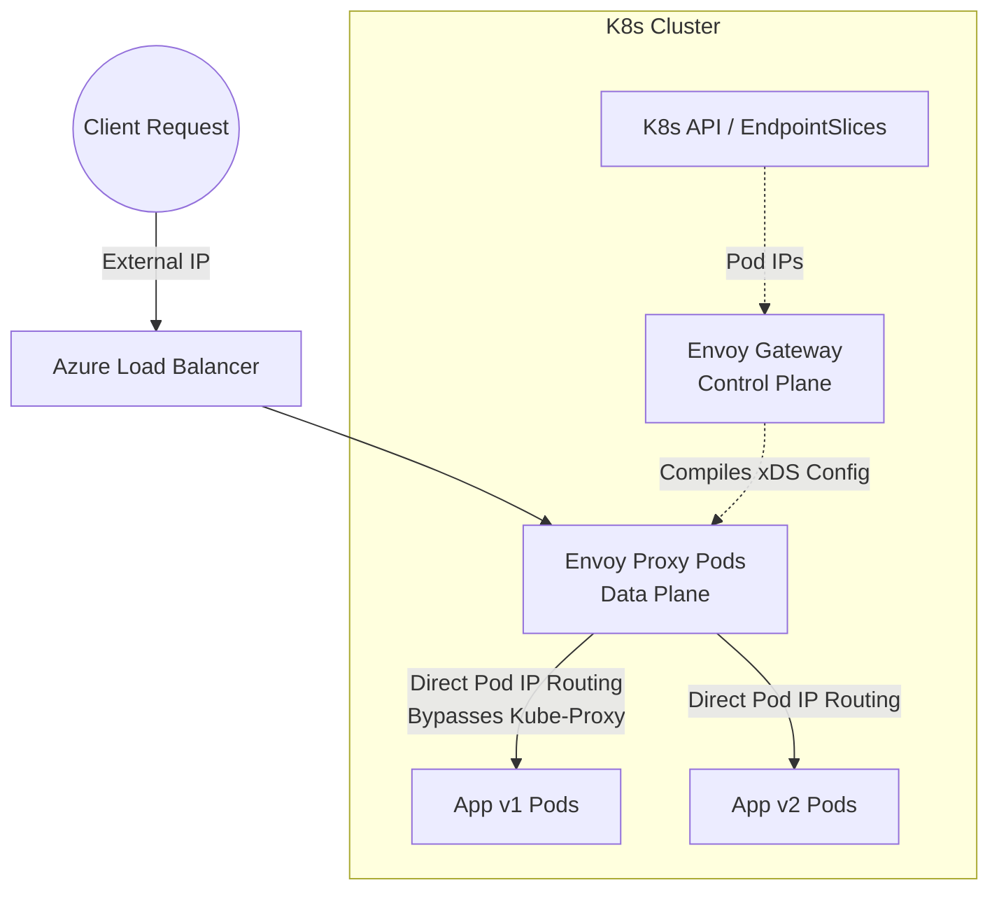
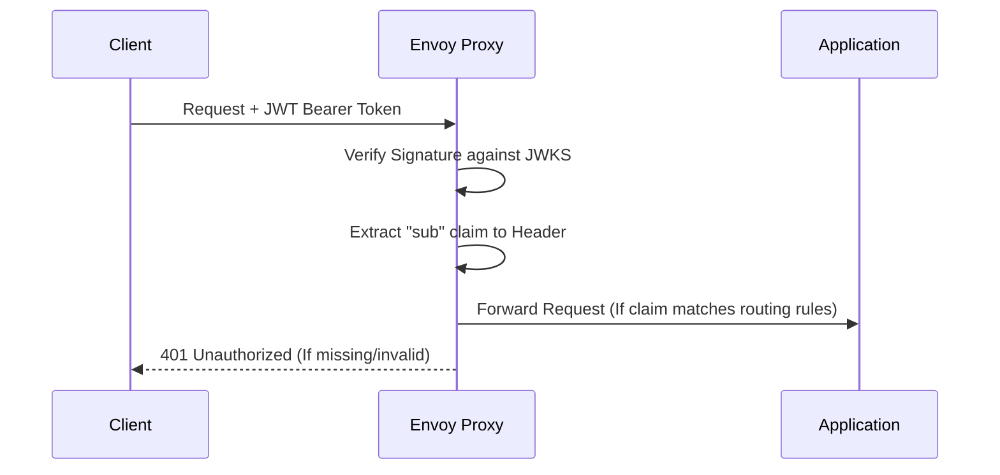

Traditional Kubernetes Ingress controllers are becoming a thing of the past. The future of edge routing, resilience, and security belongs to the Kubernetes Gateway API, powered by the robust Envoy Proxy.

This guide bypasses the purely theoretical and delivers a strict, forward-thinking blueprint for deploying a fully secured, observable, and dynamic Envoy data plane on Azure Kubernetes Service (AKS).

### What You'll Get

* **Architectural Clarity:** Understand the separation of the Control Plane and Data Plane.
* **Infrastructure Provisioning:** Learn to deploy an optimized AKS cluster with Envoy Gateway.
* **Advanced Traffic Control:** Implement canary releases and header-based routing effortlessly.
* **Edge Resilience:** Apply localized rate limiting and strict timeouts to protect your backends.
* **Zero-Trust Security:** Enforce JWT authentication and global TLS termination at the edge.
* **Deep Observability:** Extract high-cardinality JSON access logs and Prometheus metrics.

> **Note:** This tutorial assumes foundational knowledge of Kubernetes concepts like Pods and Services.

---

### Implementation Phases Overview

| Phase | Component Focus | Key Objective |
| :--- | :--- | :--- |
| **Phase 1** | Infrastructure | Provision the AKS cluster and install Envoy Gateway Control Plane. |
| **Phase 2** | Data Plane | Instantiate the proxy pods and allocate a public Azure IP. |
| **Phase 3** | Traffic Routing | Implement `HTTPRoute` for canary splits and header bypasses. |
| **Phase 4** | Resilience | Defend backends with `BackendTrafficPolicy` rate limits and timeouts. |
| **Phase 5** | Security | Offload JWT validation to the edge using `SecurityPolicy`. |
| **Phase 6** | TLS | Secure the perimeter with `cert-manager` and explicit certificates. |
| **Phase 7** | Observability | Enable structured logging and real-time metrics via `EnvoyProxy`. |

---

## The Core Architecture

Before writing infrastructure code, you must understand the modern proxy paradigm: the strict separation of the **Control Plane** (The Brain) and the **Data Plane** (The Muscle). Envoy bypasses `kube-proxy` entirely, routing traffic directly to Pod IPs for maximum performance and reduced latency.



---

## Phase 1: Infrastructure Provisioning

To utilize Envoy's direct-to-pod routing, your network plugin must support native CNI integration. We use **Azure CNI Overlay** to prevent Virtual Network (VNet) IP exhaustion while maintaining high performance.

* **Create the optimized AKS Cluster:**

```bash
az group create --name rg-envoy-demo --location centralindia
az aks create --resource-group rg-envoy-demo --name aks-envoy-demo --node-count 2 --generate-ssh-keys --enable-managed-identity --network-plugin azure --network-plugin-mode overlay
az aks get-credentials --resource-group rg-envoy-demo --name aks-envoy-demo
```

* **Install the Envoy Gateway Control Plane:**

```bash
helm install eg oci://docker.io/envoyproxy/gateway-helm \
  -n envoy-gateway-system --create-namespace \
  --set config.envoyGateway.provider.type=Kubernetes
```

---

## Phase 2: Instantiating the Data Plane & Workloads

The Control Plane remains idle until you request a `Gateway`. Applying this manifest forces Envoy to spin up the actual proxy pods and request a public IP from Azure.

* **Deploy the Gateway (`gateway.yaml`):**

```yaml
apiVersion: gateway.networking.k8s.io/v1
kind: GatewayClass
metadata:
  name: eg
spec:
  controllerName: gateway.envoyproxy.io/gatewayclass-controller
---
apiVersion: gateway.networking.k8s.io/v1
kind: Gateway
metadata:
  name: envoy-edge
  namespace: default
spec:
  gatewayClassName: eg
  listeners:
    - name: http
      protocol: HTTP
      port: 80
```

* **Deploy Demo Applications:** Deploy two versions of an application (e.g., `v1` and `v2`) alongside standard K8s `Service` objects.

> **Pro-Tip:** Standard Services are mandatory because Envoy uses them to read `EndpointSlices`, which contain the direct list of target pod IPs.

---

## Phase 3: Advanced Traffic Control (Canary & Headers)

Instead of risky "all-or-nothing" deployments, Envoy executes mathematical canary splits instantly at Layer 7.

* **Deploy an `HTTPRoute` for a 90/10 Split and Header Matching:**

```yaml
apiVersion: gateway.networking.k8s.io/v1
kind: HTTPRoute
metadata:
  name: demo-route
  namespace: default
spec:
  parentRefs:
    - name: envoy-edge
      namespace: default
  rules:
    # 1. Developer Header Bypass
    - matches:
        - headers:
            - name: X-Developer
              value: "true"
      backendRefs:
        - name: demo-app-v2-svc
          port: 8080
    # 2. 90/10 Canary Split for the Public
    - matches:
        - path:
            type: PathPrefix
            value: /
      backendRefs:
        - name: demo-app-v1-svc
          port: 8080
          weight: 90
        - name: demo-app-v2-svc
          port: 8080
          weight: 10
```

---

## Phase 4: Edge Resilience & Rate Limiting

Protect your backend pods from transient failures and brute-force attacks directly at the proxy layer, without writing custom application logic.

* **Add Timeouts to your `HTTPRoute`:**

```yaml
      timeouts:
        request: 2s
        backendRequest: 1s # Drops connection if pod takes >1s, enabling rapid retries.
```

* **Enforce Local Rate Limiting (Token Bucket):**

```yaml
apiVersion: gateway.envoyproxy.io/v1alpha1
kind: BackendTrafficPolicy
metadata:
  name: demo-rate-limiter
  namespace: default
spec:
  targetRefs:
    - group: gateway.networking.k8s.io
      kind: HTTPRoute
      name: demo-route
  rateLimit:
    type: Local
    local:
      rules:
        - limit:
            requests: 3
            unit: Second
```

> **Note on Testing:** Use a fast C-binary like `curl` in a Bash loop to test rate limits. Heavy tools like PowerShell's `Invoke-WebRequest` introduce instantiation latency, allowing the token bucket to refill between requests.

---

## Phase 5: Cryptographic Security (JWT Auth)

Offload authentication entirely from your application code. Envoy verifies JWT signatures and executes claim-based routing before malicious packets ever touch your cluster network.



* **Deploy the `SecurityPolicy`:**

```yaml
apiVersion: gateway.envoyproxy.io/v1alpha1
kind: SecurityPolicy
metadata:
  name: jwt-auth-policy
  namespace: default
spec:
  targetRefs:
    - group: gateway.networking.k8s.io
      kind: HTTPRoute
      name: demo-route
  jwt:
    providers:
      - name: sample-provider
        remoteJWKS:
          uri: https://raw.githubusercontent.com/envoyproxy/gateway/main/examples/kubernetes/jwt/jwks.json
        claimToHeaders:
          - header: x-token-subject
            claim: sub
```

---

## Phase 6: Global TLS Termination

Do not rely on implicit annotations. Declare your TLS certificates explicitly using `cert-manager` for robust security posture.

* **1. Define the Issuer and Certificate:**

```yaml
apiVersion: cert-manager.io/v1
kind: ClusterIssuer
metadata:
  name: edge-selfsigned-issuer
spec:
  selfSigned: {}
---
apiVersion: cert-manager.io/v1
kind: Certificate
metadata:
  name: envoy-edge-cert
  namespace: default
spec:
  secretName: envoy-edge-tls-secret
  issuerRef:
    name: edge-selfsigned-issuer
    kind: ClusterIssuer
  dnsNames:
    - "*.nip.io"
```

* **2. Update the Gateway Listener:**

```yaml
    - name: https
      protocol: HTTPS
      port: 443
      hostname: "*.nip.io"
      tls:
        mode: Terminate
        certificateRefs:
          - name: envoy-edge-tls-secret
```

> **Strict Execution Rule:** Because the listener explicitly expects `*.nip.io`, hitting the raw IP via `curl` will result in an immediate connection reset due to a Server Name Indication (SNI) mismatch. Always test using the domain mapping: `curl -k https://<YOUR-IP>.nip.io/`.

---

## Phase 7: Deep Observability

An edge proxy is a black box without telemetry. Envoy generates some of the most robust, high-cardinality data in the industry.

* **Configure the `EnvoyProxy` Data Plane boot parameters:**

```yaml
apiVersion: gateway.envoyproxy.io/v1alpha1
kind: EnvoyProxy
metadata:
  name: custom-proxy-config
  namespace: envoy-gateway-system
spec:
  telemetry:
    accessLog:
      settings:
        - format:
            type: JSON
            json:
              start_time: "%START_TIME%"
              method: "%REQ(:METHOD)%"
              path: "%REQ(X-ENVOY-ORIGINAL-PATH?:PATH)%"
              response_code: "%RESPONSE_CODE%"
              duration: "%DURATION%"
              upstream_service: "%UPSTREAM_CLUSTER%"
          sinks:
            - type: File
              file:
                path: /dev/stdout
    metrics:
      prometheus: {}
```

* **Attach it to your `GatewayClass`:** Update your `GatewayClass` to reference this `parametersRef`. The control plane will execute a rolling restart of your proxy pods, instantly exposing structured JSON logs to `stdout` and thousands of real-time metrics on port `19090`.

## Final Verdict

The Kubernetes Gateway API abstracts the complexity, but Envoy delivers the muscle. By codifying this exact architecture, you establish a highly scalable, secure, and observable perimeter ready for production workloads.
