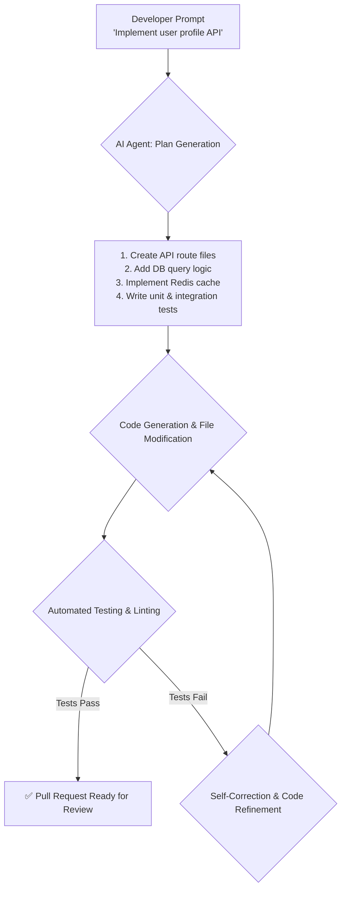

# VS Code's 2026 AI Evolution: Beyond Autocomplete to Autonomous Development

For years, AI in our IDEs has been a helpful "co-pilot," suggesting the next line of code or completing a function. It was a powerful productivity boost, but still fundamentally reactive. The year is 2026, and the paradigm has shifted. AI in Visual Studio Code is no longer just a passenger—it's a proactive, autonomous partner in the development process.

We've moved beyond simple code completion into an era of autonomous agents that handle entire development tasks, from initial scaffolding to final pull requests. This evolution is redefining what it means to be a developer, focusing our skills on architecture, problem-solving, and critical review, rather than rote implementation.

### What You'll Get

*   **The Shift Explained:** Understand the move from "AI-assisted" to "AI-autonomous" development.
*   **Core 2026 Features:** A breakdown of autonomous code generation, proactive bug detection, and intelligent refactoring.
*   **Workflow Transformation:** See a direct comparison of the 2024 vs. 2026 developer workflow.
*   **Future Challenges:** A realistic look at the hurdles we still face in this new landscape.

## The New Paradigm: From Co-pilot to Autonomous Agent

The fundamental change lies in the level of abstraction. Previously, developers guided the AI line by line. Now, we provide high-level goals, and the AI agent formulates and executes a plan to achieve them.

Think of it as the difference between giving a factory worker instructions for every screw and telling the factory manager to "manufacture the product." VS Code's integrated AI now acts as the manager, breaking down complex requests into smaller, actionable steps and executing them independently. As detailed by Microsoft, this transition leverages multi-agent systems that can reason, plan, and self-correct ([Dev.to](https://dev.to/microsoft/the-future-of-coding-with-ai-in-vscode-2026)).

## Core AI Features in VS Code 2026

The latest VS Code releases have integrated a suite of AI capabilities that work together to create a seamless, autonomous experience.

### Autonomous Code Generation & Task Execution

The most significant leap is the ability to delegate entire features to the AI. A developer can now issue a prompt directly in the editor or a `.task` file:

> "Implement a new API endpoint `/users/{id}/profile` that retrieves user data from PostgreSQL and joins it with their last 5 posts from Redis. Include full test coverage with at least 90%."

The AI agent then initiates a complete workflow, visible directly within a new "AI Task" panel in VS Code.

This flow can be visualized as a continuous loop of planning, execution, and validation.



This process transforms hours of manual coding into a few minutes of AI execution followed by a final developer review.

### Proactive Bug Detection and Self-Healing Code

Static analysis has been supercharged. The AI doesn't just check for syntax errors or style violations; it understands the *intent* of the code and proactively identifies logical flaws and potential runtime errors *before the code is ever run*.

Imagine writing a piece of JavaScript to process a shopping cart:

```javascript
// AI Analysis: Potential Race Condition Detected

// BEFORE: Buggy code written by developer
let total = 0;
async function calculateTotal(cart) {
  cart.items.forEach(async (item) => {
    const price = await getPriceFromDB(item.id);
    total += price * item.quantity; // ⚠️ Bug: Modifying 'total' in parallel async calls
  });
  return total;
}

// AFTER: AI-suggested and applied fix
async function calculateTotal(cart) {
  const pricePromises = cart.items.map(item => getPriceFromDB(item.id));
  const prices = await Promise.all(pricePromises);
  
  const total = cart.items.reduce((acc, item, index) => {
    return acc + (prices[index] * item.quantity);
  }, 0); // ✅ Fix: Correctly handles async operations and calculates total
  return total;
}
```
The AI not only flags the subtle race condition in the `forEach` loop but also provides a refactored, correct implementation using `Promise.all` and `reduce`. This "self-healing" capability drastically reduces time spent on debugging.

### Intelligent, Context-Aware Refactoring

Refactoring has evolved from simple variable renaming to complex, codebase-wide architectural changes. The AI maintains a complete abstract syntax tree (AST) and a semantic understanding of your entire workspace.

This enables powerful, high-level refactoring commands:

*   **"Refactor the `UserService` class to use the repository pattern."** The AI will create the new repository interface and implementation, update the service class to use dependency injection, and modify all call sites across the project.
*   **"Migrate this entire Vue 2 options-based component and its children to the Vue 3 Composition API."**
*   **"Identify duplicated logic between the `auth-service` and `payment-service` modules and extract it into a shared `core-lib`."**

These operations are performed with surgical precision, saving days or even weeks on large-scale code maintenance tasks ([ZDNet](https://www.zdnet.com/article/vscode-2026-ai-redefining-developer-productivity/)).

## The Transformed Developer Workflow

The productivity gains are best illustrated by comparing the old and new workflows for a common task like adding a new feature.

| Task Stage | Old Workflow (c. 2024) | New Workflow (c. 2026) |
| :--- | :--- | :--- |
| **1. Planning** | Read ticket, manually outline files and classes needed. | Write a high-level task prompt for the AI agent. |
| **2. Scaffolding**| Manually create files, folders, and write boilerplate. | AI Agent generates the entire feature branch from the prompt. |
| **3. Implementation** | Write logic line-by-line with Copilot suggestions. | AI writes the core logic; the developer *reviews and refines*. |
| **4. Testing** | Manually write unit, integration, and e2e tests. | AI generates a comprehensive test suite covering edge cases. |
| **5. Debugging** | Use debugger, `console.log`, and analyze stack traces. | AI proactively flags logical errors and suggests fixes. |
| **6. Documentation** | Manually write or update READMEs and code comments. | AI generates and updates contextual documentation automatically. |

The developer's role shifts from a *writer of code* to a *director and reviewer of a coding agent*. This elevates our work to focus on system design, architectural integrity, and the creative aspects of problem-solving.

## Challenges and the Road Ahead

Despite these incredible advances, we are not in a developer utopia. Significant challenges remain on the path to truly autonomous development.

*   **The 'Black Box' Problem:** When an AI-generated solution is subtly wrong, debugging it can be more difficult than writing it from scratch. Understanding the AI's "reasoning" is a major area of ongoing research.
*   **Security & Vulnerabilities:** Autonomous agents can just as easily write insecure code as secure code if not properly guided. Ensuring that AI-generated code is free from common vulnerabilities (like those in the OWASP Top 10) is a critical and ongoing battle.
*   **Architectural Drift:** Over-reliance on AI for feature implementation can lead to a lack of cohesive, long-term architectural vision if not carefully managed by senior developers.
*   **Developer Skill Atrophy:** There is a genuine concern that essential skills like debugging, algorithm design, and deep system understanding could weaken if developers become overly reliant on AI agents for all implementation details.

## Summary: Embracing the Autonomous IDE

The AI evolution in VS Code by 2026 is nothing short of a revolution. We've moved from helpful suggestions to full-blown autonomous task execution. This new generation of tools, as highlighted in the latest VS Code release notes ([VS Code Updates](https://code.visualstudio.com/updates/v2026-05-ai-features)), is fundamentally changing our daily workflows, unlocking massive productivity gains, and allowing us to focus on higher-level engineering challenges.

The role of the developer is not disappearing; it's elevating. We are becoming the architects, the strategists, and the final arbiters of quality, guiding powerful AI agents to build more robust and complex systems faster than ever before. The future is not about *if* you will use an AI development partner, but about *how effectively* you can direct one.


## Further Reading

- [https://code.visualstudio.com/updates/v2026-05-ai-features](https://code.visualstudio.com/updates/v2026-05-ai-features)
- [https://github.com/microsoft/vscode-copilot-next-gen-features-2026](https://github.com/microsoft/vscode-copilot-next-gen-features-2026)
- [https://www.infoq.com/news/2026/05/ai-ides-autonomous-coding/](https://www.infoq.com/news/2026/05/ai-ides-autonomous-coding/)
- [https://dev.to/microsoft/the-future-of-coding-with-ai-in-vscode-2026](https://dev.to/microsoft/the-future-of-coding-with-ai-in-vscode-2026)
- [https://www.zdnet.com/article/vscode-2026-ai-redefining-developer-productivity/](https://www.zdnet.com/article/vscode-2026-ai-redefining-developer-productivity/)
