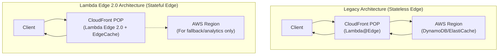
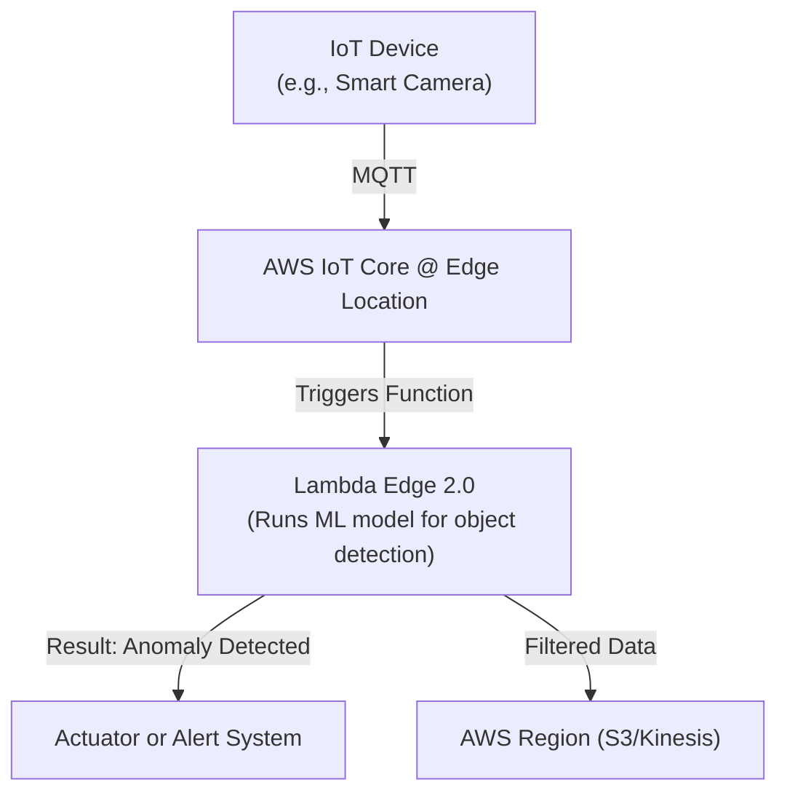

# AWS Lambda Edge 2.0: Serverless Computing Meets Intelligent Edge

For years, AWS Lambda@Edge has been a go-to for running logic at AWS's global network of edge locations. It revolutionized content delivery by enabling dynamic request/response manipulation right at the CDN layer. But the digital landscape is evolving. The demand for real-time AI, interactive experiences, and industrial IoT has pushed the boundaries of what's possible. Enter the next evolution: **Lambda Edge 2.0**. This isn't just an update; it's a fundamental reimagining of serverless at the very edge of the network, transforming it from a simple CDN trigger into a powerful, intelligent compute platform.

### What You'll Get

This article dives deep into the (hypothetical) advancements of Lambda Edge 2.0. You'll get a clear picture of:

*   **Core Architectural Changes:** How Lambda Edge 2.0 moves beyond statelessness and embraces intelligent processing.
*   **Performance Breakthroughs:** The impact of new runtimes like WebAssembly (Wasm) on cold starts and execution speed.
*   **New Integrations:** Native support for AI/ML models and deeper ties into the AWS IoT ecosystem.
*   **Expanded Use Cases:** Practical examples of how these new features unlock next-generation applications.
*   **A Glimpse into the Future:** How this shift impacts cloud architecture and your edge computing strategy.

## From CDN Logic to Edge Intelligence

The original Lambda@Edge was designed to solve a specific problem: customizing content delivered through Amazon CloudFront. It exposed four trigger points in the CDN lifecycle: viewer request, viewer response, origin request, and origin response.

This was perfect for tasks like:
*   A/B testing by modifying cookies.
*   Redirecting users based on country or device.
*   Dynamically resizing images.
*   Adding security headers.

However, it had inherent limitations for more complex workloads. Functions were stateless, had tight resource constraints, and were primarily bound to the HTTP request/response cycle. To build truly intelligent edge applications, we needed more.

> **Info:** The core shift is from *modifying data in transit* to *processing and acting on data at its point of ingestion*. This is the foundational concept behind Lambda Edge 2.0.

## Core Advancements in Lambda Edge 2.0

Lambda Edge 2.0 is built on three pillars: extreme performance, stateful operations, and native intelligence. These capabilities work in concert to create a robust platform for modern, low-latency applications.

### Blazing-Fast Performance with WebAssembly (Wasm) Runtimes

Cold starts have always been the Achilles' heel of serverless functions, especially in latency-sensitive edge scenarios. Lambda Edge 2.0 introduces first-class support for WebAssembly (Wasm) runtimes.

*   **Near-Zero Cold Starts:** Wasm modules have a sandboxed, lightweight design, allowing them to initialize in microseconds, not milliseconds.
*   **Polyglot by Nature:** You can write code in languages like Rust, Go, and C++ and compile it to a highly optimized Wasm binary.
*   **Secure and Efficient:** The Wasm security model provides strong isolation with minimal overhead compared to traditional container-based runtimes.

```rust
// Example: A simple function in Rust, compiled to Wasm
// This could perform a JWT validation at the edge with near-native speed.

#[no_mangle]
pub extern "C" fn handler(event: *const u8, event_len: usize) -> i32 {
    // Logic to validate a token from the incoming request
    // ...
    // Returns a status code (e.g., 0 for success)
    0
}
```

### Stateful Edge: Introducing EdgeCache

Perhaps the most significant advancement is the introduction of a persistent state layer at the edge. Lambda Edge 2.0 integrates with **Amazon EdgeCache**, a new, globally replicated key-value store co-located with edge POPs.

This solves the long-standing problem of statelessness. Now, functions can store session data, user preferences, A/B test configurations, and short-lived authentication tokens directly at the edge, avoiding a slow round-trip to a central database in a primary AWS region.

The diagram below illustrates the architectural simplification.



### Native AI/ML Inference at the Edge

Lambda Edge 2.0 brings machine learning directly to the edge by integrating with **AWS SageMaker Edge Manager**. This allows you to deploy and run optimized ML models for real-time inference.

*   **Low-Latency Predictions:** Perform tasks like fraud detection, content personalization, or image recognition without the network latency of calling a regional SageMaker endpoint.
*   **Optimized Runtimes:** The platform supports lightweight model formats designed for high-performance inference on resource-constrained devices.
*   **Managed Deployments:** Seamlessly manage the lifecycle of your ML models across the global edge network.

| Model Format      | Best For                                     | Typical Size  |
| ----------------- | -------------------------------------------- | ------------- |
| **TensorFlow Lite** | Mobile and embedded devices, general purpose ML | &lt; 1 MB      |
| **ONNX Runtime**  | Framework interoperability, complex models   | 1-10 MB       |
| **PyTorch Mobile**  | Models originally trained in PyTorch         | 1-5 MB        |

### Deeper Integration with the IoT Ecosystem

The connection between the edge and IoT devices is now seamless. Lambda Edge 2.0 can be triggered directly by messages published to **AWS IoT Core**, with the function executing at the edge location closest to the device.

This flow is ideal for pre-processing sensor data, filtering anomalies, or triggering immediate actions before the data is even sent to a central AWS region for storage and analysis.



## Practical Use Cases Unlocked

These new capabilities open the door to applications that were previously impractical or impossible to build at the edge.

*   **Real-Time Multiplayer Gaming:** Use EdgeCache to manage player state and leaderboards with single-digit millisecond latency for a smooth gaming experience.
*   **Interactive AR/VR:** Process gesture recognition or environmental data directly at the edge to provide immediate feedback in augmented and virtual reality applications.
*   **Live Video Stream Personalization:** Insert personalized ads or apply dynamic content overlays to live video streams on the fly, tailored to individual viewers.
*   **Smart Factory Anomaly Detection:** Analyze sensor data from factory floor machinery in real-time, detecting potential failures before they occur and triggering alerts without regional latency.

## The Future is Decentralized and Intelligent

Lambda Edge 2.0 represents a significant step in the great decentralization of cloud computing. The paradigm is shifting from a model where the edge is a simple cache or gateway to one where the edge is a powerful, autonomous compute node.

By moving state, logic, and intelligence closer to end-users and devices, we reduce latency, improve resilience, and unlock a new class of highly responsive and context-aware applications. The central cloud isn't going away; its role is evolving to focus on large-scale data aggregation, heavy-duty model training, and long-term storage, while the edge handles the immediate, real-time interactions.

---

### What's Your Edge Strategy?

The evolution of serverless at the edge from simple CDN logic to an intelligent compute platform is a game-changer. It forces us to rethink how we design and deploy applications. How could these capabilities transform your own products and services? What use cases would you build with stateful, intelligent functions at the edge?


## Further Reading

- [https://aws.amazon.com/lambda/edge/whats-new-2026/](https://aws.amazon.com/lambda/edge/whats-new-2026/)
- [https://docs.aws.amazon.com/lambda/latest/dg/lambda-edge-use-cases.html](https://docs.aws.amazon.com/lambda/latest/dg/lambda-edge-use-cases.html)
- [https://www.forbes.com/sites/2026/05/serverless-edge-ai-aws-next-gen](https://www.forbes.com/sites/2026/05/serverless-edge-ai-aws-next-gen)
- [https://www.infoq.com/articles/aws-lambda-edge-2-deep-dive/](https://www.infoq.com/articles/aws-lambda-edge-2-deep-dive/)
- [https://aws.amazon.com/solutions/case-studies/edge-ai-deployments-2026/](https://aws.amazon.com/solutions/case-studies/edge-ai-deployments-2026/)
