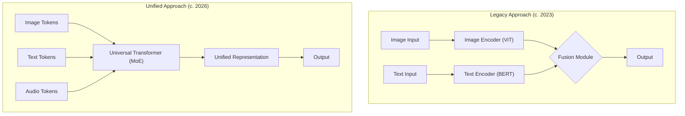

# Beyond Text and Image: The Multimodal AI Revolution of 2026

For years, AI development felt like a series of specialized sprints. We had models that mastered language, others that mastered vision, and a few that awkwardly combined the two. But by 2026, the paradigm has fundamentally shifted. We are no longer just bridging modalities; we are building models that perceive and reason in a unified, holistic way, much like humans do.

The latest generation of AI doesn't just *see* a picture and *read* a caption. It can watch a video, listen to its audio, understand the spoken dialogue, and even infer the physical properties of objects shown. This leap from specialized to universal models is unlocking applications that were pure science fiction just a few years ago. This is the multimodal revolution.

### What You'll Get

*   **Architectural Shifts:** An inside look at the move from siloed encoders to unified multimodal transformers.
*   **Breakthrough Applications:** Concrete examples from robotics, creative industries, and accessibility.
*   **Beyond the Duet:** How models now natively process video, audio, and even haptic (touch) data.
*   **The Road Ahead:** A sober look at the immense challenges that remain, from computational costs to data scarcity.

---

## The Architectural Leap Forward

The secret sauce behind 2026's multimodal prowess isn't just more data or bigger models—it's a fundamental change in architecture. We've moved from stitching separate models together to building single, elegant systems that learn a shared "language" across all types of data.

### From Fusion to Unification

Previously, a typical multimodal system would use a dedicated encoder for each data type (e.g., a ViT for images, a BERT-like model for text) and then use a "fusion" or "cross-attention" module to make them talk to each other. This was effective but clunky.

The 2026 approach is unification. A single, massive transformer backbone, often leveraging a Mixture of Experts (MoE) architecture, processes a combined sequence of tokens from *all* modalities simultaneously.



This unified approach allows the model to learn much deeper, more nuanced correlations between modalities. The relationship between the *sound* of a barking dog, the *image* of a dog, and the *text* "the dog barks" is learned in a shared representation space from the ground up.

### Tokenization is Everything

The key to this unified model is the ability to turn any data input into a sequence of discrete tokens that the transformer can understand. While text tokenization is mature, recent breakthroughs have been in:

*   **Video:** Representing video not as a series of disconnected images, but as spatiotemporal "tubes" or patches that capture motion and time.
*   **Audio:** Using tokenizers like EnCodec to convert raw waveforms or spectrograms into a sequence that preserves acoustic properties.
*   **Haptics & Sensors:** Quantizing streams of data from pressure sensors or tactile arrays into a format the model can correlate with other sensory inputs.

## Breakthrough Applications in 2026

This new architectural paradigm has moved multimodal AI from a research curiosity to a powerful tool reshaping industries.

### Robotics and Embodied AI

Robots are no longer just executing pre-programmed instructions. They are becoming true partners that can understand ambiguous, contextual human commands. An embodied AI model can now process a command like:

> "Hey, can you grab my water bottle from the kitchen counter? It's the blue one, next to the plant. Be careful, the lid isn't on tight."

The model seamlessly integrates:
*   **Audio:** The spoken command.
*   **Vision:** Identifying the kitchen, counter, plant, and the correct blue bottle.
*   **Reasoning:** Inferring that a loose lid requires a more stable, gentle grasp (a "motor plan" informed by visual and linguistic cues).

### Creative Co-Pilots

Content creation is becoming a collaborative dialogue with AI. A director or artist can now generate complex scenes using a mix of inputs. The model acts as an incredibly fast and versatile pre-visualization artist.

Consider this pseudo-prompt for a generative video model:

```python
# Fictional prompt for a 2026 generative model
generate_video(
  prompt="A lone astronaut walks on a crimson desert planet, slow-motion.",
  style_image="path/to/retro_sci-fi_poster.jpg",
  audio_mood="A low, melancholic synth hum, similar to this: [hums melody].",
  duration_seconds=15,
  camera_shot="Low-angle tracking shot, moving from right to left."
)
```
The model doesn't just generate a video from text; it synthesizes the visual style, the audio mood, and the specific cinematic instructions into a coherent whole.

### Redefining Accessibility

For accessibility, multimodal AI is nothing short of revolutionary. We are seeing real-world tools that provide a new level of environmental awareness.

*   **Real-time Environment Description:** Wearables can now capture a live video feed, analyze the sounds in the environment, and provide a rich, descriptive audio summary for a visually impaired user. Example: "A yellow taxi is approaching on your left, and you can hear a street musician playing a guitar to your right."
*   **Universal Translation:** Models can translate spoken language to sign language (as a video avatar) and vice-versa in real-time, breaking down communication barriers.

## Integrating the 'Unseen' Modalities

While text and images are foundational, the true revolution lies in the native integration of more complex, time-series data like video, audio, and haptics.

| Modality | Common Tokenization Method | 2026 Application Example |
| :--- | :--- | :--- |
| **Text** | Subword units (BPE) | High-level reasoning, instruction following |
| **Image** | Vision Transformer (ViT) patches | Scene understanding, object recognition |
| **Audio** | Spectrogram patches or raw waveforms | Speech recognition, mood analysis, sound effects |
| **Video** | Spatiotemporal "tubes" or patches | Action recognition, narrative understanding |
| **Haptics** | Quantized sensor data streams | Robotic grasping, virtual texture rendering |

The integration of haptics is particularly groundbreaking. By training on datasets that pair video of a robot's gripper with the data from its tactile sensors, models are learning the "feeling" of different objects. This allows a robot to visually identify an egg and automatically know to apply a delicate grip, without ever being explicitly programmed for "egg-handling."

## The Challenges and The Road Ahead

Despite the incredible progress, we are far from solving multimodal intelligence. The challenges are as massive as the models themselves.

*   **Computational Cost:** Training a flagship universal model requires data center-scale resources, limiting development to a handful of major labs. Efficiency and algorithmic improvements are critical.
*   **Data Scarcity:** While text and image data are abundant, high-quality, perfectly aligned datasets for video, audio, and especially haptics are still rare and expensive to create.
*   **Interpretability:** As models become more complex and unified, understanding *why* they make a certain decision becomes harder. Peering into the "black box" of a universal representation is a major research frontier.

> "We've taught our models to see and hear in a unified way. The next step is to teach them a unified form of common sense and reasoning. That's not just an engineering problem; it's a scientific one."
> — Fictional quote from a leading AI researcher, 2026.

The journey is far from over. The models of 2026 represent a monumental step towards AI that can perceive, understand, and interact with the world in a way that is finally starting to resemble our own rich, multimodal reality.

What multimodal AI application are you most excited to see become a reality?


## Further Reading

- [https://openai.com/blog/2026/05/multimodal-ai-breakthroughs](https://openai.com/blog/2026/05/multimodal-ai-breakthroughs)
- [https://deepmind.google/blog/2026/05/universal-ai-models/](https://deepmind.google/blog/2026/05/universal-ai-models/)
- [https://www.nature.com/articles/multimodal-ai-2026-review](https://www.nature.com/articles/multimodal-ai-2026-review)
- [https://arxiv.org/abs/2605.12345/multimodal-transformers-next-gen](https://arxiv.org/abs/2605.12345/multimodal-transformers-next-gen)
- [https://www.wired.com/story/2026/05/multimodal-ai-human-like-understanding](https://www.wired.com/story/2026/05/multimodal-ai-human-like-understanding)
