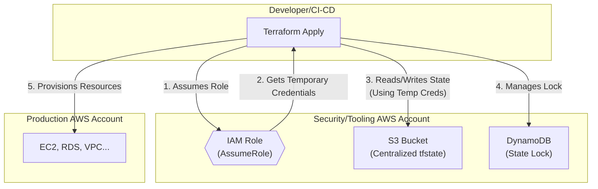

# Securing Terraform State: Best Practices in a Multi-Cloud World

Terraform state is the heart of your infrastructure management. The `terraform.tfstate` file is a sensitive artifact, often containing credentials, private keys, and a detailed map of your cloud infrastructure. Leaving it unprotected is like leaving the blueprints and keys to your digital kingdom on a public bench. In a complex, multi-cloud environment, the risk multiplies.

This guide moves beyond the basics, offering advanced, actionable best practices for locking down your Terraform state. We'll cover encryption, granular access control, secret management, and auditing to build a robust defense-in-depth strategy.

### What You'll Get

*   **Foundational Security:** Why remote state is non-negotiable and how to implement encryption at rest and in transit.
*   **Advanced Access Control:** How to apply the Principle of Least Privilege (PoLP) using IAM in a multi-account setup.
*   **Secret Management Integration:** Techniques to decouple secrets from your state file entirely.
*   **Auditing and Monitoring:** Strategies to track state access and detect potential compromises.
*   **Actionable Code Snippets:** Practical examples for AWS S3 backend configuration, IAM policies, and secret retrieval.

## The Core Challenge: State Files are a Prime Target

A Terraform state file is a JSON file that stores the mapping between your configuration and the real-world resources it manages. It's how Terraform knows what it created, what to update, and what to destroy.

This file can inadvertently store sensitive data, including:
*   Database passwords passed as resource attributes.
*   Private keys for virtual machines.
*   API credentials for third-party services.
*   A complete inventory of your cloud resources, IPs, and relationships.

Compromise of this file can lead to data breaches, infrastructure takedowns, or lateral movement across your cloud environments.

> **Note:** Never, ever commit `terraform.tfstate` files to your version control system like Git. Add `*.tfstate` and `*.tfstate.*` to your project's `.gitignore` file immediately.

## Foundational Security Measures

Before tackling advanced topics, ensure these fundamentals are in place. They represent the bare minimum for secure state management.

### Use a Remote Backend

Storing state on your local machine is fine for a personal project, but it's a security and collaboration anti-pattern for teams. Remote backends centralize state, making it accessible for team members and CI/CD pipelines while enabling crucial security features.

Popular choices include:
*   **AWS S3**
*   **Azure Blob Storage**
*   **Google Cloud Storage (GCS)**
*   **Terraform Cloud / Enterprise**

### Enforce Encryption at Rest

Your cloud provider offers robust, server-side encryption for storage services. You should always enable it. This protects your state file data if the underlying storage media is compromised.

For an AWS S3 backend, this is straightforward.

```hcl
# backend.tf
terraform {
  backend "s3" {
    bucket         = "my-secure-terraform-state-bucket-unique"
    key            = "global/networking/terraform.tfstate"
    region         = "us-east-1"
    encrypt        = true # Enforces server-side encryption
    dynamodb_table = "terraform-state-lock-table"
  }
}
```

This simple `encrypt = true` flag ensures AWS S3 encrypts your state file using its managed keys (SSE-S3). For enhanced security, you can specify your own customer-managed key (CMK) from AWS KMS.

### Ensure Encryption in Transit

This is typically handled by default. All major cloud storage backends require HTTPS for API communication. This means your state file is encrypted with TLS as it travels between your machine (or CI/CD runner) and the remote backend. There's usually no extra configuration required, but it's critical to be aware of.

## Advanced Access Control Strategies

Encryption is a great start, but controlling *who* and *what* can access the state file is just as important.

### Apply the Principle of Least Privilege (PoLP)

Grant only the minimum permissions necessary for a user or service to perform its job. For a CI/CD pipeline, this means it should only have `read` and `write` access to the specific state file it manages, not the entire S3 bucket.

Here’s an example AWS IAM policy that grants access to a specific path within a bucket:

```json
{
    "Version": "2012-10-17",
    "Statement": [
        {
            "Effect": "Allow",
            "Action": [
                "s3:GetObject",
                "s3:PutObject"
            ],
            "Resource": "arn:aws:s3:::my-secure-terraform-state-bucket-unique/global/networking/terraform.tfstate"
        },
        {
            "Effect": "Allow",
            "Action": "s3:ListBucket",
            "Resource": "arn:aws:s3:::my-secure-terraform-state-bucket-unique",
            "Condition": {
                "StringLike": {
                    "s3:prefix": [
                        "global/networking/*"
                    ]
                }
            }
        }
    ]
}
```

### Isolate State for Different Environments

Do not use a single state file for all your environments (dev, staging, prod). A breach of a less-secure development environment could expose your production infrastructure.

| Strategy | Benefit |
| --- | --- |
| **Separate Buckets** | Maximum isolation. Different IAM policies per bucket. |
| **Separate Paths (Keys)** | Simpler management, but requires more precise IAM policies. |
| **Separate Workspaces** | Terraform's built-in way to manage multiple states with one configuration. |

A common best practice is to use a dedicated cloud account (e.g., an AWS "Security" or "Tooling" account) to host the state buckets for all other environments. CI/CD pipelines and users then assume a role into this account to access the state before deploying resources into target accounts.

This cross-account model centralizes and simplifies auditing.



### Use State Locking

State locking prevents two users from running `terraform apply` at the same time, which can lead to state corruption, duplicate resources, or race conditions. This is a critical feature for any team.

*   **AWS S3:** Use a DynamoDB table.
*   **Azure Blob Storage:** Uses the blob's native leasing mechanism.
*   **Google Cloud Storage:** Does not have a native locking mechanism; use Terraform Cloud or implement a custom solution.

The S3 backend configuration shown earlier already includes the `dynamodb_table` argument to enable this.

## Decoupling Secrets from State

The most effective way to protect secrets is to *never* put them in your Terraform configuration or state file in the first place.

Use a dedicated secrets management tool and reference the secrets dynamically using data sources.

### Before: Hardcoded Secret (Bad Practice)

```hcl
# DON'T DO THIS
resource "aws_db_instance" "default" {
  # ... other configuration
  password = "MySuperSecretPassword123!" # This ends up in the state file in plain text
}
```

### After: Dynamic Secret Retrieval

First, store your password in a secret manager like AWS Secrets Manager. Then, use a data source to fetch it at runtime.

```hcl
# GOOD PRACTICE
data "aws_secretsmanager_secret_version" "db_password" {
  secret_id = "production/database/master_password"
}

resource "aws_db_instance" "default" {
  # ... other configuration
  password = data.aws_secretsmanager_secret_version.db_password.secret_string
}
```
The secret value is fetched during the `plan` and `apply` phases but is *not* stored in the `terraform.tfstate` file. Instead, the state file only records that the value comes from the data source.

Popular choices for secret management include:
*   [HashiCorp Vault](https://www.vaultproject.io/)
*   [AWS Secrets Manager](https://aws.amazon.com/secrets-manager/)
*   [Azure Key Vault](https://azure.microsoft.com/en-us/products/key-vault)
*   [Google Secret Manager](https://cloud.google.com/secret-manager)

## Auditing and Monitoring Your State

Continuously monitoring access to your state is crucial for incident detection and response.

### Enable Backend Access Logging

Your storage backend can log every single access request. Enable this feature to create an audit trail.
*   **AWS S3:** Use [Server Access Logging](https://docs.aws.amazon.com/AmazonS3/latest/userguide/ServerLogs.html) or CloudTrail data events.
*   **Azure Blob Storage:** Use [Azure Storage analytics logging](https://docs.microsoft.com/en-us/azure/storage/common/storage-analytics-logging).
*   **Google Cloud Storage:** Use [Cloud Audit Logs](https://cloud.google.com/storage/docs/audit-logging).

Analyze these logs for suspicious activity, such as access from unexpected IP addresses, unauthorized principals, or unusually frequent `GetObject` calls.

### Scan for Sensitive Data

While the goal is to keep secrets out of state, mistakes can happen. Use tools that can scan your Terraform plans or state files for inadvertently included secrets *before* they are applied or committed. Tools like [tfsec](https://github.com/aquasecurity/tfsec) or [Terrascan](https://github.com/tenable/terrascan) can help enforce policies and find sensitive data in your HCL code.

## Summary: A Layered Defense

Securing Terraform state isn't about a single solution; it's about building a defense-in-depth strategy. By combining remote backends, encryption, granular IAM policies, dynamic secret retrieval, and robust auditing, you can significantly reduce your risk profile.

Treat your state file with the same level of security as your most critical production database. It holds the keys to your infrastructure, and protecting it is paramount.

What strategies and tools are you currently using to manage and secure your Terraform state? Share your approach in the comments below


## Further Reading

- [https://docs.terraform.io/latest/language/state/security-best-practices](https://docs.terraform.io/latest/language/state/security-best-practices)
- [https://www.hashicorp.com/blog/terraform-state-management-advanced-security](https://www.hashicorp.com/blog/terraform-state-management-advanced-security)
- [https://cloudsecurityalliance.org/research/terraform-state-security-guidelines-2026](https://cloudsecurityalliance.org/research/terraform-state-security-guidelines-2026)
- [https://www.cncf.io/blog/2026/05/securing-iac-in-multi-cloud/](https://www.cncf.io/blog/2026/05/securing-iac-in-multi-cloud/)
- [https://www.databricks.com/resources/ebooks/terraform-security-for-enterprises](https://www.databricks.com/resources/ebooks/terraform-security-for-enterprises)
