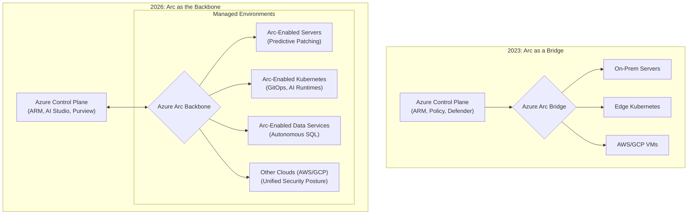
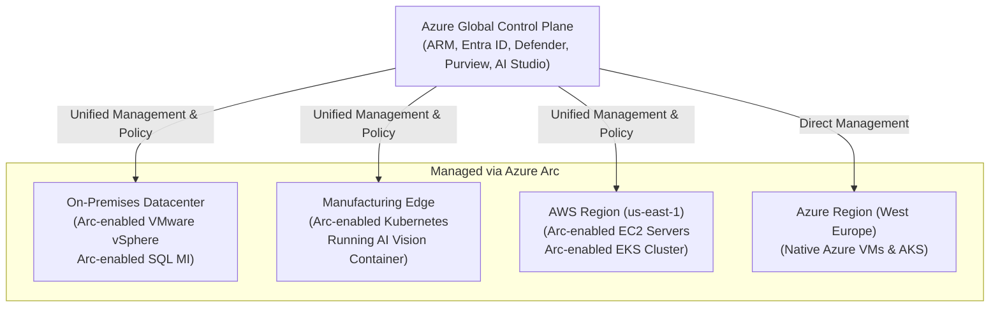

# Azure Arc's Hybrid Cloud Evolution: A Look at the 2026 Landscape

Azure Arc began as a bridge, a way to project non-Azure resources into the Azure Resource Manager (ARM) control plane. By 2026, that bridge has evolved into the central nervous system for distributed enterprise computing. It's no longer just about visibility; it's about unified control, intelligent automation, and delivering cloud-native services anywhere. This shift is fundamental for organizations navigating the complexities of hybrid, multi-cloud, and edge environments.

This article analyzes the strategic capabilities of Azure Arc in the 2026 landscape, moving beyond today's features to explore how it underpins the next generation of digital infrastructure.

### What You'll Get

*   **Projected Capabilities:** A look at the key Azure Arc features defining hybrid operations in 2026.
*   **AI and Data at the Edge:** Analysis of how Arc delivers Azure AI and data services beyond the public cloud.
*   **Unified Operations:** An architectural view of a truly unified control plane.
*   **Adoption & Challenges:** Real-world adoption patterns and the hurdles that remain.

---

## The Evolution from Bridge to Backbone

The initial promise of Azure Arc was to provide a "single pane of glass." While valuable, this was a passive role. The 2026 reality is an active one, where Arc is the *backbone* for policy enforcement, security, and application delivery across a distributed estate.

This evolution means moving from simple inventory and tagging to comprehensive lifecycle management. It's the difference between seeing a server in your on-premises data center and being able to deploy a containerized AI model to it using the same `az` CLI command you'd use for a cloud VM.



This architectural shift empowers organizations to stop thinking in terms of "cloud" vs. "on-prem" and start thinking about a single, fluid pool of compute and data resources.

## Key Capabilities in the 2026 Arc Ecosystem

By 2026, Azure Arc is no longer a collection of "enabled" services but a deeply integrated platform. Three areas highlight this maturity: AI operations, sovereign data, and true multi-cloud governance.

### Unified AI Operations: From Cloud to Edge

The demand for real-time inference and data privacy has pushed AI models to the edge. Azure Arc is the critical enabler for managing this distributed AI landscape. It allows organizations to use Azure AI Studio as a single MLOps control plane for models deployed anywhere.

*   **Containerized Azure AI Services:** Deploy pre-built Azure AI services (like Vision, Speech, or Form Recognizer) as containers on any Arc-enabled Kubernetes cluster. This brings cloud intelligence to disconnected or low-latency environments.
*   **Consistent MLOps Pipelines:** A developer can train a model in Azure Machine Learning, package it, and use a GitOps-based workflow to deploy it to thousands of retail stores or factory floors simultaneously.
*   **Hardware Acceleration Management:** Arc provides an abstraction layer to target specific hardware at the edge (e.g., GPUs, TPUs) without changing the deployment workflow in Azure.

Here is a hypothetical example of deploying a vision model to an edge cluster named `factory-floor-k8s`:

```bash
# Define the Arc-enabled Kubernetes cluster as the deployment target
az ml compute attach --resource-group my-rg --name factory-floor-k8s \
  --type kubernetes --resource-id "/subscriptions/.../arc-clusters/factory-floor-k8s"

# Deploy a registered model from the Azure ML workspace to the edge
az ml model deploy --name "conveyor-belt-vision-model" \
  --compute-target factory-floor-k8s --ic inference_config.json
```

### Sovereign Data and Autonomous Databases

Data gravity and sovereignty are non-negotiable for many industries. Arc-enabled data services have matured from managed instances to semi-autonomous platforms that respect data residency while benefiting from cloud intelligence.

*   **AI-Powered Performance Tuning:** Azure's AI-driven performance and security recommendations for SQL are now applied directly to Arc-enabled SQL Managed Instances running on-premises. The system analyzes local query patterns and suggests index changes or flags security vulnerabilities without the data ever leaving the private network.
*   **Zero-Downtime Patching:** Leveraging Kubernetes' rolling update capabilities, Arc automates security patching and version upgrades for on-premises SQL and PostgreSQL databases with minimal disruption.
*   **Unified Governance with Microsoft Purview:** Arc agents feed metadata from on-prem data sources directly into [Microsoft Purview](https://azure.microsoft.com/en-us/products/purview). This allows a data officer to discover, classify, and apply access policies to a SQL database in a Frankfurt data center and an Azure Synapse workspace from a single interface.

### True Multi-Cloud Governance and Security

By 2026, managing multi-cloud isn't just about visibility—it's about consistent enforcement. Arc acts as the enforcement agent for [Microsoft Defender for Cloud](https://azure.microsoft.com/en-us/products/defender-for-cloud) and [Azure Policy](https://azure.microsoft.com/en-us/products/azure-policy) across Azure, AWS, and GCP.

| Capability | 2023 Status | 2026 Projected Status |
| :--- | :--- | :--- |
| **Security Posture** | Recommendations & alerts from AWS/GCP | **Automated remediation** of misconfigurations on AWS/GCP resources via Azure Policy. |
| **Policy Enforcement** | Auditing of OS-level configs (Guest Config) | Granular, real-time policy enforcement on **non-Azure IaaS and PaaS** configurations. |
| **Threat Detection** | Defender for Servers on non-Azure VMs | **Unified EDR/XDR** across all clouds, correlating signals from an on-prem server and an AWS Lambda function. |
| **Cost Management** | Basic cost tagging and visibility | **Predictive cost optimization** and rightsizing recommendations for AWS and GCP VMs in Azure Advisor. |

> "The goal of a hybrid control plane is not just to see everything, but to control everything. By 2026, leaders will leverage platforms like Azure Arc to apply a single security and operational baseline everywhere, dramatically reducing complexity and risk." - *Gartner, Hybrid Cloud Management Trends (paraphrased)*

## The Architecture of a 2026 Hybrid Environment

A typical enterprise in 2026 no longer has a simple "on-prem vs. cloud" architecture. It has a distributed fabric of compute, and Azure Arc is the thread that ties it all together.


In this model, an operator uses one set of tools (Azure Portal, CLI, Terraform) to manage resources regardless of their physical location.

## Adoption Patterns and Lingering Challenges

The adoption of this advanced hybrid model is strongest where data locality, low latency, or legacy systems are business-critical.

*   **Retail:** Using Arc to manage in-store Kubernetes clusters for point-of-sale systems and AI-driven inventory management.
*   **Manufacturing:** Deploying predictive maintenance models directly onto factory floor equipment via Arc-enabled servers.
*   **Finance & Healthcare:** Running Arc-enabled data services in private data centers to meet strict data sovereignty and compliance requirements.

However, challenges remain:
*   **Connectivity:** While Arc supports disconnected scenarios, true unified management relies on stable connectivity. Far-edge locations with intermittent connections still pose an operational challenge.
*   **Skill Gap:** Teams need to be fluent in both cloud-native practices (IaC, GitOps, Kubernetes) and traditional infrastructure management. This "hybrid engineer" role is in high demand.
*   **Abstraction Complexity:** While Arc unifies management, it doesn't eliminate the underlying complexity. Troubleshooting a network issue on an Arc-enabled EKS cluster in AWS still requires AWS-specific knowledge.

## The Road Ahead

Azure Arc's journey by 2026 establishes it as the de facto standard for managing distributed IT estates. It successfully blurs the lines between cloud, edge, and on-premises. The focus now shifts toward deeper abstraction and greater autonomy. By 2030, we can imagine a world where Arc intelligently places workloads based on cost, latency, and compliance policies, creating a truly self-driving hybrid cloud.

What does your organization's hybrid cloud journey look like? Where do you see the biggest challenges and opportunities in unifying your own distributed environments?


## Further Reading

- [https://azure.microsoft.com/en-us/blog/2026/05/azure-arc-roadmap-and-innovations/](https://azure.microsoft.com/en-us/blog/2026/05/azure-arc-roadmap-and-innovations/)
- [https://docs.microsoft.com/en-us/azure/azure-arc/overview](https://docs.microsoft.com/en-us/azure/azure-arc/overview)
- [https://www.gartner.com/en/articles/hybrid-cloud-management-trends-2026](https://www.gartner.com/en/articles/hybrid-cloud-management-trends-2026)
- [https://www.zdnet.com/article/microsoft-azure-arc-multi-cloud-strategy/](https://www.zdnet.com/article/microsoft-azure-arc-multi-cloud-strategy/)
- [https://techcommunity.microsoft.com/t5/azure-arc-blog/azure-arc-for-ai-ml-in-2026/](https://techcommunity.microsoft.com/t5/azure-arc-blog/azure-arc-for-ai-ml-in-2026/)
