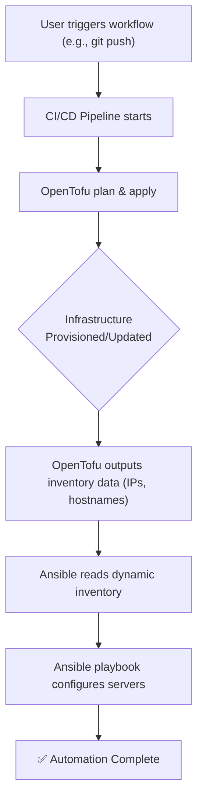
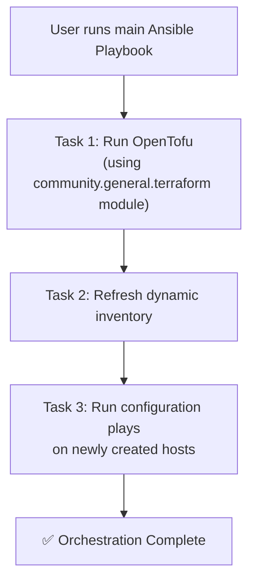
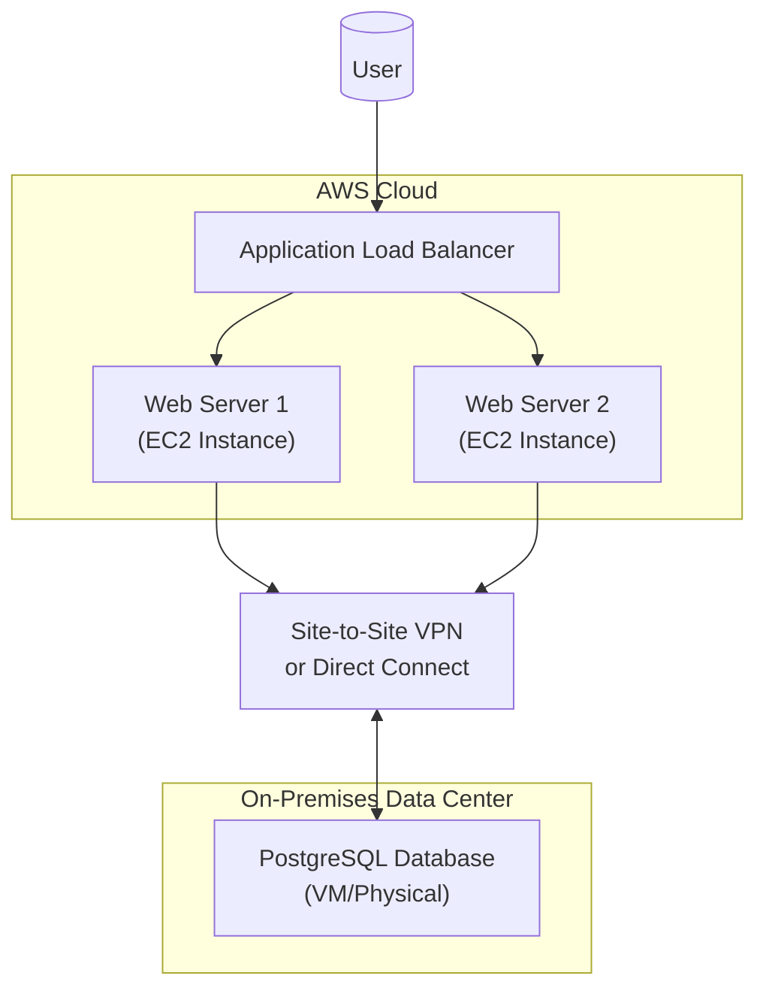

# Ansible & OpenTofu: Automating Hybrid Cloud with Declarative IaC

Managing hybrid cloud environments is a masterclass in complexity. You're juggling on-premises data centers with multiple public cloud providers, each with its own API, resource lifecycle, and quirks. To tame this beast, you need automation that is both powerful and coherent. Enter the dynamic duo: OpenTofu for declarative infrastructure provisioning and Ansible for imperative configuration management.

Separately, they are excellent. Together, they form a comprehensive automation strategy that bridges the gap between infrastructure creation and application deployment. This article explores advanced strategies for integrating them to achieve true end-to-end automation across your hybrid landscape.

### What You'll Get

By the end of this article, you will understand:

*   The complementary roles of OpenTofu and Ansible.
*   Proven integration patterns for a cohesive workflow.
*   Best practices for managing state, dynamic inventory, and secrets.
*   A practical, high-level example of a hybrid cloud deployment.

## The 'Why': OpenTofu Provisions, Ansible Configures

The most effective automation toolchains leverage tools for their intended purpose. The synergy between OpenTofu and Ansible stems from their differing but complementary philosophies.

*   **OpenTofu** is *declarative*. You define the *desired state* of your infrastructure—like "I want three EC2 instances of this type and one Azure SQL database"—and OpenTofu figures out how to make it happen. It excels at building the foundational components: networks, servers, databases, and load balancers.
*   **Ansible** is primarily *imperative* (though it has declarative modules). You define a series of *tasks* to be executed in order to reach a desired state—like "install nginx, copy this config file, and then restart the service." It excels at configuring the software *inside* those foundational components.

Think of it like building a house. OpenTofu erects the foundation, walls, and roof. Ansible comes in afterward to install the plumbing, wire the electricity, and paint the walls.

| Feature               | OpenTofu                                  | Ansible                                        |
| --------------------- | ----------------------------------------- | ---------------------------------------------- |
| **Primary Domain**    | Infrastructure as Code (IaC)              | Configuration Management (CM) & Orchestration  |
| **Approach**          | Declarative (describes the "what")        | Imperative (describes the "how")               |
| **Core Function**     | Provision, modify, and version resources  | Configure software, deploy apps, manage services |
| **State Management**  | Manages a state file to track resources   | Generally stateless (gathers facts on execution) |
| **Target**            | Cloud APIs, SaaS providers, on-prem hypervisors | Servers (Linux, Windows), network devices      |

## Integration Patterns: Making Them Work Together

Connecting these two tools isn't just possible; it's a well-established practice. Here are the two most effective patterns for a seamless workflow.

### Pattern 1: The Classic OpenTofu -> Ansible Handoff

This is the most common and straightforward approach. The workflow is sequential: OpenTofu runs first to build the infrastructure, and its output is used as the inventory for Ansible to perform the configuration.



The key is the handoff mechanism. OpenTofu can be configured to output machine-readable data, typically in JSON format, which Ansible can then consume.

**OpenTofu Output (`outputs.tf`)**

This HCL block defines what data to export after a successful `apply`.

```hcl
# outputs.tf

output "web_servers_ips" {
  description = "Public IP addresses of the web servers"
  value       = [for instance in aws_instance.web : instance.public_ip]
}

output "database_server_ip" {
  description = "Private IP address of the database server"
  value       = aws_instance.db.private_ip
}
```

Ansible then uses a **dynamic inventory** script to parse this JSON output. Instead of a static `hosts` file, you point Ansible to a script that fetches the current infrastructure details directly from the OpenTofu state.

> **Pro Tip:** Use the [Ansible community dynamic inventory script for Terraform/OpenTofu](https://github.com/ansible-community/dynamic-inventory-for-terraform). It can read the state file directly, making the handoff process incredibly smooth and eliminating the need for custom output parsing.

### Pattern 2: The Ansible-Driven Workflow

For teams that prefer a single point of orchestration, Ansible can be used to drive the entire process, including calling OpenTofu. This centralizes control within an Ansible Playbook.

The `community.general.terraform` Ansible module (which works perfectly with the `opentofu` binary) allows you to execute OpenTofu plans and applies as tasks within a playbook.



**Ansible Playbook Snippet (`deploy.yml`)**

This example shows an Ansible playbook orchestrating an OpenTofu deployment.

```yaml
---
- name: Provision Infrastructure and Configure Application
  hosts: localhost
  connection: local
  gather_facts: no

  tasks:
    - name: Provision infrastructure with OpenTofu
      community.general.terraform:
        project_path: 'opentofu/'
        state: present
        # Point to the opentofu binary if not in PATH
        # binary_path: /usr/local/bin/tofu
      register: tofu_output

    - name: Add new hosts to in-memory inventory
      ansible.builtin.add_host:
        name: "{{ item }}"
        groups: webservers
      loop: "{{ tofu_output.outputs.web_servers_ips.value }}"

- name: Configure Web Servers
  hosts: webservers
  become: yes

  tasks:
    - name: Install Nginx
      ansible.builtin.apt:
        name: nginx
        state: present
        update_cache: yes
```

This pattern is excellent for integrating IaC into existing Ansible-centric automation frameworks.

## Best Practices for a Seamless Workflow

To move from basic integration to robust automation, consider these best practices.

### Managing State and Inventory

*   **Use Remote State for OpenTofu:** Never store OpenTofu state files (`.tfstate`) locally or in Git. Use a remote backend like an S3 bucket, Azure Blob Storage, or Terraform Cloud. This provides locking to prevent concurrent runs from corrupting state and makes it accessible to all team members and CI/CD systems.
*   **Embrace Dynamic Inventory for Ansible:** Static inventory files are a liability in a dynamic cloud environment. A dynamic inventory script that queries your cloud provider or OpenTofu state file ensures Ansible *always* has an up-to-date list of hosts to manage.

### Handling Secrets Securely

Hardcoding secrets is a cardinal sin of automation. Your hybrid cloud setup will inevitably involve database passwords, API keys, and SSL certificates.

*   **Ansible Vault:** For secrets used exclusively by Ansible, [Ansible Vault](https://docs.ansible.com/ansible/latest/vault_guide/index.html) is a great built-in solution. It encrypts sensitive variables within your playbook repository.
*   **External Secret Managers:** For secrets shared between OpenTofu, Ansible, and your applications, a dedicated secrets manager is the gold standard. Tools like [HashiCorp Vault](https://www.vaultproject.io/) or cloud-native services (AWS Secrets Manager, Azure Key Vault) provide centralized, auditable, and highly secure secrets management.

| Method                  | Pros                                                | Cons                                                       |
| ----------------------- | --------------------------------------------------- | ---------------------------------------------------------- |
| **Ansible Vault**       | Integrated, simple setup, good for Ansible-only secrets. | Decryption key must be managed, not ideal for non-Ansible use. |
| **External Manager**    | Centralized, auditable, API-driven, language-agnostic. | Adds an extra component to manage, more complex setup.     |

## A Practical Hybrid Cloud Example

Let's imagine a scenario: deploy a public-facing web application on **AWS** that needs to connect to a legacy database running in an **on-premises data center** (or another cloud like GCP for simulation).

**Architecture Overview**



**The Workflow**

1.  **OpenTofu Defines All Resources:** A single OpenTofu project defines the AWS VPC, subnets, ALB, security groups, and EC2 instances. It also defines a placeholder resource or data source representing the on-prem database to retrieve its IP address.
2.  **OpenTofu Applies Changes:** Running `tofu apply` builds the AWS environment and establishes the network connectivity (e.g., configures the VPN gateway).
3.  **OpenTofu Outputs Inventory:** The state file now contains the public IPs of the new EC2 instances and the private IP of the on-prem database.
4.  **Ansible Dynamic Inventory Runs:** An inventory script queries the OpenTofu state, creating two groups in-memory: `[web_servers]` and `[database_servers]`.
5.  **Ansible Playbook Executes:**
    *   A play targeting `web_servers` installs the application, configures the web server, and uses the database IP (passed as a variable) to set the database connection string.
    *   A separate play targeting `database_servers` could be used to apply schema updates or manage database users.

## Conclusion: The Declarative and Imperative Power Duo

OpenTofu and Ansible are not competing tools; they are two sides of the same automation coin. By leveraging OpenTofu for its declarative infrastructure provisioning and Ansible for its robust configuration management, you create a powerful, repeatable, and transparent process for managing complex hybrid cloud environments.

This combination reduces manual errors, increases deployment speed, and provides a clear audit trail from infrastructure definition to application configuration. By adopting these patterns and best practices, your team can move beyond simple scripting and achieve true end-to-end automation.


## Further Reading

- [https://www.ansible.com/blog/2026/05/integrating-opentofu-with-ansible](https://www.ansible.com/blog/2026/05/integrating-opentofu-with-ansible)
- [https://opentofu.org/docs/integrations/ansible](https://opentofu.org/docs/integrations/ansible)
- [https://www.redhat.com/en/blog/ansible-automation-platform-hybrid-cloud-2026](https://www.redhat.com/en/blog/ansible-automation-platform-hybrid-cloud-2026)
- [https://www.infoq.com/articles/declarative-automation-ansible-opentofu/](https://www.infoq.com/articles/declarative-automation-ansible-opentofu/)
- [https://community.aws.amazon.com/blogs/ansible-opentofu-gcp-azure-integration](https://community.aws.amazon.com/blogs/ansible-opentofu-gcp-azure-integration)
