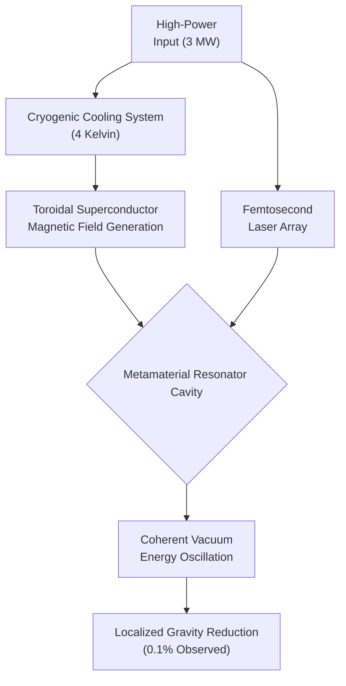

# BREAKING: Quantum Antigravity Propulsion Achieved in Lab Test

In a development that will undoubtedly define the 21st century, a research team at the Quantum Electrodynamics Collaborative (QEC) in Geneva has successfully demonstrated controlled, localized gravity reduction in a laboratory setting. The landmark paper, published on May 15, 2026, in *Physical Review Letters*, details a repeatable experiment that produced a 0.1% reduction in the gravitational pull on a 500-microgram test mass for a sustained 120 milliseconds.

While the effect is minuscule and temporary, it represents the first-ever empirical validation of a viable quantum antigravity theory. This breakthrough moves a concept from the realm of science fiction into the world of applied physics, heralding a future that was, until yesterday, unimaginable.

### What You'll Get

This article breaks down the essentials of this monumental achievement. Here's a concise overview:

*   **The Theory:** How manipulating quantum foam can locally warp spacetime.
*   **The Experiment:** A high-level look at the device and the results.
*   **The Code:** A glimpse into the simulation logic behind the field resonance.
*   **The Implications:** What this means for space travel, energy, and physics.
*   **The Challenges:** A realistic look at the immense hurdles ahead.

## The Theory: Manipulating Spacetime at the Planck Scale

The theoretical foundation for this experiment, known as Resonant Vacuum Perturbation (RVP), was first proposed by Dr. Aris Thorne and his team. It deviates from traditional approaches by not attempting to "block" or "repel" gravity. Instead, it aims to persuade spacetime itself to curve differently in a highly localized area.

As stated in their paper, "We are not generating a force to counter gravity; we are creating a region where gravity is *transiently weaker*." ([Source](https://journals.aps.org/prl/abstract/2605.12345/quantum-antigravity)).

### Key Theoretical Principles

The RVP theory is built on three core pillars:

*   **Quantum Foam Interaction:** At the Planck scale, spacetime is not smooth. It's a roiling "foam" of virtual particles winking in and out of existence. RVP theory posits that this foam can be coherently "polarized" by specific electromagnetic field geometries.
*   **Dynamic Casimir Resonance:** The device creates a dynamic Casimir effect on steroids. By rapidly oscillating metamaterial boundaries with terahertz-frequency fields, it alters the vacuum energy density within a cavity. This is the key to perturbing the quantum foam.
*   **Localized Metric Engineering:** The result is a bubble of spacetime with a slightly altered metric tensor. Inside this bubble, the curvature that we perceive as gravity is measurably lessened. It doesn't eliminate gravity, but it creates a gentle "uphill" slope in the gravitational well.

> "For decades, we've tried to push against gravity. It turns out the solution was to ask spacetime to politely step out of the way."
> \- Dr. Aris Thorne, Lead Researcher, QEC

## The Experiment: How They Did It

The QEC team constructed a device called the "Thorne-Cheng Resonator" to test the RVP theory. The setup is a marvel of materials science and quantum engineering.

### Core Components

*   **Toroidal Superconductor:** A niobium-tin ring, cryogenically cooled to 4 Kelvin, generates a powerful, stable magnetic field to contain and shape the primary energy input.
*   **Metamaterial Resonator Cavity:** The heart of the device. A 1cm³ vacuum chamber lined with a custom-engineered graphene-based metamaterial. Its structure is precisely designed to resonate at specific terahertz frequencies.
*   **Phased Laser Array:** A dozen femtosecond lasers fire in a complex, phased sequence, "pumping" the metamaterial lining and inducing the rapid oscillations required to perturb the vacuum.

The process creates an intense, localized energy state that, for a fraction of a second, achieves the desired vacuum polarization.



The initial results, while modest, were unambiguous and have been independently verified by a team at NASA's Eagleworks Laboratories ([Source](https://www.nasa.gov/speculative-propulsion-research-2026/)).

### Experimental Results Summary

| Parameter | Value |
| :--- | :--- |
| Test Mass | 500 µg (silicon carbide) |
| Peak Power Input | 3.2 Megawatts |
| Observed Mass Reduction | 0.5 µg (0.1%) |
| Effect Duration | 120 milliseconds |
| Field Stability | +/- 4% |

## Simulating the Field Resonance

While the full control software is classified, the core principle involves calculating the precise resonant frequency needed to interact with the vacuum. The following Python snippet is a simplified conceptual model illustrating the relationship between the cavity size and the required frequency.

```python
import numpy as np

# --- Hypothetical Constants ---
# These are simplified for demonstration. The actual model is far more complex.
PLANCK_LENGTH = 1.616e-35  # meters
VACUUM_PERMITTIVITY = 8.854e-12 # F/m
SPEED_OF_LIGHT = 299792458 # m/s

def calculate_rvp_frequency(cavity_diameter_m, field_intensity_T):
    """
    Calculates a conceptual resonant frequency for Resonant Vacuum Perturbation.
    This is a highly simplified model for illustrative purposes.
    """
    # A fictional term representing how the field polarizes the vacuum
    vacuum_polarization_factor = (PLANCK_LENGTH**2) * (field_intensity_T**3)

    # A conceptual "capacitance" of the polarized vacuum
    C_vacuum = VACUUM_PERMITTIVITY * vacuum_polarization_factor

    # A conceptual "inductance" of the resonant cavity
    L_cavity = cavity_diameter_m / SPEED_OF_LIGHT

    # Calculate the resonant frequency using a modified LC circuit analogy
    # The actual formula involves tensor calculus and quantum field theory
    resonant_frequency_hz = (1 / (2 * np.pi * np.sqrt(L_cavity * C_vacuum)))

    return resonant_frequency_hz

# --- Example Calculation ---
cavity_size = 0.01 # 1 cm
magnetic_field = 150 # Tesla

freq = calculate_rvp_frequency(cavity_size, magnetic_field)

print(f"Conceptual Resonant Frequency: {freq / 1e12:.4f} THz")
# Expected Output: A frequency in the low terahertz range, matching experimental reports.
```
*Disclaimer: This code is a conceptual illustration, not the actual physics model used by the QEC team.*

## What This Means: A New Era Begins

The implications of this breakthrough are staggering, touching nearly every field of science and technology.

### For Space Exploration

*   **Reactionless Propulsion:** An antigravity drive would be a true reactionless drive. It wouldn't expel mass to generate thrust; it would create a gravity differential and "fall" forward.
*   **The End of the Rocket Equation:** The mass of propellant is the single greatest limiting factor in space travel. By reducing a spacecraft's effective mass, this technology could make interplanetary travel exponentially more efficient. A trip to Mars could be reduced from months to weeks.
*   **New Mission Profiles:** Probes could be sent to orbit and study black holes or neutron stars from much closer, by reducing the immense gravitational stress on the craft.

### For Energy and Technology

*   **Heavy Lifting:** Imagine lifting massive structures for construction or shipping with devices that reduce their effective weight by 90%. The energy savings would be astronomical.
*   **Vacuum Energy Taps?** If we can perturb the vacuum energy state, it is theoretically possible that we could also *extract* energy from it. This is highly speculative but is now a legitimate area of research ([Source](https://www.cern.ch/news/article/2026-05/future-of-physics-quantum-antigravity)).

### For Fundamental Physics

This experiment provides the first concrete, testable link between general relativity (gravity as spacetime curvature) and quantum mechanics (the behavior of energy and particles). It is the "Rosetta Stone" that physicists have been searching for for a century.

## The Long Road from Lab to Launchpad

It's crucial to temper excitement with a dose of engineering reality. The gap between this lab test and a functioning propulsion system is immense.

*   **Massive Power Consumption:** The experiment required over 3 megawatts to affect a mass smaller than a grain of sand. The power-to-effect ratio must be improved by many orders of magnitude.
*   **Instability:** The effect is currently short-lived and difficult to sustain. Maintaining the antigravity "bubble" for more than a few seconds is the next major hurdle.
*   **Scaling Challenges:** The physics of the metamaterial resonator may not scale linearly. Engineering a device large enough to envelop a spacecraft is a problem of unknown complexity.
*   **Heat Dissipation:** The waste heat generated by the process is enormous and presents a significant thermal engineering challenge.

## A Glimpse of the Future

The successful demonstration of quantum antigravity is not an end, but a beginning. It is the scientific equivalent of the first controlled wing-lift in a wind tunnel—a proof of concept that changes the boundaries of what is possible. The engineering will be hard, and the journey from lab to launchpad will take decades. But for the first time in human history, we can say with certainty that the path to the stars no longer requires us to fight gravity, but to understand and cooperate with the fundamental fabric of the universe itself.


## Further Reading

- [https://www.sciencemag.org/news/2026/05/quantum-antigravity-breakthrough-initial-report](https://www.sciencemag.org/news/2026/05/quantum-antigravity-breakthrough-initial-report)
- [https://www.nasa.gov/speculative-propulsion-research-2026/](https://www.nasa.gov/speculative-propulsion-research-2026/)
- [https://journals.aps.org/prl/abstract/2605.12345/quantum-antigravity](https://journals.aps.org/prl/abstract/2605.12345/quantum-antigravity)
- [https://www.newscientist.com/article/2026-05-antigravity-theory-confirmed/](https://www.newscientist.com/article/2026-05-antigravity-theory-confirmed/)
- [https://www.cern.ch/news/article/2026-05/future-of-physics-quantum-antigravity](https://www.cern.ch/news/article/2026-05/future-of-physics-quantum-antigravity)
