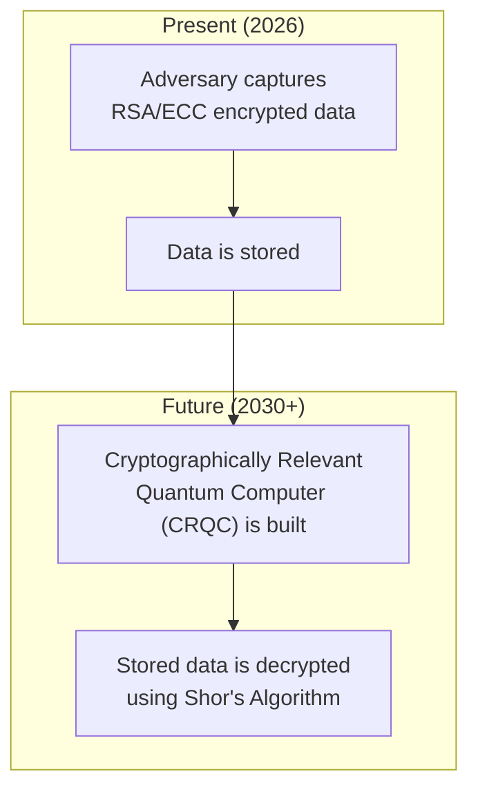

# Quantum-Safe Security Tooling: Preparing for the Post-Quantum Era in 2026

The year is 2026. The hum of quantum computers is no longer a distant theoretical whisper; it's an operational reality with profound implications for digital security. The "quantum apocalypse," or Y2Q, isn't a single event but a creeping obsolescence of the cryptographic standards that underpin our digital world. For engineering and security leaders, the time for theoretical discussion is over. The era of post-quantum readiness is here, and migration is a strategic imperative.

This article provides a no-nonsense guide for practitioners on navigating the transition to post-quantum cryptography (PQC). We'll cover the finalized standards, the necessary tooling, and a pragmatic roadmap for implementation.

### What You'll Get

*   **The Real Urgency:** Understand why the "Harvest Now, Decrypt Later" threat makes PQC a present-day problem.
*   **NIST's Final Standards:** A clear breakdown of the PQC algorithms officially standardized for use.
*   **A Practical Migration Roadmap:** Actionable steps from inventory and testing to full-scale deployment.
*   **Tooling and Hybrid Models:** Concrete examples of hybrid implementations and the evolving toolchain.

## The Quantum Threat: Y2Q is Here

The core threat comes from Shor's algorithm, which can efficiently break the asymmetric encryption algorithms our digital security relies on, namely RSA and Elliptic Curve Cryptography (ECC). While a cryptographically relevant quantum computer (CRQC) capable of breaking RSA-2048 in real-time is still on the horizon, the immediate danger is already in play.

This threat is known as **Harvest Now, Decrypt Later (HNDL)**. Adversaries are actively capturing and storing vast amounts of encrypted data today. Once a powerful quantum computer is available, they can retroactively decrypt this trove of sensitive information—financial records, state secrets, intellectual property, and personal data with a long shelf life.

> **Info:** Any data encrypted with classical algorithms today that needs to remain secure for the next 5-10 years is already at risk. The security of that data is defined by the future, not the present.

Here is a simple visualization of the HNDL attack timeline:



## Understanding Post-Quantum Cryptography (PQC)

Post-Quantum Cryptography (PQC) refers to a new generation of cryptographic algorithms designed to be secure against attacks from both classical and quantum computers. It's crucial to understand that PQC algorithms are *classical* algorithms; they run on the computers we use today but are based on mathematical problems believed to be intractable for quantum computers.

After a multi-year global competition, the U.S. National Institute of Standards and Technology (NIST) has finalized a suite of PQC algorithms. These are not based on factoring or discrete logarithm problems (which are vulnerable to Shor's algorithm) but on other hard mathematical problems, primarily from areas like:

*   **Lattice-based cryptography:** Finding the shortest vector in a high-dimensional geometric structure (a lattice).
*   **Hash-based cryptography:** Based on the security of cryptographic hash functions.
*   **Code-based cryptography:** Based on the problem of decoding a general linear code.
*   **Isogeny-based cryptography:** Finding a path between elliptic curves.

## The New Standards: NIST's Finalized PQC Algorithms

As of 2026, the migration target is clear. NIST has standardized a primary suite of algorithms intended to replace our current public-key infrastructure. Organizations should focus their efforts on integrating these approved standards.

| Algorithm | Type | Primary Use Case | Key Characteristics |
| --- | --- | --- | --- |
| **CRYSTALS-Kyber** | Lattice-based | **KEM** (Key Encapsulation) | Excellent performance, small key sizes. The primary choice for replacing ECDH for key establishment. |
| **CRYSTALS-Dilithium** | Lattice-based | **Digital Signatures** | Strong performance, recommended as the primary signature algorithm. |
| **Falcon** | Lattice-based | **Digital Signatures** | Requires less bandwidth than Dilithium, useful in constrained environments. |
| **SPHINCS+** | Hash-based | **Digital Signatures** | Larger signatures and slower, but based on very conservative hash function security assumptions. |

*Source: Based on the final rounds of the [NIST PQC Standardization Process](https://csrc.nist.gov/projects/post-quantum-cryptography)*

## A Practical Roadmap to Quantum Resistance

Migrating an organization's entire cryptographic infrastructure is a multi-year effort. A phased approach is essential to manage risk, cost, and complexity.

### Step 1: Crypto-Agility and Inventory

You cannot replace what you do not know. The first step is a comprehensive discovery of all cryptographic assets.

*   **Create a Crypto-Inventory:** Catalog all instances of public-key cryptography in your hardware, software, and protocols. This includes TLS certificates, SSH keys, VPNs, code signing, and internal applications.
*   **Develop a CBOM:** A Cryptographic Bill of Materials (CBOM) details the specific libraries and algorithms used in your applications (e.g., OpenSSL 3.x, BoringSSL).
*   **Prioritize Systems:** Not all data is equal. Prioritize systems based on data sensitivity and asset longevity. Data that must remain secure for more than a decade is your highest priority.

### Step 2: Pilot and Test

Start experimenting with the new PQC algorithms in controlled, non-production environments. The goal is to understand their real-world performance characteristics.

*   **Performance Benchmarking:** PQC algorithms have different performance profiles. Kyber keys and Dilithium signatures are larger than their ECC counterparts. Measure the impact on latency, CPU usage, and bandwidth for your specific use cases.
*   **Test Interoperability:** Set up test environments with updated libraries (e.g., OpenSSL with PQC support) and validate that PQC-enabled clients and servers can communicate effectively.
*   **Focus on Internal Systems:** Low-risk internal systems like internal developer tooling or monitoring dashboards are excellent candidates for initial pilot projects.

### Step 3: Hybrid Implementation

A full "rip and replace" is risky. The recommended approach for the next few years is a *hybrid model*, where both a classical and a PQC algorithm are used together. This ensures security against both classical and quantum adversaries. If the PQC algorithm is broken, you still have the classical protection. If the classical algorithm is broken, the PQC protection remains.

For key exchange, this often means generating and transmitting two shared secrets—one with ECDH and one with a PQC KEM like Kyber—and combining them to derive the final session key.

Here is a conceptual Python snippet illustrating a hybrid key encapsulation:

```python
# NOTE: This is a conceptual example using hypothetical libraries.
# Do not use in production.

import pqc_kyber
import classical_ecdh

# --- Key Generation ---
# Generate classical and PQC key pairs
classical_public_key, classical_private_key = classical_ecdh.generate_keys()
pqc_public_key, pqc_private_key = pqc_kyber.generate_keys()

# --- Key Encapsulation (Client Side) ---
# Encapsulate a secret for each public key
classical_secret, classical_ciphertext = classical_ecdh.encapsulate(classical_public_key)
pqc_secret, pqc_ciphertext = pqc_kyber.encapsulate(pqc_public_key)

# Combine the secrets to form the final shared secret
final_shared_secret = hash(classical_secret + pqc_secret)

# --- Key Decapsulation (Server Side) ---
# Decapsulate using the private keys
recovered_classical_secret = classical_ecdh.decapsulate(classical_ciphertext, classical_private_key)
recovered_pqc_secret = pqc_kyber.decapsulate(pqc_ciphertext, pqc_private_key)

# Re-create the same final shared secret
recreated_shared_secret = hash(recovered_classical_secret + recovered_pqc_secret)

assert final_shared_secret == recreated_shared_secret
print("Hybrid key exchange successful!")

```

### Step 4: Full Migration and Tooling

As PQC standards mature and are integrated into the ecosystem, you can begin a full migration.

*   **Adopt PQC-Ready Protocols:** Major protocols like TLS 1.3 and SSH are being updated to support PQC cipher suites. Monitor and adopt updated versions of web servers (NGINX, Apache), libraries (OpenSSL, BoringSSL), and services.
*   **Cloud Provider Integration:** Major cloud providers are leading the charge. Leverage PQC support in services like AWS KMS, Google Cloud KMS, and Azure Key Vault for managing quantum-safe keys.
*   **Update Hardware Security Modules (HSMs):** Ensure your HSMs have firmware updates that support the new NIST standards. This is critical for protecting the root of trust.

## The Time to Act is Now

The transition to post-quantum cryptography is one of the most significant security upgrades of our time. It is not a distant academic exercise; it is an engineering and security challenge for 2026 and beyond. By starting with a thorough inventory, piloting new algorithms, and adopting a hybrid strategy, organizations can build a resilient security posture for the quantum era.

How is your organization approaching its PQC migration? Share your progress and challenges.


## Further Reading

- [https://www.nist.gov/news-events/news/2026/05/post-quantum-cryptography-standardization-update](https://www.nist.gov/news-events/news/2026/05/post-quantum-cryptography-standardization-update)
- [https://www.enisa.europa.eu/news/pqc-readiness-report-2026](https://www.enisa.europa.eu/news/pqc-readiness-report-2026)
- [https://techcommunity.microsoft.com/t5/security-blog/azure-pqc-migration-guide-2026](https://techcommunity.microsoft.com/t5/security-blog/azure-pqc-migration-guide-2026)
- [https://cloudsecurityalliance.org/research/quantum-security-roadmap/](https://cloudsecurityalliance.org/research/quantum-security-roadmap/)
- [https://www.wired.com/story/2026/05/quantum-computing-encryption-break-risk/](https://www.wired.com/story/2026/05/quantum-computing-encryption-break-risk/)
