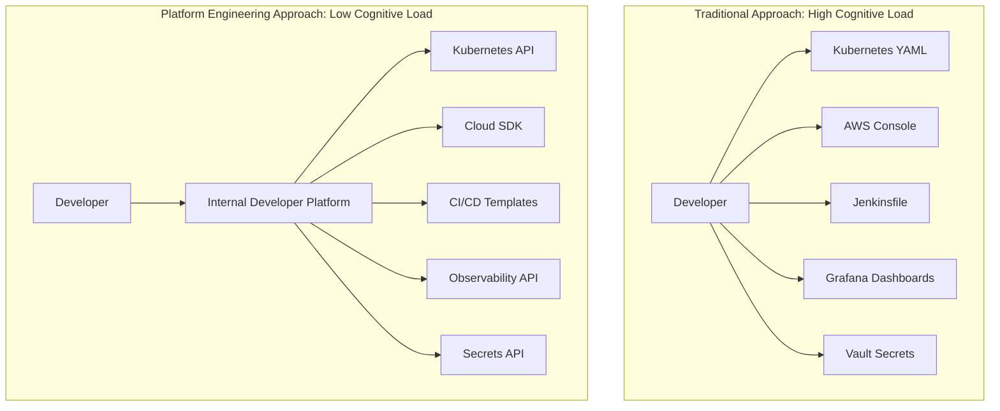
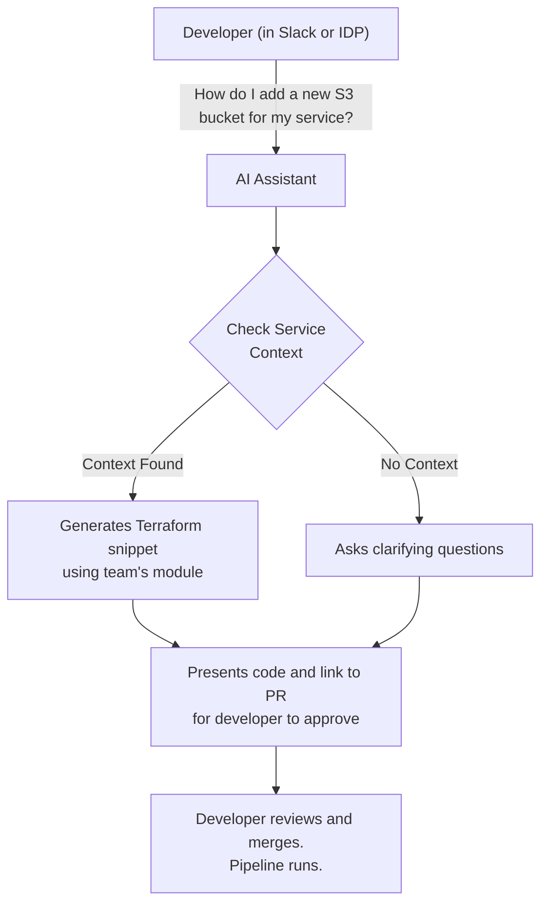

# DevOps Beyond Automation: Reducing Cognitive Load with AI & Platform Engineering

DevOps promised a world of speed and agility, built on the back of automation. While CI/CD pipelines and Infrastructure as Code (IaC) have become standard, they've introduced their own complexity. Developers now face a bewildering array of tools, configurations, and responsibilities, leading to a "cognitive load crisis." The constant context-switching between writing code, managing pipelines, interpreting observability data, and securing infrastructure is burning engineers out.

The next evolution of DevOps isn't just about *more* automation; it's about *smarter* systems that actively reduce this mental burden. By combining the structural discipline of Platform Engineering with the intelligence of AI, we can create environments that free developers to do what they do best: solve business problems.

### What You'll Get

*   **Understanding the Problem:** A clear definition of cognitive load and its sources in modern software development.
*   **Platform Engineering as a Solution:** How building an Internal Developer Platform (IDP) creates "golden paths" that simplify complexity.
*   **AI's Role:** Concrete examples of how AI can supercharge your platform, from self-healing systems to intelligent developer assistants.
*   **A Pragmatic Roadmap:** Actionable steps to begin reducing cognitive load in your own organization.

## The Hidden Tax: Why Cognitive Load Matters

Cognitive load, a concept from psychology, refers to the amount of working memory used to process information. In software engineering, it's the mental effort required to perform a task. As defined in the book *Team Topologies*, there are three key types, but the one we can—and must—address is *extraneous* cognitive load. This is the "tax" imposed by our tools and processes.

> "When the cognitive load of performing a task is too high, the task is either performed poorly or abandoned entirely. In software, this leads to bugs, delays, and developer burnout." - [Manuel Pais & Matthew Skelton, Team Topologies](https://teamtopologies.com/)

This extraneous load comes from non-essential work that distracts from the core task.

| Source of Cognitive Load | Example |
| :--- | :--- |
| **Toolchain Complexity** | Navigating dozens of disconnected UIs for Git, CI/CD, cloud console, and monitoring. |
| **Ambiguous Processes** | Trying to figure out the "right way" to provision a new database or deploy a service. |
| **Alert Fatigue** | Sifting through hundreds of low-signal monitoring alerts to find the one that matters. |
| **Onboarding Friction** | A new engineer spending weeks just getting their local environment and access rights set up. |

Every minute a developer spends fighting a YAML file or debugging a flaky pipeline is a minute they aren't spending on building features.

## Platform Engineering: Paving the Golden Paths

Platform Engineering tackles cognitive load at a structural level. It treats your internal platform as a product, with developers as its customers. The goal is to provide a curated, self-service experience that abstracts away the underlying complexity. This is often materialized as an **Internal Developer Platform (IDP)**.

An IDP doesn't hide everything, but it provides well-supported "golden paths" for common tasks like spinning up a new service, running tests, or deploying to production. This dramatically reduces the number of decisions a developer needs to make.

Here's how the developer's interaction with the ecosystem changes:



### The Role of the IDP

An IDP, often built around a service catalog like [Backstage](https://backstage.io/) or [Port](https://www.getport.io/), centralizes key workflows:
*   **Service Scaffolding:** Create a new production-ready microservice with boilerplate code, CI/CD pipeline, and monitoring dashboards from a single command.
*   **Centralized Documentation:** Automatically generated and discoverable tech docs tied directly to services.
*   **Unified View:** A single pane of glass to see a service's build status, deployments, and on-call ownership.

## AI: The Intelligence Layer for Your Platform

If Platform Engineering provides the paved roads, AI provides the smart traffic signals, GPS navigation, and roadside assistance. It moves us from passive abstraction to active, intelligent support.

### Intelligent Automation and Self-Healing Systems

This is the domain of **AIOps**. Instead of writing brittle, rule-based automation, we use machine learning to identify patterns and act proactively.

*   **Proactive Anomaly Detection:** An AI model analyzes telemetry data (logs, metrics, traces) and flags unusual patterns that precede an outage.
*   **Automated Root Cause Analysis:** When an incident occurs, an AI can correlate events across the stack to pinpoint the likely cause, reducing mean time to resolution (MTTR).
*   **Self-Healing:** In some cases, the system can fix itself. For instance, if an AI detects a memory leak in a service, it can automatically trigger a graceful restart of the affected pod and open a ticket with diagnostic data for the developer.

```bash
# Example AIOps Alert Summary
---
Incident: P1 - High API Error Rate (service-auth)
Time: 14:32 UTC
Likely Cause:
- High latency detected in dependent 'user-db' (95th percentile increased 300ms).
- Correlated with a recent deployment (commit: a4fb2c1).
- Log analysis shows an increase in "Connection Timeout" errors.
Suggested Action: Initiate rollback of commit a4fb2c1 for service-auth.
---
```

### Codifying Best Practices with AI-Powered Guardrails

Documentation in a wiki is often ignored. AI allows us to embed expertise directly into the developer's workflow.

Imagine a CI pipeline step or pre-commit hook that uses an LLM to review Infrastructure as Code.

```python
# A pseudo-code example of an AI-powered Terraform check
import openai

def check_terraform_plan(plan_file):
    with open(plan_file, 'r') as f:
        plan_text = f.read()

    prompt = f"""
    Analyze this Terraform plan for potential issues related to security,
    cost, and reliability. Flag any non-standard configurations.
    Is the S3 bucket public? Are the instance sizes excessive?
    Is high availability configured correctly?

    Plan:
    {plan_text}
    """
    response = openai.Completion.create(model="text-davinci-003", prompt=prompt)

    if "WARNING" in response.choices[0].text:
        print(response.choices[0].text)
        exit(1) # Fail the build
```
This moves security and cost-optimization from a post-deployment review to a real-time, automated check, reducing the cognitive load of remembering hundreds of best practices.

### Enhancing the Developer Experience (DevEx)

AI can make the IDP itself more intuitive and helpful, particularly through conversational interfaces.

A developer shouldn't have to read pages of documentation to figure out a common task. They should be able to ask.


This interaction model, powered by retrieval-augmented generation (RAG) on your internal documentation, turns the platform into a collaborative partner.

## Putting It Into Practice: A Pragmatic Roadmap

This evolution is a journey, not an overnight transformation. Here’s a pragmatic way to start.

1.  **Find the Friction:** Before building anything, talk to your developers. Use simple surveys or interviews to identify the biggest sources of cognitive load. Is it the on-call process? Setting up a new service? Understanding dependencies?
2.  **Pave One Golden Path:** Pick one high-friction, high-impact workflow. Automate and abstract it via your platform. This could be as simple as creating a CLI command that scaffolds a new microservice with all the necessary CI/CD and deployment boilerplate.
3.  **Introduce a Small AI Win:** Start with a low-risk, high-visibility AI tool. This could be an AI-powered log summarizer that enriches on-call alerts in Slack, or deploying a tool like [GitHub Copilot](https://github.com/features/copilot) to help write boilerplate and IaC.
4.  **Measure and Iterate:** Collect feedback. Did the new "golden path" reduce deployment time? Did the AI log summaries help reduce MTTR? Use these metrics to justify further investment and decide which part of the platform to enhance next.

## Conclusion: The Future is Composable and Intelligent

DevOps succeeded by breaking down silos between development and operations. The next step is to break down the cognitive barriers imposed by the very tools we created.

By building a solid foundation with **Platform Engineering**, we provide the structure and consistency needed to reduce chaos. By layering **Artificial Intelligence** on top, we transform that platform from a passive toolset into an active, intelligent partner. The ultimate goal is not to replace engineers, but to augment their abilities—freeing their valuable cognitive capacity to focus on innovation and solving the complex problems that truly matter.


## Further Reading

- [https://www.oreilly.com/library/view/reducing-cognitive-load-in-devops/2026/](https://www.oreilly.com/library/view/reducing-cognitive-load-in-devops/2026/)
- [https://martinfowler.com/articles/platform-engineering-cognitive-load.html](https://martinfowler.com/articles/platform-engineering-cognitive-load.html)
- [https://www.cncf.io/blog/2026/05/ai-for-developer-well-being/](https://www.cncf.io/blog/2026/05/ai-for-developer-well-being/)
- [https://www.infoq.com/articles/devops-mental-health-automation/](https://www.infoq.com/articles/devops-mental-health-automation/)
- [https://hbr.org/2026/05/the-cost-of-cognitive-load-in-tech](https://hbr.org/2026/05/the-cost-of-cognitive-load-in-tech)
