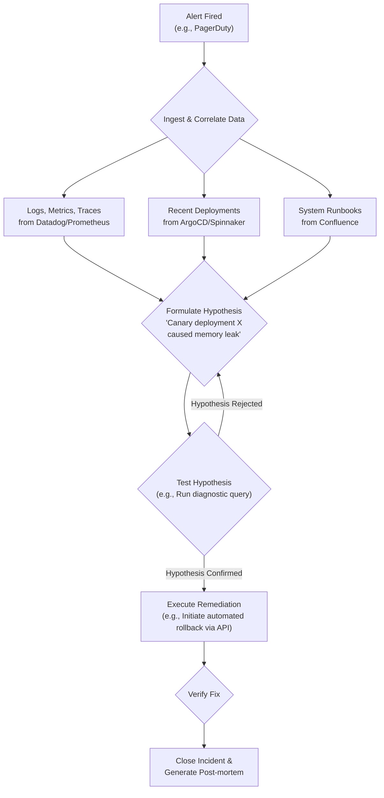

# Gemini 2.0 & Copilot Pro: The AI Agents Revolutionizing IT Operations

The world of IT Operations is on the cusp of a monumental shift. For years, we've used AI as an *assistant*—a powerful tool for autocompleting code, answering queries, and summarizing data. But the next wave is here: AI *agents*. These are not just responders; they are autonomous actors capable of managing complex systems, resolving incidents, and optimizing infrastructure with minimal human intervention.

Leading this charge are Google's Gemini 2.0 and Microsoft's Copilot Pro. These aren't just incremental updates; they represent a new paradigm where AI transitions from a passive tool to a proactive team member. This article dives deep into what this means for you, your team, and your infrastructure.

### What You'll Get

*   **The Core Difference:** Understand the leap from AI assistants to autonomous AI agents.
*   **Deep Dive:** A detailed look at the capabilities of Gemini 2.0 and Copilot Pro for IT Operations.
*   **Practical Examples:** See how these agents handle incident response, cloud optimization, and CI/CD pipelines.
*   **Comparative Analysis:** A clear table comparing the strengths and ideal use cases for each agent.
*   **Future of IT Roles:** An analysis of how roles like SRE and DevOps will evolve, not disappear.
*   **Balanced View:** A discussion of the significant benefits and critical risks of agentic AI.

---

## The Paradigm Shift: From AI Assistants to AI Agents

To grasp the impact of Gemini 2.0 and Copilot Pro, we must first distinguish between an AI assistant and an AI agent.

*   An **AI Assistant** is reactive. It requires explicit, step-by-step instructions to perform a task. Think of it as a powerful command-line interface with natural language processing. You are the operator.
*   An **AI Agent** is proactive. You give it a high-level goal, and it independently formulates and executes a multi-step plan to achieve it. It can use tools, learn from its environment, and adapt its strategy. It is the operator.

The agentic model follows a loop: **Observe -> Orient -> Decide -> Act (OODA)**. The AI perceives the state of a system, orients itself with context and data, decides on a course of action, and then executes it using APIs, CLIs, or other tools. This is the foundation of autonomous IT operations.

## Google's Gemini 2.0: The Proactive Problem-Solver

Google's Gemini 2.0 is engineered for proactive, cross-platform autonomy. It excels at understanding complex, interconnected systems and taking decisive action, making it a powerful ally for Site Reliability Engineering (SRE) and platform teams.

### Core Capabilities

*   **Multi-modal Reasoning:** Ingests and correlates data from logs, metrics, traces, and even system architecture diagrams.
*   **Tool Use and Augmentation:** Natively integrates with a vast array of APIs, including Google Cloud, Kubernetes, and popular third-party tools like Datadog and PagerDuty.
*   **Autonomous Goal Execution:** Pursues high-level objectives like "Reduce p99 latency for the checkout service to under 200ms" by creating and running its own action plans.

### Autonomous Incident Management

Imagine a critical service degradation at 3 AM. Instead of waking up an on-call engineer, Gemini 2.0 takes the first-responder role. Its workflow is designed to minimize Mean Time To Resolution (MTTR).

Here’s a high-level view of its autonomous incident response flow:



### Cloud Resource Optimization

Gemini 2.0 can also act as a continuous optimization engine for your cloud infrastructure. You don't tell it *how* to save money; you tell it the *goal*.

For example, you could provide a prompt like this:

```plaintext
Goal: Reduce Q3 cloud spend for the 'production-analytics' project by 15% without impacting SLOs.
Constraints: Do not modify persistent disk storage types. Prioritize spot instances for batch processing workloads.
```

The agent would then:
1.  Analyze current resource usage and spending patterns via the GCP Billing API.
2.  Identify over-provisioned VMs or idle resources.
3.  Model the cost/performance impact of switching machine types.
4.  Automatically resize clusters or migrate suitable workloads to cheaper compute options, all while monitoring performance metrics to ensure SLOs are met.

## Microsoft's Copilot Pro: The Enterprise Integrator

While Gemini 2.0 focuses on broad system autonomy, Microsoft's Copilot Pro is engineered for deep integration within the enterprise ecosystem, particularly Azure, Microsoft 365, and GitHub. It acts as an orchestrator, connecting disparate parts of the development and operations lifecycle.

### Core Capabilities

*   **Deep Platform Integration:** Unparalleled access to the Microsoft Graph API, Azure Resource Manager, and GitHub Actions internals.
*   **Enterprise Context-Awareness:** Understands organizational structure, code ownership, and compliance policies from Azure AD and GitHub.
*   **Secure by Design:** Leverages existing enterprise security models (RBAC, Entra ID) to ensure its actions are compliant and auditable.

### Automated Root Cause Analysis (RCA)

Copilot Pro excels at generating comprehensive RCA reports by tapping into its rich ecosystem context. When a bug is reported, it can automatically:
*   **Trace the issue:** Correlate user reports from a Teams channel with Azure Application Insights traces.
*   **Pinpoint the commit:** Identify the exact PR in GitHub that introduced the regression by analyzing CI/CD logs.
*   **Identify the owner:** Use the `CODEOWNERS` file and Azure AD to suggest the right engineer or team to notify.
*   **Draft the RCA:** Generate a pre-filled RCA document with timelines, impact analysis, and contributing factors.

### CI/CD Pipeline Augmentation

Copilot Pro can become an active participant in your software delivery pipeline. It can analyze pipeline performance and suggest specific, actionable improvements.

For instance, after observing several slow builds, it might open a pull request on your `azure-pipelines.yml` with a change like this:

```diff
# Copilot Pro Suggestion: Enable parallel job execution and caching

- job: Build
  pool:
    vmImage: 'ubuntu-latest'
  steps:
  - script: |
      npm install
      npm run build
    displayName: 'Build Project'

+ strategy:
+   parallel: 2 # Run test and lint jobs in parallel
+ job: Build
+   pool:
+     vmImage: 'ubuntu-latest'
+   steps:
+   - task: Cache@2
+     inputs:
+       key: 'npm | "$(agent.os)" | package-lock.json'
+       path: '/home/vsts/.npm'
+     displayName: Cache npm
+   - script: |
+       npm ci
+       npm run build
+     displayName: 'Build Project'

```

> **Expert Insight:** "Copilot Pro isn't just about writing code anymore. It's about optimizing the entire system that delivers that code. It understands the 'scaffolding' around your application—the CI/CD pipelines, the infrastructure, and the team structure." - [Forrester Report, "The Rise of Autonomous AI in IT"](https://www.forrester.com)

## Agentic AI in Action: A Comparative Look

Neither agent is a one-size-fits-all solution. Your choice will depend on your existing tech stack, operational philosophy, and specific goals.

| Feature               | Gemini 2.0                                             | Copilot Pro                                            |
| --------------------- | ------------------------------------------------------ | ------------------------------------------------------ |
| **Autonomy Level**    | High (Goal-driven, proactive system management)        | Medium-High (Orchestration-driven, human-in-the-loop)  |
| **Primary Ecosystem** | Google Cloud, Kubernetes, Open Source & 3rd-party tools | Microsoft Azure, GitHub, Microsoft 365                |
| **Key Strength**      | Autonomous problem-solving in complex, heterogeneous environments. | Deep integration and context-awareness within the Microsoft stack. |
| **Ideal Use Case**    | SRE team managing a multi-cloud Kubernetes platform.   | Enterprise DevOps team looking to streamline its Azure/GitHub workflow. |

## Impact on IT Roles: Evolution, Not Extinction

The rise of AI agents will not eliminate IT jobs; it will elevate them. The focus will shift from repetitive, manual tasks to high-level strategic work.

*   **SREs / Platform Engineers:** Will move from writing scripts and responding to alerts to designing, training, and managing fleets of AI agents. Their role becomes that of an "AI Shepherd."
*   **DevOps Engineers:** Will spend less time tweaking YAML files and more time defining the high-level goals and constraints for CI/CD and infrastructure agents.
*   **IT Operations Managers:** Will oversee a hybrid workforce of humans and AI agents, focusing on performance, governance, and the strategic application of autonomous systems.

The most valuable skill in this new era will be the ability to effectively define goals, constraints, and success metrics for AI agents.

## The Double-Edged Sword: Benefits vs. Risks

The potential benefits are enormous, but we must proceed with caution. The autonomy that makes these agents powerful also introduces new classes of risk.

### Perceived Benefits

*   **Drastic MTTR Reduction:** Agents can detect and resolve incidents faster than any human team.
*   **Hyper-Efficient Resource Usage:** Continuous, automated optimization can lead to significant cost savings.
*   **Increased Developer Productivity:** Offloads operational burdens, allowing developers to focus on building features.
*   **Scaling Expertise:** Encapsulates the knowledge of senior engineers into an agent that can operate 24/7.

### Critical Risks

*   **Autonomous Errors:** An agent with the wrong goal or a flawed understanding could autonomously cause a major outage or security breach.
*   **Loss of Control & Oversight:** How do you stop an agent that is acting on a faulty premise? "Kill switches" and robust auditing are non-negotiable.
*   **Security Vulnerabilities:** If an agent is compromised, an attacker could gain high-level control over your entire infrastructure.
*   **Debugging and Explainability:** Understanding *why* an agent made a particular decision can be incredibly complex, making it difficult to debug failures.

## The Future is Autonomous

Gemini 2.0 and Copilot Pro are at the forefront of a revolution in IT operations. They challenge us to rethink our relationship with technology, moving from tool operators to goal setters and system designers. The transition will require new skills, new processes, and a healthy dose of caution.

The era of the autonomous IT agent is here. The question is no longer *if* we will adopt them, but *how* we will govern them. How is your organization preparing to manage a hybrid workforce of humans and AI?


## Further Reading

- [https://deepmind.google/blog/2026/05/gemini-2-0-agentic-capabilities/](https://deepmind.google/blog/2026/05/gemini-2-0-agentic-capabilities/)
- [https://github.com/microsoft/copilot-pro-roadmap-2026](https://github.com/microsoft/copilot-pro-roadmap-2026)
- [https://www.zdnet.com/article/ai-agents-it-automation-2026/](https://www.zdnet.com/article/ai-agents-it-automation-2026/)
- [https://www.forrester.com/report/the-rise-of-autonomous-ai-in-it-2026/](https://www.forrester.com/report/the-rise-of-autonomous-ai-in-it-2026/)
- [https://www.infoq.com/news/2026/05/ai-agents-revolutionize-ops/](https://www.infoq.com/news/2026/05/ai-agents-revolutionize-ops/)
