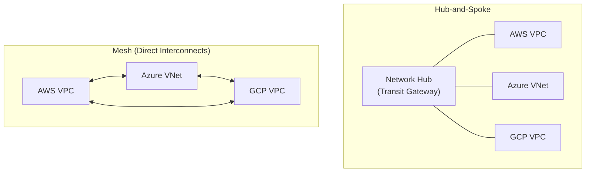

# Optimizing Multi-Cloud Networking for AI Workloads: A 2026 Guide

The era of single-cloud dominance is fading, especially for high-stakes AI and ML development. Organizations now strategically leverage best-of-breed services—Google's TPUs for training, AWS's Inferentia for inference, and Azure's data services for governance. But this distributed power comes at a cost: a complex, fragmented, and often sluggish network layer.

By 2026, the success of your AI initiatives will depend less on the models themselves and more on the performance of the network fabric connecting them. Standard networking practices fail under the immense pressure of petabyte-scale datasets and latency-sensitive distributed training. This guide provides a practitioner-focused blueprint for designing and managing a high-performance multi-cloud network built for the demands of modern AI.

## What You'll Get

*   **Core Challenges:** A breakdown of why AI workloads break traditional network architectures.
*   **Architectural Patterns:** An overview of hub-and-spoke, full-mesh, and platform-based models.
*   **High-Performance Connectivity:** A look at the physical and virtual pipes needed, from direct interconnects to GPU-aware protocols.
*   **Security & Governance:** Strategies for enforcing a unified security posture across disparate environments.
*   **Cost Optimization:** Actionable tactics to control the notorious data egress fees.
*   **Future-Ready Practices:** A glimpse into the tools and methodologies that will define AI networking.

## The Unique Networking Demands of AI

AI workloads are not just another application. They place extreme, spiky, and unique demands on the network that require a purpose-built approach. The three phases of the AI lifecycle each have distinct networking needs.

| AI Phase | Primary Network Demand | Why It Matters |
| :--- | :--- | :--- |
| **Data Ingestion & Prep** | **High Throughput** (100+ Gbps) | Moving petabytes of raw data from on-prem or other clouds to a central processing location without creating a bottleneck. |
| **Distributed Training** | **Ultra-Low Latency** (<10µs) | Synchronizing gradients across hundreds or thousands of GPUs/TPUs. High latency directly increases model training time and cost. |
| **Model Inference** | **High Availability & Scalable Egress** | Serving model predictions to a global user base with minimal delay and ensuring the inference endpoints are always reachable. |

These requirements force us to move beyond simple VPNs and public internet routing. We need an architecture that treats the network as a high-performance computing fabric.

## Core Architectural Patterns for 2026

There is no single "best" architecture; the right choice depends on your workload distribution, budget, and management overhead tolerance. By 2026, three patterns have become dominant.

### The Hub-and-Spoke Transit Model

A classic, centralized approach. A central "hub" VPC/VNet (often containing shared services like firewalls and logging) acts as a transit point for all traffic between different cloud "spokes."

*   **Pros:** Centralized security and policy enforcement, simplified routing.
*   **Cons:** Can become a performance bottleneck; adds latency due to the extra hop.

### The Full-Mesh Cloud Backbone

For ultimate performance, a full-mesh or partial-mesh topology provides direct, low-latency paths between every cloud environment. This is typically built using dedicated cloud-to-cloud interconnects.

*   **Pros:** Lowest possible latency and highest throughput for inter-cloud communication.
*   **Cons:** High cost and management complexity that scales exponentially with each new environment.

### The Rise of Multi-Cloud Networking Platforms (MCNP)

This is the key trend for 2026. MCNPs (from vendors like [Aviatrix](https://aviatrix.com/), [Prosimo](https://prosimo.io/), or [Alkira](https://www.alkira.com/)) create a software-defined abstraction layer over the native cloud networking constructs. They provide a unified control plane to build, manage, and secure the network.

*   **Pros:** Drastically simplified operations, consistent policy across clouds, intelligent path selection.
*   **Cons:** Potential vendor lock-in, adds another layer of cost and abstraction.

Here is a simplified view of these concepts:



## High-Throughput & Low-Latency Connectivity Options

The architectural pattern is only as good as the underlying connections. For AI, you need the biggest, fastest pipes available.

### Direct Interconnects

These are your foundational, private connections into the cloud providers' backbones. They offer predictable performance and lower data transfer costs compared to the public internet.

*   **Examples:** AWS Direct Connect, Azure ExpressRoute, Google Cloud Interconnect.
*   **Best For:** Bulk data transfer between your data center and a primary cloud. Capacities of 10 Gbps, 40 Gbps, and 100 Gbps are now standard.

### Cloud-to-Cloud Routers

To connect clouds directly, you can leverage dedicated services that bypass the public internet entirely.

*   **Examples:** Google's [Cross-Cloud Interconnect](https://cloud.google.com/network-connectivity/docs/interconnect/concepts/cross-cloud-interconnect), or third-party solutions from [Equinix](https://www.equinix.com/interconnection-services/equinix-fabric) or Megaport that offer virtual routing between cloud on-ramps within their data centers.
*   **Best For:** Creating the low-latency links required for a mesh architecture.

### GPU-Aware Networking and RDMA

For distributed training, standard TCP/IP is too slow. Remote Direct Memory Access (RDMA) allows one machine's GPU to access another's memory directly, bypassing the CPU and kernel.

> **Info:** While true RDMA across different public clouds is still an emerging and complex capability, the principles are driving innovation. Cloud providers offer optimized fabrics *within* their data centers (like AWS EFA and GCP's GPUDirect-TCPX) that significantly accelerate training. The next frontier is extending this performance profile across cloud boundaries.

Libraries like NVIDIA's [NCCL](https://developer.nvidia.com/nccl) are used to manage these collective communications. A simplified configuration might instruct NCCL to prioritize a specific high-speed interface:

```bash
# Example pseudo-code for environment configuration
# This tells the training job to use the high-performance network interface
# for GPU-to-GPU communication.

export NCCL_SOCKET_IFNAME=ens5f0
export NCCL_DEBUG=INFO

# Run the distributed training job
torchrun --nproc_per_node=8 train_model.py
```

## Security and Governance Across Clouds

A distributed environment expands your attack surface. A unified security posture is not optional; it's a requirement for production-grade AI.

*   **Centralized Threat Inspection:** Deploy next-generation firewall (NGFW) virtual appliances in a dedicated security VPC/VNet and route all inter-cloud traffic through them for inspection.
*   **Embrace Zero Trust:** Operate on a "never trust, always verify" principle. Every service-to-service call across a cloud boundary must be authenticated and authorized, typically using mutual TLS (mTLS) and identity-aware proxies.
*   **Policy as Code:** Do not manage network security rules through a GUI. Use tools like Terraform or OpenTofu to define firewall rules, routing tables, and security groups in version-controlled code. This ensures consistency and auditability.

```hcl
# Example Terraform resource for a security group rule
# This allows traffic only from a trusted CIDR block for training data sync

resource "aws_security_group_rule" "allow_data_sync" {
  type              = "ingress"
  from_port         = 50051 # gRPC port for data transfer
  to_port           = 50051
  protocol          = "tcp"
  cidr_blocks       = ["10.100.0.0/16"] # Traffic from our secure GCP VPC
  security_group_id = aws_security_group.ml_training_cluster.id
  description       = "Allow data sync from GCP training environment"
}
```

## Taming the Multi-Cloud Cost Monster

Without careful planning, data transfer costs can silently cripple your AI budget. Egress fees—the cost of moving data *out* of a cloud—are the primary culprit.

> "The most expensive part of multi-cloud isn't the compute; it's the data's round-trip ticket."

### Key Cost Management Strategies

1.  **Honor Data Gravity:** Process data where it lives. If your 500 TB dataset is on Amazon S3, perform initial data prep and even training in AWS to avoid a massive one-time egress charge.
2.  **Use Private Interconnects:** Data transfer over Direct Connect or ExpressRoute is significantly cheaper (often by 50-70%) than transfer over the public internet.
3.  **Route Intelligently:** When a model in GCP needs a feature set from Azure, an MCNP or custom routing logic can ensure the traffic takes the most cost-effective path, which may not always be the lowest latency one.
4.  **Compress and Cache:** Before moving data, compress it. For frequently accessed data (like feature stores), use a distributed cache (like Redis) to serve requests from a closer, cheaper location.

## Conclusion: The Path Forward

By 2026, multi-cloud networking for AI has moved from a niche engineering problem to a core business competency. The winning strategy is not about picking a single cloud provider; it's about building an intelligent, secure, and cost-aware network fabric that spans all of them.

The key takeaways are clear:
*   **Abstract the complexity** with a Multi-Cloud Networking Platform or a well-designed transit architecture.
*   **Invest in high-speed, private interconnects** as the foundation of your network.
*   **Automate your security posture** using Infrastructure as Code.
*   **Aggressively monitor and optimize** data transfer costs.

The network is no longer just plumbing. For AI workloads, it is an active and critical component of the computational stack.

---

***What are your biggest multi-cloud networking pains for AI? Share your challenges in the comments below.***


## Further Reading

- [https://www.gartner.com/en/articles/multi-cloud-networking-for-ai-2026](https://www.gartner.com/en/articles/multi-cloud-networking-for-ai-2026)
- [https://aws.amazon.com/solutions/networking-for-ai-ml-in-multi-cloud/](https://aws.amazon.com/solutions/networking-for-ai-ml-in-multi-cloud/)
- [https://azure.microsoft.com/en-us/solutions/multi-cloud-networking-for-ai/](https://azure.microsoft.com/en-us/solutions/multi-cloud-networking-for-ai/)
- [https://cloud.google.com/blog/networking/optimizing-ai-across-clouds](https://cloud.google.com/blog/networking/optimizing-ai-across-clouds)
- [https://www.sdxcentral.com/articles/2026/05/multi-cloud-networking-trends-ai/](https://www.sdxcentral.com/articles/2026/05/multi-cloud-networking-trends-ai/)
