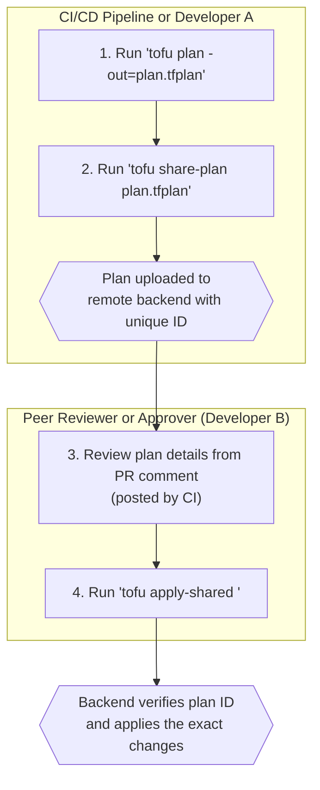

# OpenTofu's 2026 Release: Enhanced State Locking and Collaborative Workflows

The Infrastructure as Code (IaC) landscape is defined by collaboration, and as teams grow, the tools they use must evolve to prevent friction. The latest OpenTofu release, version `2026.6.0`, directly addresses the key challenges of concurrent development in large-scale environments. This update moves beyond basic state management to introduce a sophisticated suite of features for state locking, plan sharing, and backend integration, fundamentally improving how teams work together.

This article dives deep into the technical specifics of these new features, exploring how they solve common bottlenecks and enable safer, more efficient collaborative workflows.

### What You'll Get

*   **Detailed Breakdown:** An in-depth look at the new lease-based and optimistic state locking mechanisms.
*   **Workflow Visualization:** A diagram and explanation of the new `tofu share-plan` collaborative review process.
*   **Technical Deep Dive:** An overview of the enhanced backend metadata API and its implications.
*   **Practical Impact:** Analysis of how these updates directly boost productivity for large and complex deployments.

---

## Redefining State Management: Lease-Based and Optimistic Locking

State locking is critical for preventing concurrent modifications and state corruption. However, the traditional "hard lock" model often becomes a bottleneck. A forgotten lock or a failed CI/CD job can halt all development until a manual intervention occurs. The 2026 release introduces a more intelligent, two-pronged approach.

### Lease-Based Locks

Instead of an indefinite lock, OpenTofu now implements **lease-based locking**. When a command like `tofu apply` initiates a lock, it acquires a lease with a configurable, finite duration.

*   **Automatic Expiry:** If a process holding a lock terminates unexpectedly, the lock is automatically released when the lease expires. This eliminates the "stale lock" problem that frequently plagues teams.
*   **Lease Renewal:** For long-running operations, the OpenTofu client will periodically renew the lease, ensuring the lock remains active only as long as the process is healthy.
*   **Configurability:** Teams can configure the lease duration in the backend configuration, balancing safety with flexibility.

```hcl
# example backend.tf configuration
terraform {
  backend "s3" {
    bucket         = "my-opentofu-state-bucket"
    key            = "global/networking/terraform.tfstate"
    region         = "us-east-1"
    dynamodb_table = "terraform-state-locks"
    
    # New configuration options
    lock_lease_duration = "15m" // Lock expires after 15 minutes
    lock_renew_interval = "5m"  // Renew the lease every 5 minutes
  }
}
```

> **The End of Manual Unlocking**
> By making locks temporary by default, teams can spend less time troubleshooting CI/CD pipelines and more time delivering infrastructure. This is a significant quality-of-life improvement for any team managing non-trivial infrastructure.

### Optimistic Locking

For workflows that prioritize speed, OpenTofu now supports **optimistic locking**. This strategy avoids acquiring a hard lock during the `plan` phase altogether.

Instead, it records the state file's version when the plan is created. During the `apply` phase, it re-checks the version. If the version has changed since the plan was generated, it means another process has modified the state. OpenTofu will then safely abort the apply, forcing the user to re-plan against the latest state. This model is ideal for high-velocity environments where state conflicts are infrequent.

## The New Collaborative Standard: Plan Sharing and Reviews

One of the biggest challenges in a GitOps workflow is ensuring the plan reviewed in a pull request is the *exact* plan that gets applied. The 2026 release introduces a native workflow to solve this, centered around the new `tofu share-plan` command.

This feature allows a developer or a CI job to generate a plan and upload it securely to the remote backend. Another team member or an automated process can then review and apply that exact plan file.

### The Collaborative Workflow

The new process creates a clear, auditable chain of events from planning to application.


*Jekyll-safe Mermaid syntax has been used for this diagram.*

This new flow provides several advantages:
*   **Plan Immutability:** The plan applied is cryptographically identical to the plan that was reviewed.
*   **Reduced Permissions:** The user running `apply-shared` may not need permissions to run a `plan`, only to apply a pre-approved one.
*   **Audit Trail:** The backend now has a record of who created the plan and who approved its application.

### Old vs. New Workflow

| Feature | Old Workflow (Pre-2026) | New Workflow (2026 Release) |
| :--- | :--- | :--- |
| **Plan Handling** | Plan files are passed as CI artifacts. | Plans are uploaded to the backend via `tofu share-plan`. |
| **Apply Command** | `tofu apply <artifact_path>` | `tofu apply-shared <plan_id>` |
| **Integrity** | Relies on CI system integrity to prevent tampering. | Guaranteed by the backend; plan cannot be altered. |
| **Audit** | Dependent on CI logs. | Native audit trail in the backend metadata. |

## Deeper Backend Integration: The Metadata API

Underpinning these new features is the **Enhanced Backend Metadata API**. This formalizes a specification for remote backends to store not just the state file, but also associated metadata about locks and plans.

This turns the backend from a simple file store into a lightweight control plane for IaC operations.

### Key Metadata Stored

*   **Lock Information:** Who holds a lock, when it was acquired, and when it will expire.
*   **Shared Plans:** The binary plan file, the SHA256 hash of the plan, who uploaded it, and its status (e.g., `pending`, `applied`, `cancelled`).
*   **Run History:** A log of which plans have been applied to a given state file, creating a native change history.

This API is designed to be implemented by various backend providers. While the initial release includes full support for S3/DynamoDB, HashiCorp Consul, and others, the open specification allows the community to add support for any backend. For more information, see the official [OpenTofu documentation on team collaboration](https://docs.opentofu.org/latest/guides/team-collaboration).

## Impact on Team Productivity and Complex Deployments

So, how will these features improve your team's productivity?

1.  **Reduced Downtime:** Lease-based locking means developers are no longer blocked by stale locks from failed pipeline runs or colleagues' machines. This directly translates to less waiting and more doing.
2.  **Increased Confidence:** The `share-plan` and `apply-shared` workflow eliminates the risk of applying a stale or tampered plan. This increases confidence in the review process, especially for critical infrastructure changes.
3.  **Clearer Auditing:** With a native history of plans and applies stored in the backend, tracking *who* did *what* and *when* becomes trivial. This simplifies compliance and incident response.
4.  **Enabling Parallelism:** For complex deployments with multiple teams working on different parts of the same state, optimistic locking can significantly increase velocity by reducing lock contention on `plan` operations.

These enhancements are not just minor tweaks; they represent a significant step forward in making OpenTofu a robust, enterprise-ready tool for managing infrastructure at scale. By directly tackling the most common sources of friction in collaborative IaC, OpenTofu's 2026 release empowers teams to build more, faster, and with greater confidence.


## Further Reading

- [https://opentofu.org/blog/2026/06/release-notes-q2-2026](https://opentofu.org/blog/2026/06/release-notes-q2-2026)
- [https://github.com/opentofu/opentofu/releases/tag/v2026.6.0](https://github.com/opentofu/opentofu/releases/tag/v2026.6.0)
- [https://www.infoq.com/news/2026/06/opentofu-collaboration-features/](https://www.infoq.com/news/2026/06/opentofu-collaboration-features/)
- [https://medium.com/@iac_insights/collaborative-opentofu-best-practices-2026](https://medium.com/@iac_insights/collaborative-opentofu-best-practices-2026)
- [https://docs.opentofu.org/latest/guides/team-collaboration](https://docs.opentofu.org/latest/guides/team-collaboration)
