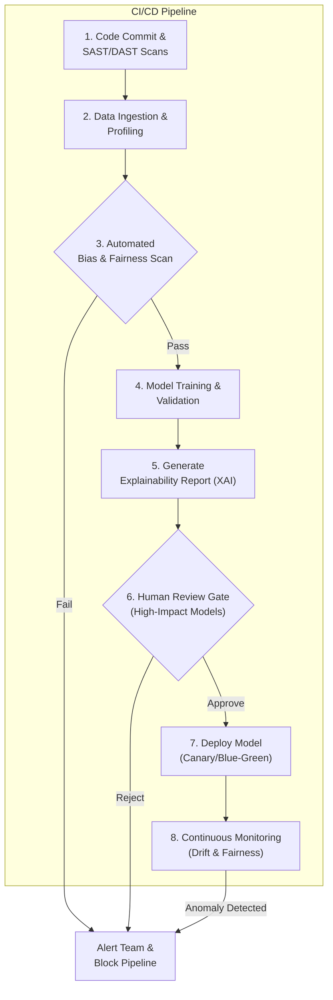
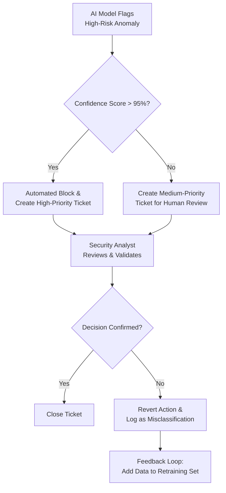

# Ethical AI in DevSecOps: Building Trustworthy & Fair Security Systems

In the fast-paced world of DevSecOps, speed and security are paramount. We leverage automation to ship code faster and more securely than ever before. Artificial Intelligence (AI) and Machine Learning (ML) are the rocket fuel for this automation, powering everything from intelligent threat detection to sophisticated vulnerability analysis. But this power comes with a critical responsibility. When an AI model makes a security decision, is it fair? Is it transparent? And who is accountable when it gets it wrong?

Integrating AI into our security pipelines isn't just a technical challenge; it's an ethical one. An AI model trained on biased data can create security blind spots, block legitimate users, or worse, perpetuate systemic inequalities. This article dives into the essential principles of ethical AI and provides a practical framework for implementing them within a DevSecOps culture.

### What You'll Get

*   **Core Concepts:** A clear breakdown of fairness, transparency, and accountability in AI-powered security.
*   **Practical Strategies:** Actionable steps to mitigate bias in your security models and data.
*   **Implementation Blueprints:** High-level diagrams for integrating ethical checks into your CI/CD pipeline.
*   **Real-World Guidance:** An understanding of the trade-offs and challenges you'll face.

## The Pillars of Trustworthy AI in Security

Before we can automate security decisions, we must trust the decision-maker. In the context of AI, trust is built on three core pillars: Fairness, Transparency, and Accountability. Neglecting any one of these can undermine your entire security posture.

### Fairness: Beyond Raw Accuracy

Fairness ensures that an AI security model does not produce systematically prejudiced outcomes against certain groups or inputs. It's about preventing algorithmic bias.

*   **The Problem:** An intrusion detection system trained primarily on data from North American traffic might perform poorly at identifying sophisticated, region-specific threats from Asia, creating a dangerous false sense of security. Similarly, a fraud detection model could disproportionately flag transactions from low-income postal codes if its training data reflects historical human bias.
*   **The Goal:** Strive for models that perform reliably and equitably across diverse data distributions. This isn't just about social good; it's about robust security that covers all your attack surfaces, not just the most common ones.

### Transparency: Cracking the "Black Box"

Transparency, often called Explainable AI (XAI), is the ability to understand *why* a model made a specific prediction. If an AI flags a developer's commit as malicious, you need to know which features (e.g., specific API calls, code obfuscation) triggered the alarm.

*   **The Problem:** A "black box" model provides a decision with no justification. This is useless for a security analyst who needs to validate the alert, and it's impossible to debug or improve the model's logic.
*   **The Goal:** Implement systems where every AI-driven security decision is accompanied by a human-readable explanation. This builds confidence, enables effective oversight, and accelerates incident response.

### Accountability: Defining Ownership

Accountability means establishing clear responsibility for the outcomes of an AI system. When an AI-powered Web Application Firewall (WAF) mistakenly blocks a major customer, who is responsible for the investigation, remediation, and system improvement?

*   **The Problem:** Without defined accountability, AI failures lead to a blame game between developers, security teams, and data scientists. Issues go unfixed because ownership is unclear.
*   **The Goal:** Create a governance framework that assigns clear roles and responsibilities for the entire lifecycle of an AI model—from data sourcing and training to deployment and decommissioning.

## A Practical Framework for Ethical AI in DevSecOps

Moving from principles to practice requires integrating ethical checkpoints directly into your automated pipelines. Think of it as "Ethics as Code."

This diagram illustrates a DevSecOps pipeline enhanced with ethical AI gates. Each stage includes automated checks and balances to ensure models are fair, explainable, and continuously monitored.



### Mitigating Bias in Your Models

Bias often originates in the data. Your first line of defense is a data-centric approach.

*   **Audit Your Datasets:** Use profiling tools to analyze your training data for imbalances. Are you over-representing certain types of network traffic, user demographics, or geolocations?
*   **Data Augmentation:** If your data is skewed, generate synthetic data to fill the gaps. For example, if you lack sufficient samples of a rare attack type, create realistic variations to train your model.
*   **Use Fairness Metrics:** Go beyond simple accuracy. Evaluate models using metrics like *demographic parity* (ensuring the prediction rate is similar across groups) and *equalized odds* (ensuring the true positive and false positive rates are similar across groups).

### Implementing Explainable AI (XAI)

Don't deploy a model you can't interrogate. Integrate XAI techniques to make your models transparent.

> **Quote from a practitioner:** "If your security AI can't tell you *why* it blocked a transaction, it's not a security tool—it's a random number generator with a high-stakes opinion."

Here’s a comparison of popular XAI methods:

| Method | Type | Best For |
| :--- | :--- | :--- |
| **SHAP** (SHapley Additive exPlanations) | Model-Agnostic | Providing precise, game theory-based contribution scores for each feature on a specific prediction. |
| **LIME** (Local Interpretable Model-agnostic Explanations) | Model-Agnostic | Explaining individual predictions by approximating the "black box" model with a simpler, interpretable model locally. |
| **Integrated Gradients** | Model-Specific | Deep learning models; attributing predictions to input features (e.g., pixels in an image, words in text). |

Here's a simplified Python pseudo-code snippet showing how you might generate an explanation using a library like SHAP:

```python
#
# A conceptual example of generating an AI explanation.
#
import shap
import my_security_model # Your trained AI model

# 1. Load your trained model and the SHAP explainer
model = my_security_model.load('threat_detector.pkl')
explainer = shap.TreeExplainer(model)

# 2. Get the data for a specific security event you want to explain
event_data = get_event_by_id('alert-12345')

# 3. Calculate SHAP values to see feature contributions
shap_values = explainer.shap_values(event_data)

# 4. Print the explanation
print(f"Explanation for Alert ID: 12345")
print(f"Base model output value: {explainer.expected_value}")
print(f"Feature contributions (SHAP values): {shap_values}")

# This output tells an analyst which features pushed the model's score
# towards "malicious" (positive SHAP value) or "benign" (negative SHAP value).
```

### Establishing Governance with a Human-in-the-Loop

Automation is powerful, but absolute authority should remain with human experts. The Human-in-the-Loop (HITL) model is essential for accountability, especially for critical decisions.



This workflow ensures that while the AI can act quickly on high-confidence threats, ambiguous or critical cases are always validated by a person. That validation serves as a crucial feedback mechanism to correct and improve the model over time. For more structured guidance, consider frameworks like the [NIST AI Risk Management Framework](https://www.nist.gov/itl/ai-risk-management-framework), which provides a robust process for managing risks associated with AI systems.

## The Challenges and Trade-offs

Implementing ethical AI is not without its challenges.

*   **Performance vs. Fairness:** Sometimes, the most accurate model is also the most biased. Debias-ing a model may lead to a slight drop in overall accuracy. Your organization must decide what trade-off is acceptable.
*   **Complexity:** XAI methods add computational overhead and complexity to your MLOps pipeline.
*   **Adversarial Attacks:** Attackers can craft inputs designed to fool your AI models. A robust ethical framework must also be a secure one, prepared for adversarial machine learning. The [OWASP AI Security and Ethics Guidelines](https://owasp.org/www-project-ai-security-and-ethics-guidelines/) is an excellent resource for understanding these dual risks.

## Final Thoughts: Building a Culture of Responsibility

Ethical AI in DevSecOps is not a one-time checklist; it's a cultural shift. It's about empowering your teams to ask critical questions at every stage of the lifecycle: *Is this data representative? Can we explain this decision? What is our recourse if the model is wrong?*

By embedding fairness, transparency, and accountability into your automated security pipelines, you do more than just build better models. You build trustworthy systems that enhance, rather than undermine, human expertise. In the world of DevSecOps, trust is the ultimate currency. Don't automate it away.


## Further Reading

- [https://www.ieee.org/ai-ethics-standards-for-security-2026.html](https://www.ieee.org/ai-ethics-standards-for-security-2026.html)
- [https://www.cisa.gov/resources/cybersecurity-framework-ai-ethics-guidance-2026](https://www.cisa.gov/resources/cybersecurity-framework-ai-ethics-guidance-2026)
- [https://www.ibm.com/blogs/research/2026/06/ethical-ai-in-security-best-practices/](https://www.ibm.com/blogs/research/2026/06/ethical-ai-in-security-best-practices/)
- [https://www.wired.com/story/2026/06/bias-in-ai-security-algorithms/](https://www.wired.com/story/2026/06/bias-in-ai-security-algorithms/)
- [https://owasp.org/www-project-ai-security-and-ethics-guidelines/](https://owasp.org/www-project-ai-security-and-ethics-guidelines/)
