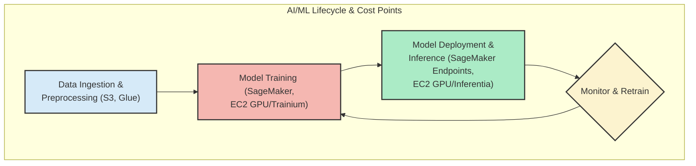
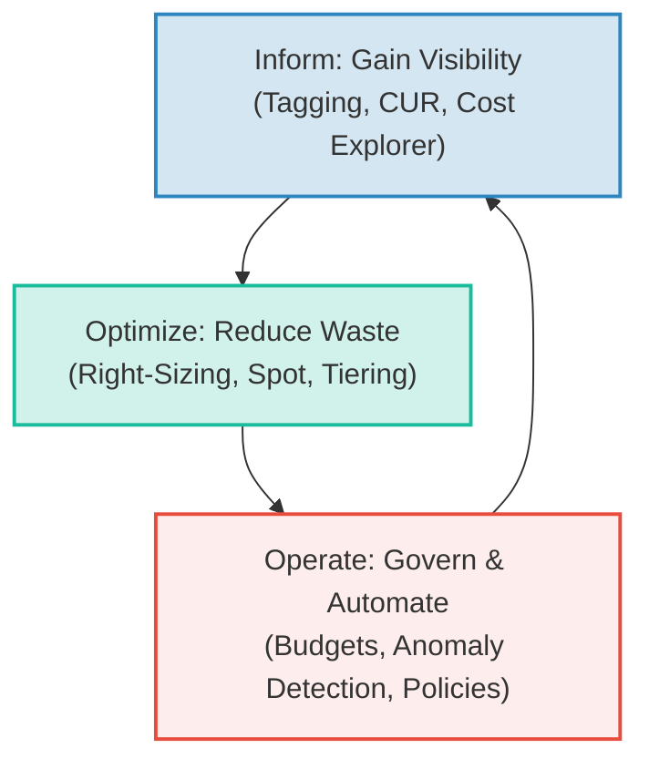

# FinOps for AI: Optimizing Cloud Spend for Machine Learning Workloads on AWS

Artificial intelligence and machine learning are transforming industries, but they come with a significant price tag. The iterative nature of model development, massive datasets, and reliance on specialized hardware can lead to unpredictable and spiraling cloud costs. Applying FinOps principles—the practice of bringing financial accountability to the variable spend model of the cloud—is no longer a "nice-to-have" but a critical discipline for any organization serious about AI.

This guide provides a practitioner-focused approach to implementing FinOps for your AI/ML workloads on AWS. We'll move beyond generic advice and dive into specific strategies for compute, storage, and specialized accelerators, helping you balance innovation with cost efficiency.

### What You'll Get

*   Actionable strategies for optimizing compute, storage, and specialized hardware costs.
*   A breakdown of AWS services and tools tailored for ML cost management.
*   Best practices for monitoring, forecasting, and governing your AI spend.
*   Clear guidance on avoiding common pitfalls that inflate ML cloud bills.

## Understanding the AI/ML Cost Landscape

AI/ML workloads have a unique cost profile compared to traditional applications. The lifecycle is highly experimental and resource-intensive, with costs accumulating across three main phases: data processing, model training, and inference.



*   **Data Processing:** Costs are driven by storage volume (S3), data transfer, and processing jobs (e.g., AWS Glue, EMR). Large datasets can incur significant storage and egress fees.
*   **Model Training:** This is often the most expensive phase, characterized by short, intense bursts of compute using powerful GPUs or custom accelerators.
*   **Inference:** While a single prediction is cheap, inference at scale can become a dominant, continuous cost. It requires a 24/7 "always-on" infrastructure, making optimization crucial.

## Cost Optimization Strategies for AI Compute

Compute is typically the largest component of your ML bill. Optimizing it requires a multi-faceted approach, from instance selection to leveraging managed services.

### Choosing the Right Compute Option

You have a choice between raw EC2 instances and managed services like Amazon SageMaker. Each has its trade-offs.

| Option | Best For | Cost Profile | Management Overhead |
| :--- | :--- | :--- | :--- |
| **EC2 On-Demand** | Quick experiments, unpredictable workloads | Highest per-hour cost | High (manual setup) |
| **EC2 Spot Instances** | Fault-tolerant training jobs | Lowest cost (up to 90% savings) | Medium (requires handling interruptions) |
| **Savings Plans/RIs** | Stable, predictable inference workloads | Significant savings over On-Demand | Low (commitment-based) |
| **Amazon SageMaker** | End-to-end ML lifecycle | Higher than EC2, but includes orchestration | Low (managed environment) |

For most teams, a hybrid approach is best. Use **Amazon SageMaker** to abstract away infrastructure management, and leverage its features like Managed Spot Training to get the cost benefits of Spot Instances without the manual overhead.

### Right-Sizing Instances and Accelerators

Overprovisioning is a primary driver of wasted spend. It's tempting to choose the most powerful GPU instance, but it's often unnecessary.

*   **Use AWS Compute Optimizer:** This service analyzes your resource utilization and provides right-sizing recommendations for your EC2 and SageMaker instances.
*   **Choose the Right Accelerator:** Don't default to a general-purpose GPU. AWS offers specialized hardware that can deliver better performance-per-dollar for specific tasks.
    *   **AWS Trainium:** Purpose-built for high-performance *training* of deep learning models. Can offer significant cost savings over comparable GPU-based instances.
    *   **AWS Inferentia:** Designed for high-throughput, low-latency *inference*. Ideal for reducing the cost of running models in production.
*   **Profile Your Models:** Use tools like [Amazon SageMaker Debugger](https://aws.amazon.com/sagemaker/debugger/) to identify performance bottlenecks and determine if your model is CPU-bound, memory-bound, or I/O-bound. This insight helps you select an instance with the right balance of resources.

### Leveraging Spot Instances for Training

Training jobs are often long-running and can tolerate interruptions, making them perfect candidates for EC2 Spot Instances. Amazon SageMaker's Managed Spot Training simplifies this process immensely.

> **Pro Tip:** By enabling Managed Spot Training in SageMaker, you can save up to 90% on your training costs. SageMaker automatically manages the Spot Instance lifecycle, checkpointing your job, and resuming it on a new instance if the old one is reclaimed.

Here’s a simplified example of how you enable it using the SageMaker Python SDK:

```python
import sagemaker
from sagemaker.pytorch import PyTorch

# Configure the estimator
estimator = PyTorch(
    entry_point='train.py',
    role=sagemaker.get_execution_role(),
    instance_count=1,
    instance_type='ml.p3.2xlarge',
    framework_version='1.12',
    py_version='py38',
    # --- FinOps Magic Here ---
    use_spot_instances=True,      # Enable Spot Training
    max_wait=3600,                # Max time to wait for a Spot instance (in seconds)
    max_run=1800                  # Max job run time (in seconds)
)

# Start the training job
estimator.fit({'training': 's3://my-bucket/my-training-data/'})
```
By adding `use_spot_instances=True`, you instruct SageMaker to use Spot Instances, dramatically lowering the cost of this training run.

## Taming Storage and Data Transfer Costs

While compute often takes the spotlight, storage and data transfer costs can silently accumulate.

### S3 Storage Tiering

Your ML data has a lifecycle. Not all data needs to be in the most expensive, highest-performance storage tier.

*   **S3 Intelligent-Tiering:** This is the ideal storage class for ML datasets with unknown or changing access patterns. It automatically moves data between frequent and infrequent access tiers, optimizing costs without performance impact or operational overhead.
*   **Lifecycle Policies:** For predictable access patterns, create lifecycle policies to automatically transition older model artifacts, logs, and checkpoints to cheaper storage like **S3 Glacier Instant Retrieval** or **S3 Glacier Deep Archive**.

### Minimizing Data Transfer Fees

Data transfer costs are notoriously difficult to track but can be significant.

*   **Co-locate Resources:** Ensure your S3 buckets, SageMaker instances, and other AWS resources are in the same region to avoid inter-region data transfer charges.
*   **Use VPC Endpoints:** When accessing S3 from within your VPC (e.g., from a SageMaker Notebook), use a [Gateway VPC Endpoint for S3](https://docs.aws.amazon.com/vpc/latest/privatelink/vpc-endpoints-s3.html). This keeps traffic within the AWS network, avoiding costly NAT Gateway processing fees.

## Monitoring and Governance: The FinOps Core

You cannot optimize what you cannot measure. A robust monitoring and governance strategy is the foundation of FinOps.

### Gaining Visibility with AWS Tools

*   **Tagging is Non-Negotiable:** Implement a mandatory tagging strategy for all ML resources. This is the single most important step for cost visibility.
    *   **Essential Tags:** `project-name`, `team-owner`, `environment` (dev/staging/prod), `experiment-id`.
*   **AWS Cost Explorer:** Use Cost Explorer, filtered by your tags, to visualize spending trends and identify the biggest cost drivers.
*   **AWS Budgets:** Set up budget alerts for specific projects, teams, or services. Configure alerts to notify you via Slack or email when costs exceed a predefined threshold.
*   **Cost and Usage Report (CUR):** For deep analysis, ingest the CUR into Amazon Athena and query it to get granular, hourly-level cost data for your ML workloads.

> "A resource without a tag is a resource you can't attribute. In the world of AI/ML, where hundreds of experiments might run in parallel, untagged resources are a direct path to financial chaos."

### Forecasting and Anomaly Detection

*   **AWS Cost Anomaly Detection:** Enable this free service to automatically detect unusual spending patterns and alert you to potential cost overruns before they escalate.
*   **Collaborative Forecasting:** Your FinOps team, data scientists, and ML engineers must collaborate. The ML team knows about upcoming training jobs and new model deployments; the FinOps team can translate that into a cost forecast.

## Tying It All Together: A FinOps Flywheel for AI

Effective FinOps isn't a one-time project; it's a continuous cycle of improvement.



1.  **Inform:** Start with complete visibility through meticulous tagging and monitoring.
2.  **Optimize:** Use the data you've gathered to make informed decisions about right-sizing, instance selection, and storage tiering.
3.  **Operate:** Embed cost-awareness into your MLOps processes. Use budgets and automation to enforce governance and create a culture of financial accountability.

By consistently turning this flywheel, you create a virtuous cycle where every optimization provides more data to inform the next round of decisions, leading to a more cost-efficient and sustainable AI/ML practice.

---

Managing AI/ML costs on the cloud is a complex but solvable challenge. It requires a cultural shift towards cost-awareness, a strong partnership between finance and engineering, and the disciplined application of the strategies outlined above.

What's your biggest challenge in managing AI/ML cloud costs? Share your experience in the comments below.


## Further Reading

- [https://aws.amazon.com/blogs/aws/finops-for-ml-workloads-deep-dive-2026/](https://aws.amazon.com/blogs/aws/finops-for-ml-workloads-deep-dive-2026/)
- [https://www.finops.org/framework/ai-ml-workloads-cost-optimization/](https://www.finops.org/framework/ai-ml-workloads-cost-optimization/)
- [https://docs.aws.amazon.com/whitepapers/cost-optimization-for-ai-ml.pdf](https://docs.aws.amazon.com/whitepapers/cost-optimization-for-ai-ml.pdf)
- [https://www.cloudhealthtech.com/blog/2026/06/finops-ai-cost-efficiency-aws](https://www.cloudhealthtech.com/blog/2026/06/finops-ai-cost-efficiency-aws)
- [https://www.gartner.com/en/articles/finops-trends-for-ai-cloud-spend-2026](https://www.gartner.com/en/articles/finops-trends-for-ai-cloud-spend-2026)
