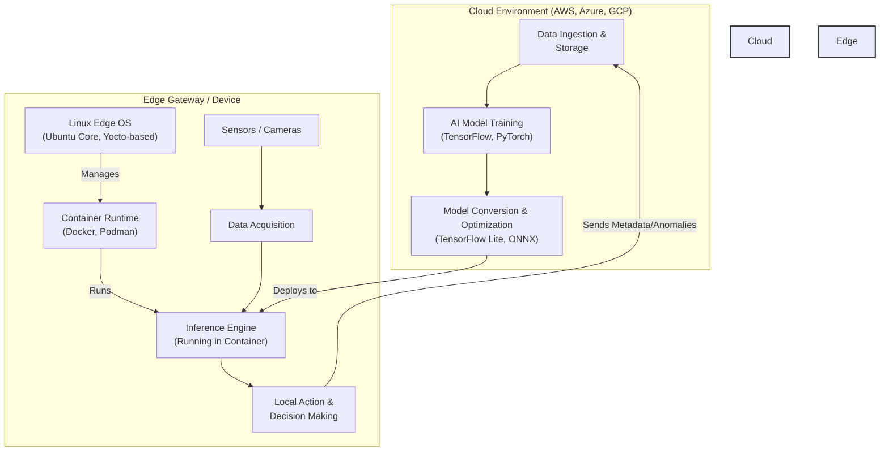

# Linux on the Edge: Powering Next-Gen AIoT Devices and Gateways

The fusion of Artificial Intelligence and the Internet of Things—AIoT—is transforming industries by bringing computation closer to the data source. From smart factories to autonomous vehicles, intelligent edge devices are making real-time decisions without relying on the cloud. At the heart of this revolution is Linux, the open-source kernel that has become the de facto operating system for building reliable, secure, and powerful edge solutions.

This article explores why Linux is the definitive choice for AIoT and examines the specific distributions and characteristics that make it uniquely suited for the demands of edge computing. We'll move beyond the hype and dive into the technical details that matter to developers and architects building the next generation of intelligent devices.

### What You'll Get

*   **Core Concepts:** Understand why Linux dominates the edge computing landscape.
*   **Technical Deep-Dive:** Learn about the key features of an edge-optimized Linux OS, including minimal footprints, real-time processing, and security hardening.
*   **Distro Showcase:** A look at prominent edge Linux distributions like Ubuntu Core, RHEL for Edge, and the Yocto Project.
*   **Practical Workflow:** A high-level view of the AIoT development pipeline, from cloud training to edge deployment.
*   **Actionable Examples:** See practical code snippets and architectural diagrams relevant to real-world scenarios.

---

## Why Linux is the Standard for the Edge

Linux wasn't just adopted for the edge; it feels like it was destined for it. Its foundational principles of modularity, flexibility, and open-source collaboration make it the ideal platform for the diverse and demanding world of AIoT.

*   **Unmatched Customizability:** The Linux kernel and its surrounding ecosystem can be stripped down or built up to fit any hardware profile. You can create a multi-gigabyte OS for a powerful edge gateway or a sub-100MB image for a resource-constrained sensor node.
*   **Hardware Abstraction:** Linux boasts one of the most extensive sets of hardware drivers in existence. This simplifies development, allowing teams to focus on their application logic rather than writing low-level drivers for specific chipsets or peripherals.
*   **Kernel Stability and Performance:** The Linux kernel is famously robust, a non-negotiable requirement for devices that may operate for years without direct human intervention. Its process scheduler and networking stack are highly optimized for performance.
*   **Open Source and Community Driven:** With no vendor lock-in and a global community of developers, security researchers, and maintainers, Linux benefits from constant scrutiny and innovation. If you encounter a problem, chances are someone else already has and a solution exists.

> **What about RTOS?**
> While Real-Time Operating Systems (RTOS) like FreeRTOS are excellent for microcontrollers with extreme low-latency requirements, Linux occupies the space of more powerful "rich edge" devices. These devices run complex applications, manage multiple tasks, and often require a full networking stack and POSIX-compliant environment, which is where Linux excels.

## Key Characteristics of an Edge-Optimized Linux

Not all Linux distributions are created equal, especially when it comes to the edge. An "edge-optimized" Linux OS is meticulously engineered with several key characteristics.

### Minimal Footprint

Edge devices often have limited flash storage and RAM. A minimal OS reduces the attack surface, lowers resource consumption, and improves boot times.

Build systems are crucial for achieving this. Instead of starting with a general-purpose distribution and removing packages, tools like the **[Yocto Project](https://www.yoctoproject.org/)** and **[Buildroot](https://buildroot.org/)** allow you to construct a custom Linux image from the ground up, including only the essential libraries and packages your application needs.

### Real-Time Capabilities

For many AIoT applications, such as industrial robotics or autonomous drone navigation, "fast enough" isn't good enough. They require deterministic, low-latency processing. This is where real-time Linux comes in.

The **PREEMPT_RT patchset**, a long-running effort now being merged into the mainline kernel, transforms Linux into a hard real-time operating system. It makes the kernel almost fully preemptible, significantly reducing the maximum time a high-priority task has to wait.

You can check if your kernel has real-time capabilities with a simple command:
```bash
$ uname -v
#... PREEMPT_RT ...
```

### Robust Security Hardening 🛡️

With millions of devices deployed in the field, edge security is paramount. A single vulnerability could be catastrophic. Modern edge Linux distros incorporate multiple layers of security:

*   **Immutable Root Filesystem:** The core operating system is mounted as read-only. This prevents unauthorized modifications, both malicious and accidental. Updates are applied atomically—either the entire update succeeds, or the system rolls back to the last known good state.
*   **Mandatory Access Control (MAC):** Systems like **SELinux** and **AppArmor** enforce strict policies on what applications can do, containing potential breaches by limiting an attacker's ability to move laterally.
*   **Secure Boot:** Ensures that the device only boots trusted, cryptographically signed software, preventing rootkits and other low-level malware from taking hold.
*   **Application Confinement:** Using containers or sandboxing technologies (like Ubuntu's snaps), applications are isolated from each other and the host OS, each with a minimal set of required permissions.

### Containerization at the Edge

Containers have become the standard for packaging and deploying applications, and the edge is no exception. Tools like Docker and Podman allow developers to package AI models and their dependencies into portable images that run consistently everywhere.

This is a sample `Dockerfile` for a simple Python-based inference application:

```dockerfile
# Use a lean base image suitable for edge devices
FROM python:3.9-slim-bullseye

# Set the working directory inside the container
WORKDIR /app

# Copy and install Python dependencies efficiently
COPY requirements.txt .
RUN pip install --no-cache-dir -r requirements.txt

# Copy the pre-trained model and application script
COPY ./model /app/model
COPY app.py .

# Define the command to run when the container starts
CMD ["python", "app.py", "--model", "./model/model.tflite"]
```
For managing containers on multiple devices, lightweight Kubernetes distributions like **[K3s](https://k3s.io/)** are gaining popularity, bringing powerful orchestration capabilities to resource-constrained environments.

## Leading Linux Distributions for the Edge

While you can technically adapt any Linux distribution for the edge, several projects are specifically designed for it.

| Feature | Yocto Project | Ubuntu Core | RHEL for Edge |
| :--- | :--- | :--- | :--- |
| **Type** | Build Framework | Immutable OS | Enterprise OS |
| **Package Mgmt** | BitBake Layers | Snaps (Transactional) | RPM-OSTree (Atomic) |
| **Best For** | Deeply embedded, custom hardware | Secure, OTA-focused devices | Enterprise, mission-critical gateways |
| **Learning Curve** | High | Low-to-Medium | Medium |
| **Key Strength** | Extreme customization | Security & App Confinement | Stability & Enterprise Support |

### Yocto Project

The Yocto Project is not a distribution itself but a powerful open-source collaboration project that provides templates, tools, and methods to create custom Linux-based systems for embedded products. It offers ultimate control but comes with a steep learning curve.

### Ubuntu Core

[Ubuntu Core](https://ubuntu.com/core) is a minimal, containerized version of Ubuntu designed for IoT and edge devices. Its entire architecture is based on **snaps**—secure, confined, and transactional application packages. OS and application updates are atomic and can be rolled back, making it extremely reliable for remote devices.

### RHEL for Edge

[Red Hat Enterprise Linux for Edge](https://www.redhat.com/en/technologies/linux-platforms/enterprise-linux/edge) extends the trusted RHEL platform to small-footprint devices. It uses **RPM-OSTree** to provide atomic updates and rollbacks and is designed for workloads running in containers managed by Podman. Its key selling point is integration with the wider Red Hat ecosystem, including Ansible for automation and OpenShift for container orchestration.

## The AIoT Workflow: From Cloud to Edge

Developing and deploying an AIoT solution involves a continuous loop between the cloud and the edge. Linux plays a critical role at the edge, serving as the platform for the deployed AI model.

Here is a typical workflow:



1.  **Cloud Training:** AI models are trained on large datasets in the cloud using powerful GPUs and frameworks like TensorFlow or PyTorch.
2.  **Model Optimization:** The trained model is converted and optimized using a tool like [TensorFlow Lite](https://www.tensorflow.org/lite) or the [ONNX Runtime](https://onnxruntime.ai/) to run efficiently on resource-constrained edge hardware.
3.  **Deployment:** The optimized model and its inference application are packaged into a container and deployed to the edge device.
4.  **Edge Inference:** The Linux-powered edge device captures data from sensors, runs it through the local model, and makes an immediate decision or takes an action.
5.  **Feedback Loop:** Only relevant metadata, insights, or anomalies are sent back to the cloud for further analysis, storage, or model retraining.

## Conclusion

Linux is more than just an operating system for the edge; it is the foundational building block for the entire AIoT ecosystem. Its open-source nature, combined with a relentless focus on security, real-time performance, and modularity from projects like Yocto, Ubuntu Core, and RHEL for Edge, provides the stability and flexibility that developers need.

As AIoT devices become more powerful and autonomous, the role of a robust, secure, and customizable underlying OS will only grow more critical. For the foreseeable future, that OS is, and will continue to be, Linux.


## Further Reading

- [https://www.linuxfoundation.org/blog/2026/06/linux-for-edge-aiot-update](https://www.linuxfoundation.org/blog/2026/06/linux-for-edge-aiot-update)
- [https://ubuntu.com/blog/2026/06/ubuntu-core-for-aiot-devices](https://ubuntu.com/blog/2026/06/ubuntu-core-for-aiot-devices)
- [https://www.redhat.com/en/blog/rhel-for-edge-computing-ai](https://www.redhat.com/en/blog/rhel-for-edge-computing-ai)
- [https://docs.kernel.org/edge-computing/overview.html](https://docs.kernel.org/edge-computing/overview.html)
- [https://www.zdnet.com/article/best-linux-distros-for-edge-ai-2026/](https://www.zdnet.com/article/best-linux-distros-for-edge-ai-2026/)
