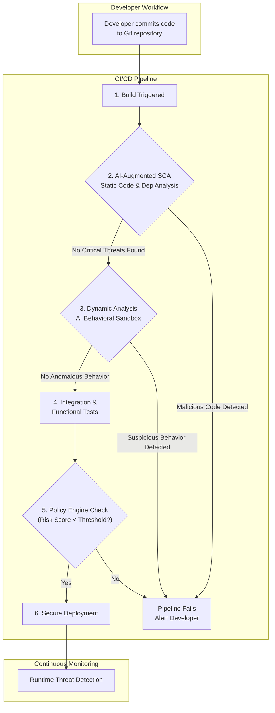

# Beyond CVEs: AI-Driven Supply Chain Security for DevSecOps in 2026

The software supply chain remains a primary battleground for cyber attacks. Incidents like SolarWinds and Log4Shell were wake-up calls, demonstrating that traditional vulnerability scanning, focused on known Common Vulnerabilities and Exposures (CVEs), is no longer sufficient. We are reactive, always a step behind. By 2026, the DevSecOps landscape will have fundamentally shifted, embracing AI-driven intelligence to move from a reactive to a proactive security posture. This isn't about replacing developers; it's about arming them with predictive insights.

### What You'll Get

*   **The Limitations of CVE Scanning:** Understand why relying solely on CVEs leaves you vulnerable.
*   **AI-Powered Techniques:** Discover how AI analyzes code behavior, contributor reputation, and semantic meaning.
*   **The 2026 DevSecOps Workflow:** Visualize how AI integrates into a modern CI/CD pipeline.
*   **Emerging Tools & Frameworks:** A look at the next generation of supply chain security tooling.
*   **Actionable Insights:** Learn how to prepare your team for this paradigm shift.

## The CVE-Centric Blind Spot

For years, Software Composition Analysis (SCA) has been the cornerstone of supply chain security. Its primary function is to scan your dependencies, match them against databases like the NVD, and flag known CVEs. While essential, this model has critical flaws in a modern threat landscape.

*   **It's Reactive:** A CVE is documented *after* a vulnerability has been discovered, and often after it has been exploited. This leaves a significant window of exposure.
*   **It Misses Zero-Days:** By definition, CVE scanning cannot detect novel or undisclosed vulnerabilities.
*   **It Ignores Malicious Intent:** A package can be "vulnerability-free" but contain intentionally malicious code. Typosquatting, dependency confusion, and maintainer account takeovers all introduce threats that have no associated CVE.

> The SolarWinds attack was a watershed moment. The malicious code was not a pre-existing vulnerability; it was a deliberately injected implant within a trusted software update. No CVE scanner could have detected it at the time.

This is where Artificial Intelligence changes the game. It shifts the focus from a "list of known bads" to a "pattern of suspicious behavior."

## The AI Paradigm Shift: From Signatures to Behavior

AI doesn't just check a library's version number; it dissects its essence. By training models on vast datasets of both benign and malicious code, AI can identify subtle anomalies and predict risk far more effectively than signature-based tools.

### Key AI-Powered Techniques

Here are the core methods driving this evolution:

#### Behavioral Anomaly Detection
Instead of just scanning static code, AI-driven tools execute dependencies in a secure, sandboxed environment during the CI process. They monitor for suspicious actions:
*   Unexpected network callouts to unknown domains.
*   Unauthorized filesystem access or modification.
*   Spawning of unexpected child processes.
*   Attempts to exfiltrate environment variables or secrets.

#### Code Semantic Analysis
Leveraging Large Language Models (LLMs) trained on billions of lines of code, these systems analyze the *intent* of the source code itself.
*   **Detecting Obfuscation:** AI can identify code that is intentionally convoluted, a common tactic for hiding malicious logic.
*   **Identifying "Logic Bombs":** The model can recognize code blocks that are dormant until a specific condition is met.
*   **Flagging Data Exfiltration Patterns:** AI can spot functions designed to collect and send data in non-standard ways.

#### Contributor Reputation Analysis
An open-source package is only as trustworthy as the people who write it. AI platforms now ingest data from sources like GitHub, GitLab, and developer forums to build a reputation score for every contributor.
*   **Sudden Changes in Behavior:** A reputable developer who suddenly commits obfuscated or low-quality code is a major red flag.
*   **Low-Reputation Contributions:** A critical new feature added by a brand-new, anonymous account will be flagged for human review.
*   **Social Engineering Detection:** AI can even analyze commit messages and pull request comments for signs of social engineering or coercion.

The output is no longer a simple "vulnerable/not vulnerable" flag. It's a rich, contextual risk profile.

```json
{
  "dependency": "acme-parser@3.1.4",
  "overall_risk_score": 8.7,
  "risk_factors": [
    {
      "type": "Behavioral",
      "description": "Post-install script makes network call to unregistered TLD (.xyz)",
      "severity": "CRITICAL"
    },
    {
      "type": "Code Semantics",
      "description": "Base64 encoded string found in binary asset, decodes to shell script",
      "severity": "HIGH"
    },
    {
      "type": "Contributor",
      "description": "Primary contributor's NPM account was inactive for 2 years prior to this release",
      "severity": "MEDIUM"
    }
  ],
  "suggested_action": "Quarantine package and downgrade to v3.1.2. Manual review required."
}
```

## A Glimpse into the 2026 DevSecOps Workflow

AI-driven security is not a separate, standalone step. It is seamlessly integrated throughout the CI/CD pipeline, providing continuous analysis and feedback.

This Mermaid diagram illustrates the modern flow:



In this model, security checks are performed *before* extensive testing, saving time and resources. The pipeline fails fast on clear threats, providing developers immediate, actionable feedback directly in their workflow.

## Emerging Tools and Frameworks

The tooling landscape is evolving rapidly to support this new paradigm. While many existing vendors are integrating AI, a new class of specialized tools is emerging.

| Tool Category | Key Features | Conceptual Examples |
| :--- | :--- | :--- |
| **AI-Augmented SCA** | Semantic code analysis, predictive vulnerability detection, contributor reputation scoring. | *CodeTrust, Veracode AI, Snyk Intel* |
| **Dynamic Analysis Platforms** | Automated sandboxing in CI, behavioral analysis, network traffic monitoring for dependencies. | *Dependency Sandbox, ReversingLabs, Socket.dev* |
| **Trust & Reputation Engines** | Aggregates developer and package metadata to create a "trust score." Integrates with package managers. | *OpenSSF Scorecard 2.0, TrustSource AI* |
| **AI-Powered SBOMs** | Generates SBOMs enriched with AI-driven risk scores, license intelligence, and behavioral summaries for each component. | *CycloneDX-AI, Dependency-Track ML* |

These tools move beyond simple pattern matching to provide a holistic view of the risks embedded within your software supply chain.

## The Road Ahead: Challenges and Opportunities

Adopting an AI-driven security model is not without its challenges.

*   **False Positives:** Overly sensitive AI models can create alert fatigue, eroding developer trust. Continuous tuning and human-in-the-loop validation are essential.
*   **Computational Cost:** Dynamic analysis and deep code scanning are more resource-intensive than traditional SCA.
*   **Adversarial AI:** Attackers will inevitably begin using AI to design malware that evades detection, creating a new cat-and-mouse game.

Despite these hurdles, the opportunity is immense. By embracing this shift, organizations can build a more resilient, secure, and efficient development lifecycle. The goal is to empower developers with intelligent tools that allow them to innovate quickly without compromising on security.

The future of DevSecOps isn't about more alerts; it's about better insights. The move beyond CVEs has already begun, and by 2026, AI will be the indispensable co-pilot for every security-conscious engineering team.


## Further Reading

- [https://www.cisa.gov/resources/software-supply-chain-security-ai-report-2026](https://www.cisa.gov/resources/software-supply-chain-security-ai-report-2026)
- [https://snyk.io/blog/ai-in-software-supply-chain-security-2026/](https://snyk.io/blog/ai-in-software-supply-chain-security-2026/)
- [https://owasp.org/www-project-top-ten-supply-chain-risks-ai-focus-2026/](https://owasp.org/www-project-top-ten-supply-chain-risks-ai-focus-2026/)
- [https://www.darkreading.com/analytics/ai-powered-supply-chain-defense-2026](https://www.darkreading.com/analytics/ai-powered-supply-chain-defense-2026)
- [https://www.sonatype.com/blog/2026/06/ai-for-open-source-risk-management](https://www.sonatype.com/blog/2026/06/ai-for-open-source-risk-management)
