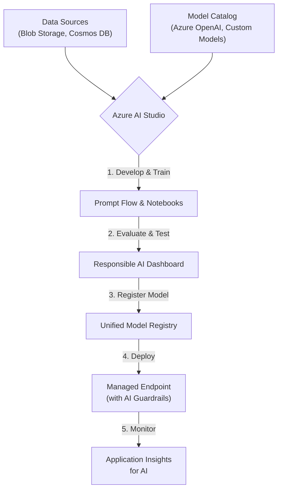

# Azure AI Services 2026: New Horizons in Cognitive Cloud Computing

The AI landscape is moving at an unprecedented pace, and 2026 marks a pivotal year for Microsoft's Azure AI platform. We've moved beyond siloed cognitive services into a new era of integrated, multimodal, and ethically-aware intelligence. The focus has shifted from providing AI "primitives" to offering a cohesive, developer-centric ecosystem that accelerates the creation of sophisticated and responsible AI applications.

This article explores the significant updates to the Azure AI portfolio in 2026. We'll dive into the new unified studio, groundbreaking multimodal capabilities, and the "responsible AI by design" philosophy that now underpins the entire platform.

### What You'll Get

*   **Unified Development:** An overview of the matured Azure AI Studio as the central hub for all AI workloads.
*   **Multimodal Advancements:** Details on the new Cognitive Synthesis API for processing mixed media inputs.
*   **Responsible AI in Practice:** A look at the new, deeply integrated AI Guardrails service.
*   **Industry-Specific Solutions:** How Azure is delivering specialized, pre-trained AI for key sectors.
*   **Practical Examples:** Code snippets and diagrams to illustrate these new capabilities.

---

## Azure AI Studio: The Unified Development Hub

In 2026, the fragmentation of AI development environments is a thing of the past. Azure AI Studio has evolved into the definitive, all-in-one platform for building, deploying, and managing AI solutions. It fully integrates the capabilities previously found in separate studios for Machine Learning, Cognitive Services, and Azure OpenAI.

This unified approach streamlines the entire MLOps lifecycle, from data ingestion and model training to deployment and real-time monitoring.

### Key Enhancements in AI Studio

*   **Integrated Model Catalog:** Access a vast library of models, including Microsoft's latest foundation models, third-party offerings from partners like Hugging Face, and your own custom-trained models—all in one place.
*   **Visual Prompt Flow:** The prompt engineering tool, Prompt Flow, now supports complex, multi-turn, and multimodal interactions. You can visually chain together prompts, models, and data sources to create sophisticated AI agents.
*   **Automated MLOps Pipelines:** Simplified YAML-based definitions for creating and triggering complete CI/CD pipelines, including data validation, model testing, and staged deployments.

The diagram below illustrates a typical development workflow within the new Azure AI Studio.



> **From the Field:** "The consolidation into a single AI Studio has cut our development cycle for new AI features by nearly 40%. The friction between experimentation and production is effectively gone." - Lead AI Engineer, Contoso Corp.

## The Rise of Multimodal Intelligence

Perhaps the most significant leap forward is in multimodal AI. Azure now treats text, images, audio, and video not as separate data types but as interconnected streams of information. This enables applications to understand context and nuance in a way that was previously impossible.

### Introducing the Cognitive Synthesis API

The new star of the show is the **Cognitive Synthesis API**. This single, unified endpoint can ingest and process a combination of inputs in a single call, providing a holistic, synthesized output.

Imagine feeding an API a video stream, an audio track, and a text-based question about the content. The Cognitive Synthesis API can process all three inputs simultaneously to provide a single, coherent answer.

Here’s a conceptual Python example demonstrating its power:

```python
# pip install azure-ai-synthesis-sdk
from azure.ai.synthesis import SynthesisClient
from azure.identity import DefaultAzureCredential

# Authenticate
credential = DefaultAzureCredential()
client = SynthesisClient(endpoint="https...cognitivesynthesis.azure.com", credential=credential)

# Define multimodal inputs
multimodal_request = {
    "video_url": "https://<storage-account>/meeting-recording.mp4",
    "audio_stream": "https://<storage-account>/meeting-audio.wav",
    "prompt": "Summarize the key decisions made in the first 10 minutes and identify who proposed the final marketing budget."
}

# Make a single API call for a complex task
response = client.analyze(request=multimodal_request)

print(f"Summary: {response.summary}")
print(f"Key Decision Maker: {response.entities['budget_proposer']}")
```

This removes the complexity of orchestrating multiple API calls (e.g., one for transcription, one for vision, one for language understanding) and allows the underlying model to draw richer, cross-modal conclusions.

## Responsible AI by Design

Microsoft's commitment to ethical AI takes a major step forward with the introduction of **Azure AI Guardrails**, a service that is deeply integrated across the AI Studio. Instead of being an afterthought, responsible AI practices are now embedded directly into the development and deployment workflow.

### Core Features of AI Guardrails

*   **Real-time Content Safety:** Configurable filters for harmful content, hate speech, and personally identifiable information (PII) that are applied at the endpoint level.
*   **Bias and Fairness Audits:** Integrated tools within the AI Studio to automatically test models for demographic and social biases before they are deployed.
*   **Explainability-as-a-Service:** For supported models, you can now call an endpoint to get human-readable explanations for specific model outputs, helping with transparency and debugging.
*   **Groundedness Checks:** For generative models, Guardrails can automatically verify that the model's output is grounded in the provided source data, significantly reducing hallucinations in RAG (Retrieval-Augmented Generation) scenarios.

| Feature             | 2024 Approach (Manual)                                    | 2026 Approach (Integrated)                                |
| ------------------- | --------------------------------------------------------- | --------------------------------------------------------- |
| **Content Safety**  | Separate Content Moderator API call after model response. | Built-in, configurable safety filter at the endpoint.     |
| **Bias Detection**  | SDK-based, offline analysis using Fairlearn.              | Automated bias report generation during model evaluation. |
| **Hallucination**   | Manual prompt engineering and fact-checking.              | Real-time "groundedness" score as part of the API response. |

## Specialized AI for Industry Verticals

Recognizing that general-purpose models are not always enough, Azure has launched several new, highly-specialized AI services tailored for specific industries. These services come with pre-trained models, fine-tuned on industry-specific datasets, and compliant with relevant data regulations.

### New Industry-Specific Services in 2026

*   **Azure AI for Digital Health:** A HIPAA-compliant service for analyzing medical imaging (like X-rays and MRIs), extracting insights from clinical notes, and powering diagnostic support tools.
*   **Azure AI for Financial Services:** Tools for advanced fraud detection, algorithmic trading compliance checks, and automated analysis of financial reports and earnings calls.
*   **Azure AI for Supply Chain:** A solution for demand forecasting, route optimization, and anomaly detection in logistics data, helping businesses build more resilient supply chains.

These specialized solutions dramatically lower the barrier to entry for organizations in these sectors, allowing them to leverage state-of-the-art AI without needing to build and train massive models from scratch. For more details, see the official [Azure AI updates and roadmap](https://azure.microsoft.com/blog/2026/06/azure-ai-updates-and-roadmap/).

## Final Thoughts 🚀

The Azure AI ecosystem of 2026 is smarter, more integrated, and fundamentally more accessible for developers. The shift towards a unified studio, powerful multimodal capabilities, and built-in responsible AI guardrails empowers teams to build next-generation applications faster and more safely than ever before. By abstracting away immense complexity, Azure is solidifying its position as the go-to platform for enterprises looking to infuse their operations with meaningful, production-grade artificial intelligence.


## Further Reading

- [https://azure.microsoft.com/en-us/blog/2026/06/azure-ai-updates-and-roadmap/](https://azure.microsoft.com/en-us/blog/2026/06/azure-ai-updates-and-roadmap/)
- [https://docs.microsoft.com/en-us/azure/ai-services/whats-new-2026](https://docs.microsoft.com/en-us/azure/ai-services/whats-new-2026)
- [https://techcommunity.microsoft.com/t5/azure-ai-blog/new-horizons-in-azure-ai-2026/](https://techcommunity.microsoft.com/t5/azure-ai-blog/new-horizons-in-azure-ai-2026/)
- [https://www.zdnet.com/article/microsoft-azure-ai-latest-innovations/](https://www.zdnet.com/article/microsoft-azure-ai-latest-innovations/)
- [https://www.forrester.com/report/azure-ai-ecosystem-review-2026/](https://www.forrester.com/report/azure-ai-ecosystem-review-2026/)
