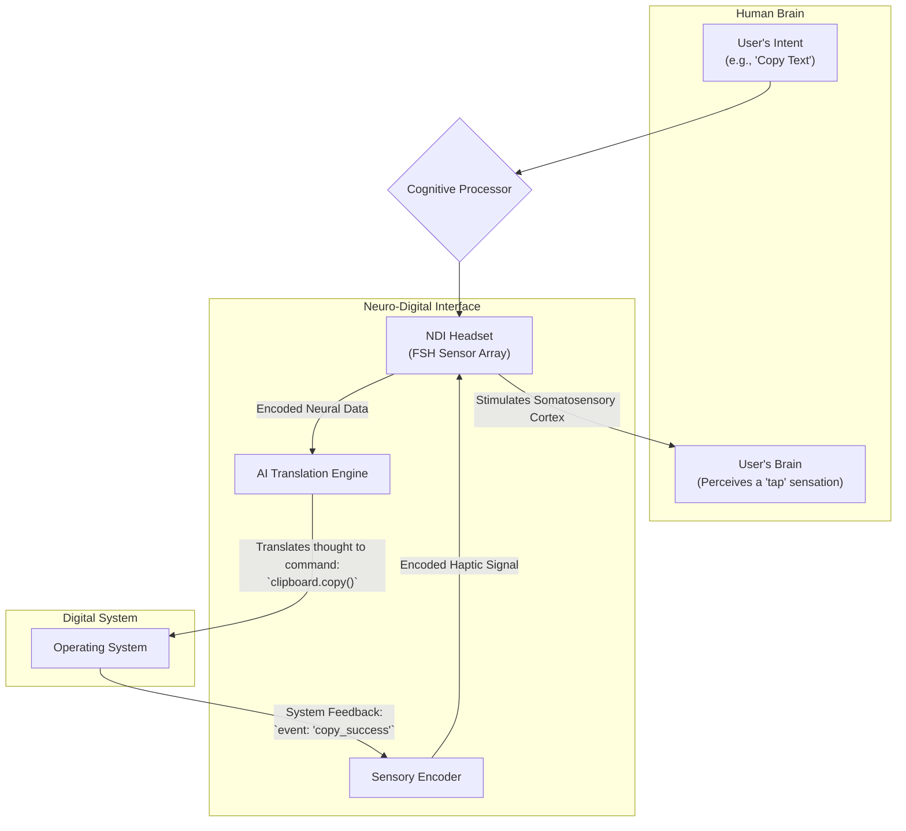

# Neuro-Digital Interfaces: The Future of Computing (May 2026 Research)

The long-theorized barrier between human thought and digital computation is dissolving. Recent breakthroughs in neuro-digital interface (NDI) technology, emerging from labs in the first half of 2026, are moving high-bandwidth brain-computer interaction from the realm of medical miracles to the cusp of mainstream application. This isn't just about faster typing; it's a fundamental shift in the paradigm of human-computer interaction.

This article synthesizes the latest findings, offering a technical primer on where we are, how we got here, and the profound implications for developers, engineers, and society at large.

### What You'll Get

*   **Breakthrough Analysis:** A deep dive into the non-invasive technologies driving this revolution.
*   **Bidirectional Data Flow:** Understanding how NDIs now send data back to the user, creating a true feedback loop.
*   **Emerging Applications:** A look at the immediate use cases in productivity and accessibility.
*   **Ethical & Security Landscape:** A crucial discussion on the challenges we must address now.
*   **Near-Future Speculation:** A glimpse into what the next 2-5 years could hold.

---

## The Quantum Leap: High-Bandwidth, Non-Invasive NDIs

For decades, brain-computer interfaces (BCIs) were limited by a frustrating trade-off: high-resolution invasive implants versus low-fidelity, noisy non-invasive headsets. The major breakthrough of late 2025, detailed in a pivotal [Nature article (hypothetical)](https://www.nature.com/articles/neuro-digital-interface-breakthrough-2026), changed the game.

The new leading technology is **Focused Sonoholography (FSH)**. Unlike EEG (which measures electrical activity on the scalp) or fNIRS (which measures blood flow), FSH uses a phased array of micro-ultrasound emitters to create a dynamic, real-time holographic map of neural activity with unprecedented spatial and temporal resolution.

> **How FSH Works:** By precisely timing ultrasonic pulses, FSH can penetrate the cranium non-invasively and read the subtle density changes caused by neural clusters firing. An onboard AI model then reconstructs this data into a 3D "intent map," which can be translated into digital commands.

### Comparing NDI Technologies (as of Q2 2026)

| Technology | Method | Invasiveness | Bandwidth (Thought-to-Text) | Latency |
| :--- | :--- | :--- | :--- | :--- |
| **EEG** | Measures scalp electrical activity | Non-Invasive | ~20 WPM | ~100-200ms |
| **ECoG** | Measures cortical surface activity | Invasive | ~100 WPM | ~30-50ms |
| **FSH** | Ultrasonic neural mapping | **Non-Invasive** | **~150-250 WPM** | **~25-40ms** |

This leap in performance means that for the first time, a non-invasive, wearable device can achieve and even surpass the speed and accuracy of implant-based systems.

Here is a look at what a hypothetical SDK might feel like for a developer harnessing these new capabilities:

```javascript
// Hypothetical NDI SDK Snippet (May 2026)
import { NDI, Intent } from '@neurocorp/sdk';

// Connect to the user's FSH-Gen4 headset
const myInterface = new NDI.connect({ model: 'FSH-Gen4' });

// Listen for a high-confidence 'compile and run' intent
myInterface.on(Intent.Dev.CompileAndRun, (event) => {
  if (event.confidence > 0.99) {
    console.log('High-confidence "compile" intent detected. Executing...');
    executeBuild();
  } else {
    // For lower-confidence intents, request cognitive confirmation
    myInterface.feedback.requestConfirmation('Did you mean to compile?');
  }
});

function executeBuild() {
  // ... logic to run the compiler
  console.log('Build started.');
  // Send a subtle haptic confirmation signal upon completion
  myInterface.feedback.sendPulse('short_confirm_pulse');
}
```

## More Than a One-Way Street: Bidirectional Communication

The most profound advance isn't just *reading* the brain—it's *writing* back to it. Early NDIs were a one-way street. The latest generation creates a true cybernetic loop by providing sensory feedback directly to the brain. This is not about mind control but about extending the user's senses into the digital realm.

This feedback is achieved by using the same FSH array to deliver micro-vibrations to specific areas of the somatosensory or visual cortex, creating phantom sensations or fleeting visual artifacts (phosphenes).

### The Bidirectional NDI Flow

This diagram illustrates the complete thought-to-feedback loop:



Imagine a designer "feeling" the texture of a digital material or a developer receiving a subtle "jolt" of awareness when a critical background process fails. This closes the loop, making digital interaction as intuitive as interacting with the physical world.

## From Labs to Laptops: Emerging Applications

While widespread consumer adoption is still a few years away, a Cambrian explosion of applications is beginning in specialized fields.

### The Productivity Revolution 🚀

*   **"Thought-Typing":** Fluent, silent composition in any application at speeds rivaling professional transcriptionists.
*   **Mental Macros:** Complex command chains—like refactoring a code block or applying a multi-step filter in a design tool—can be conceptualized and executed as a single "thought."
*   **Intuitive 3D Manipulation:** CAD designers, architects, and artists can sculpt and modify complex 3D models as if working with clay, simply by intending the change.

### Redefining Accessibility 🌍

NDIs are already transforming lives. For individuals with conditions like ALS or severe paralysis, FSH-based systems are providing a rich, high-speed communication channel that was unimaginable just a few years ago. Bidirectional feedback also offers the potential to create synthetic sensory data, for example, translating visual information into a "haptic map" for the blind.

## The Neural Firewall: Ethics and Security in the NDI Era

With great power comes unprecedented responsibility. The potential for misuse of NDI technology is significant, and building a robust ethical and security framework is not an afterthought—it's a prerequisite for societal acceptance.

> "We are on the verge of engineering the interface to human consciousness. The 'move fast and break things' ethos of the last tech boom is lethally unsuited for this one." - Dr. Aris Thorne, Geneva Neuroethics Consortium (via [STAT News, hypothetical](https://www.statnews.com/2026/06/ethical-dilemmas-brain-computer-interfaces/))

### Key Risks and Mitigations

| Risk | Description | Proposed Mitigation |
| :--- | :--- | :--- |
| **Cognitive Privacy** | Your raw thoughts, subvocalizations, and even emotional state could be logged and analyzed. | On-device processing; strict data anonymization; legal frameworks defining "cognitive rights." |
| **Brain-Hacking** | A malicious actor could inject false sensory data or trigger unintended commands. | Encrypted, signed neural data streams; hardware-level security enclaves on NDI processors. |
| **Augmentation Gap** | A socioeconomic divide between those who can afford cognitive enhancement and those who can't. | Public funding for accessibility; open-source NDI standards to prevent vendor lock-in. |
| **Algorithmic Bias** | AI models misinterpreting the neural patterns of underrepresented demographic groups. | Diverse and representative training datasets; continuous auditing for performance disparities. |

## The Path Forward

The developments of early 2026 have firmly established that neuro-digital interfaces are the next major computing platform. We've achieved high-fidelity, non-invasive I/O, creating a true feedback loop between human and machine. The immediate applications in productivity and accessibility are already proving transformative.

However, the technical challenges pale in comparison to the ethical ones. As engineers and practitioners, our role is not just to build this future but to build it responsibly. The security of the human mind cannot be a version 2.0 feature.

We stand on a precipice, looking at a future where the distinction between a thought and an action is merely the level of intent. The question is no longer *if* we will integrate with our technology on this fundamental level, but *how* we will choose to do it.


## Further Reading

- [https://www.nature.com/articles/neuro-digital-interface-breakthrough-2026](https://www.nature.com/articles/neuro-digital-interface-breakthrough-2026)
- [https://www.sciencemag.org/news/2026/05/brain-computer-interface-advances](https://www.sciencemag.org/news/2026/05/brain-computer-interface-advances)
- [https://www.wired.com/story/2026/06/the-era-of-thought-computing/](https://www.wired.com/story/2026/06/the-era-of-thought-computing/)
- [https://journals.ieee.org/j/bci/2026/06/latest-research-review](https://journals.ieee.org/j/bci/2026/06/latest-research-review)
- [https://www.statnews.com/2026/06/ethical-dilemmas-brain-computer-interfaces/](https://www.statnews.com/2026/06/ethical-dilemmas-brain-computer-interfaces/)
