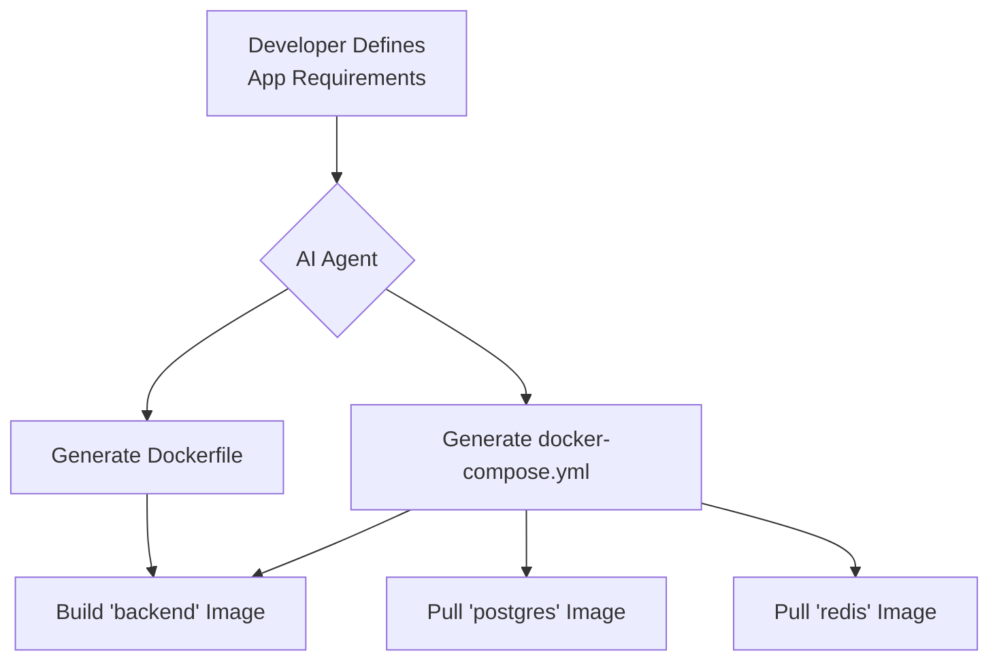
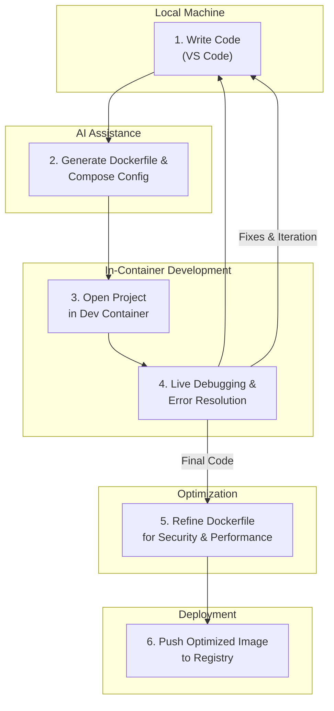

# Optimizing Docker Development Workflows with VS Code & AI Agents

Docker has revolutionized how we build and ship applications, but let's be honest: writing optimal Dockerfiles, managing multi-container setups, and debugging *inside* a container can still be a source of friction. The context-switching is real, and the boilerplate can be tedious. What if you could automate the mundane, get intelligent suggestions, and debug with an AI pair programmer by your side?

This is where the powerful combination of VS Code, its rich container ecosystem, and modern AI agents changes the game. By integrating tools like GitHub Copilot directly into your container development loop, you can significantly reduce complexity and accelerate your workflow. This article dives into practical strategies to supercharge your Docker development, moving you from manual configuration to an intelligent, automated process.

### What You'll Get

*   **Automated Dockerfile & Compose Generation:** Learn how AI can analyze your repository and instantly generate optimized, multi-stage Dockerfiles and `docker-compose.yml` files.
*   **Intelligent Containerization Insights:** Discover how AI helps choose the right base images and suggests security and performance best practices.
*   **Seamless Live Debugging:** A step-by-step guide to using VS Code's Dev Containers for live debugging with AI-assisted error resolution.
*   **Actionable Workflow Diagrams:** High-level Mermaid diagrams illustrating modern, AI-enhanced container workflows.
*   **Practical Code & Prompts:** Real-world examples you can adapt for your projects today.

## The Modern Toolchain: VS Code, Docker, and AI

Your core toolkit for this enhanced workflow is surprisingly lean. It's not about adding dozens of new tools, but about leveraging the synergy between a few powerful ones.

*   **VS Code:** Your development environment.
*   **Docker Extension for VS Code:** Essential for managing images, containers, and Docker contexts directly within the editor. Find it on the [VS Code Marketplace](https://marketplace.visualstudio.com/items?itemName=ms-azuretools.vscode-docker).
*   **Dev Containers Extension:** The key to seamless in-container development. It lets you use a Docker container as a full-featured development environment. Get it from the [VS Code Marketplace](https://marketplace.visualstudio.com/items?itemName=ms-vscode-remote.remote-containers).
*   **An AI Agent:** A code assistant like [GitHub Copilot](https://github.com/features/copilot) or [Codeium](https://codeium.com/). These tools are no longer just for autocompleting code; they are powerful partners for generating configuration and diagnosing issues.

## AI-Powered Dockerfile Generation

Manually writing a Dockerfile is error-prone. Did you forget to expose a port? Are you using an unnecessarily large base image? Are you correctly leveraging multi-stage builds to keep your final image lean? AI agents can answer these questions by analyzing your project's structure.

### From Project Analysis to Dockerfile

An AI assistant can scan your project's dependency files (`package.json`, `requirements.txt`, `pom.xml`, etc.) and infer the application's needs.

**Example Prompt for GitHub Copilot Chat:**

> "Analyze my Node.js project. It uses npm for dependencies. Create an optimized, multi-stage Dockerfile that builds the application and serves it with a non-root user."

The AI will generate a file that looks something like this, often with comments explaining each stage.

```dockerfile
# Stage 1: Build the application
FROM node:20-alpine AS builder

WORKDIR /usr/src/app

# Copy package files and install dependencies
COPY package*.json ./
RUN npm install

# Copy application source code
COPY . .

# Build the application (e.g., for a TypeScript or React project)
RUN npm run build

# Stage 2: Production image
FROM node:20-alpine

WORKDIR /usr/src/app

# Create a non-root user for security
RUN addgroup -S appgroup && adduser -S appuser -G appgroup
USER appuser

# Copy only necessary files from the builder stage
COPY --from=builder /usr/src/app/package*.json ./
COPY --from=builder /usr/src/app/node_modules ./node_modules
COPY --from=builder /usr/src/app/dist ./dist

EXPOSE 3000

CMD [ "node", "dist/main.js" ]
```

> **Pro Tip:** By using a multi-stage build, the final image doesn't contain the build tools and source code, making it smaller and more secure—a best practice AI agents can enforce automatically.

## Intelligent Multi-Container Setups with Docker Compose

For most real-world applications, a single container isn't enough. You need a database, a cache, and maybe other backend services. Manually writing a `docker-compose.yml` file is straightforward but tedious. AI can accelerate this by scaffolding the entire file for you.

### Generating a Compose File

Imagine a project with a Python backend, a PostgreSQL database, and a Redis cache.

**Example Prompt:**

> "Create a `docker-compose.yml` file for a development environment. It needs three services: `backend` (built from the local Dockerfile), `db` (using the official postgres:15 image), and `cache` (using the official redis:7 image). Ensure the backend can connect to the db and cache. Persist the database data using a volume."

This prompt gives the AI all the context it needs. The generated output will be a fully functional compose file, complete with networking, environment variables, and volumes.

```yaml
version: '3.8'

services:
  backend:
    build: .
    ports:
      - "8000:8000"
    volumes:
      - .:/app
    environment:
      - DATABASE_URL=postgresql://user:password@db:5432/mydatabase
      - REDIS_URL=redis://cache:6379
    depends_on:
      - db
      - cache

  db:
    image: postgres:15-alpine
    environment:
      - POSTGRES_USER=user
      - POSTGRES_PASSWORD=password
      - POSTGRES_DB=mydatabase
    volumes:
      - postgres_data:/var/lib/postgresql/data
    ports:
      - "5432:5432"

  cache:
    image: redis:7-alpine

volumes:
  postgres_data:
```

This workflow can be visualized easily. The AI acts as a central configuration engine, interpreting your needs and generating the required artifacts.



## Live Debugging with an AI Co-Pilot

This is where the magic truly happens. Debugging an application *running inside a container* has traditionally been a challenge involving `docker exec`, remote debuggers, and a lot of patience. The **Dev Containers extension** in VS Code simplifies this dramatically.

By adding a `.devcontainer/devcontainer.json` file to your project, you instruct VS Code to open your entire workspace inside a running container. Your terminal, debugger, and editor are all operating within the container's environment, eliminating "it works on my machine" issues.

### The AI-Assisted Debugging Flow

1.  **Generate Dev Container Config:** Use the VS Code command palette (`Ctrl+Shift+P`) and select "Dev Containers: Add Dev Container Configuration Files...". VS Code will analyze your project and suggest a base configuration.
2.  **Reopen in Container:** Once the config is created, a prompt will appear. Click "Reopen in Container." VS Code will build the image and launch your dev environment inside it.
3.  **Set Breakpoints & Debug:** Set a breakpoint in your code just as you would locally. Launch the VS Code debugger (`F5`). When the code hits the breakpoint, execution will pause.
4.  **Engage the AI:** If you encounter a runtime error or unexpected behavior, highlight the problematic code or paste the error message into your AI chat panel.

**Example AI Prompt for a bug:**

> "My Python app is throwing a `ConnectionRefusedError` when trying to connect to Redis inside my Docker Compose setup. Here is the relevant code snippet. The service name in `docker-compose.yml` is 'cache'. What's wrong?"

The AI will likely spot the issue immediately—for instance, you might be using `localhost` instead of the Docker service name (`cache`) in your connection string. It provides an immediate, context-aware solution without you having to leave your editor.

### Comparing Dockerfile Instructions

AI can also help optimize your Dockerfiles by suggesting more efficient or secure instructions. Here’s a simple comparison:

| Naive Approach (Manual)                 | AI-Optimized Suggestion                           | Benefit                                                                 |
| --------------------------------------- | ------------------------------------------------- | ----------------------------------------------------------------------- |
| `COPY . .`                              | `COPY package*.json ./`<br/>`RUN npm install`<br/>`COPY . .` | Leverages layer caching, speeding up subsequent builds if dependencies haven't changed. |
| `RUN apt-get update && apt-get install -y wget` | `RUN --mount=type=cache,target=/var/cache/apt ...`        | Uses Docker's build cache mounts to speed up package installation.      |
| `FROM ubuntu:latest`                    | `FROM python:3.11-slim`                           | Uses a smaller, purpose-built base image, reducing image size and attack surface. |

## The Complete AI-Enhanced Workflow

The end-to-end process becomes a fluid cycle, with the AI agent acting as a DevOps assistant at every stage.



This integrated loop keeps you in a state of flow, minimizing context switches and automating the most repetitive aspects of containerization. You spend more time writing features and less time wrestling with configuration. The future of container development is not just about containers—it's about the intelligent, assistive tooling that surrounds them.


## Further Reading

- [https://www.docker.com/blog/2026/06/vscode-ai-integration-for-docker/](https://www.docker.com/blog/2026/06/vscode-ai-integration-for-docker/)
- [https://code.visualstudio.com/docs/containers/docker-ai-workflow-2026](https://code.visualstudio.com/docs/containers/docker-ai-workflow-2026)
- [https://www.infoq.com/articles/ai-in-container-development/](https://www.infoq.com/articles/ai-in-container-development/)
- [https://dev.to/microsoft/supercharge-docker-with-vscode-and-ai-2026](https://dev.to/microsoft/supercharge-docker-with-vscode-and-ai-2026)
- [https://www.oreilly.com/library/view/docker-and-vscode-ai-workflows/2026/](https://www.oreilly.com/library/view/docker-and-vscode-ai-workflows/2026/)
