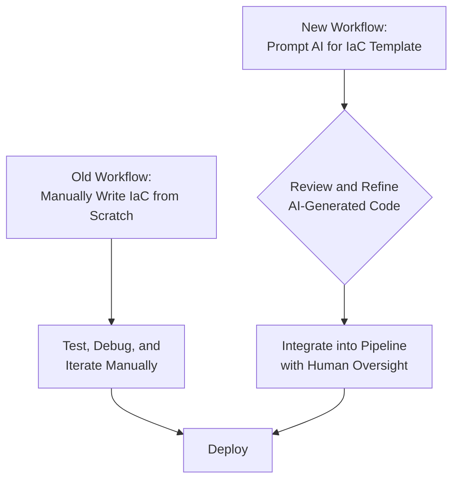
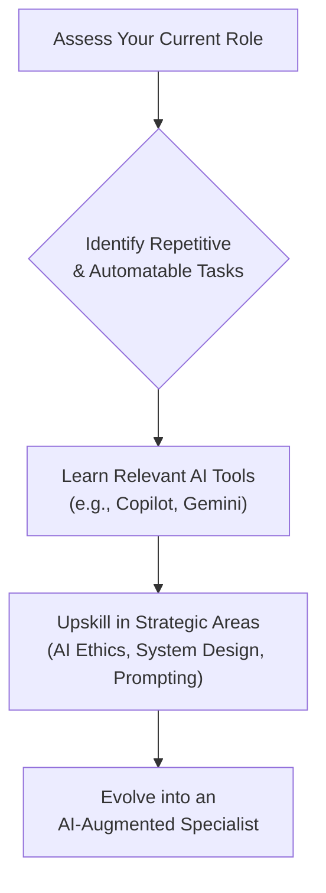

# Generative AI's Impact on IT Roles: Reskilling and the Future Workforce in 2026

Generative AI is no longer a futuristic concept; it's a present-day force actively reshaping the IT landscape. Tools like Gemini, GitHub Copilot, GPT-4, and Claude are not just enhancing productivity—they are fundamentally altering the nature of IT work. As we look toward 2026, the integration of these models will be so profound that adaptation becomes non-negotiable. This isn't about replacement; it's about evolution. The IT professionals who thrive will be those who learn to partner with AI, leveraging it to solve more complex problems than ever before.

This article provides a practitioner's guide to navigating this transformation. We'll cut through the hype to deliver a clear-eyed view of what's changing, what's emerging, and how you can prepare for the AI-augmented IT department of 2026.

### What You'll Get

*   An analysis of which core IT tasks are being automated by generative AI.
*   A look at the new IT roles emerging from the AI revolution.
*   Actionable strategies for reskilling and future-proofing your career.
*   A balanced perspective on the anxieties and opportunities ahead.

## The Automation Wave: Which IT Tasks Are Changing?

Generative AI excels at pattern recognition, translation, and creation, making it a powerful *augmenter* for skilled professionals rather than an outright *replacer*. It targets repetitive, time-consuming tasks, freeing up humans to focus on architecture, strategy, and complex problem-solving.

### Code Generation and Debugging

The role of a developer is shifting from a "writer of code" to a "reviewer and architect of systems." AI assistants are now powerful partners in the development lifecycle.

*   **Boilerplate and Scaffolding:** Tools like GitHub Copilot can generate entire functions, classes, and test suites from a single natural language comment.
*   **Complex Algorithms:** Need a specific sorting algorithm or a function to process a data structure? AI can provide a robust first draft in seconds.
*   **Debugging Assistance:** Instead of just finding syntax errors, AI can analyze code snippets, explain what they do, and suggest fixes for logical errors.

Here’s a simple example of prompting an AI to generate a Python function for fetching and parsing JSON from an API:

```python
# Prompt to AI:
# "Write a Python function that takes a URL, fetches JSON data from it,
# and handles potential HTTP and JSON decoding errors. Use the 'requests' library."

# AI-Generated Code:
import requests
import json

def fetch_json_from_url(url: str):
    """
    Fetches JSON data from a given URL with error handling.

    Args:
        url: The URL to fetch data from.

    Returns:
        A dictionary containing the JSON data, or None if an error occurs.
    """
    try:
        response = requests.get(url, timeout=10)
        # Raise an exception for bad status codes (4xx or 5xx)
        response.raise_for_status()
        return response.json()
    except requests.exceptions.HTTPError as http_err:
        print(f"HTTP error occurred: {http_err}")
    except requests.exceptions.RequestException as req_err:
        print(f"Request error occurred: {req_err}")
    except json.JSONDecodeError:
        print("Failed to decode JSON from the response.")
    return None

# Example usage:
# data = fetch_json_from_url("https://api.example.com/data")
# if data:
#     print(data)
```

The human developer's value is in verifying this code, integrating it securely, and ensuring it meets architectural standards—tasks that require critical thinking and domain expertise.

### Infrastructure Management and DevOps

Infrastructure as Code (IaC) has become a standard, and generative AI is accelerating its adoption. DevOps engineers can now describe their desired infrastructure in plain English and receive a functional template.

*   **IaC Generation:** Creating Terraform, CloudFormation, or Bicep templates from a prompt like, "Generate a Terraform config for a secure S3 bucket with versioning and private access."
*   **Automated Root Cause Analysis:** AI models can sift through terabytes of logs and metric data to identify anomalies and suggest the root cause of an outage, drastically reducing Mean Time to Resolution (MTTR).
*   **CI/CD Pipeline Optimization:** GenAI can analyze pipeline configurations and suggest improvements for speed, security, and efficiency.

This diagram illustrates the shift in the DevOps workflow:



### IT Support and Service Desks

Level 1 support is undergoing a massive transformation. AI-powered chatbots are now capable of handling a significant portion of user queries with natural language understanding.

*   **Intelligent Triage:** AI systems can understand user issues, ask clarifying questions, and either resolve the issue or route it to the correct specialized team.
*   **Agent Assist:** For human agents, AI can summarize long ticket histories, retrieve relevant knowledge base articles, and draft response templates in real-time. This frees up support staff to focus on high-touch, complex problems that require empathy and deep technical knowledge.

## The Rise of New AI-Centric Roles

As technology automates certain tasks, it invariably creates new specializations. The AI era is no different. A report from the [World Economic Forum](https://www.worldeconomicforum.org/agenda/2026/06/future-of-jobs-ai-impact-on-tech-roles/) predicts a net positive job growth in tech, driven by these new and evolving roles.

| Traditional Role | 2026 AI-Augmented Counterpart | Key Responsibilities |
| :--- | :--- | :--- |
| Software Developer | **AI-Assisted Developer** | Reviews, refines, and integrates AI-generated code; focuses on system architecture. |
| Systems Administrator | **AI Integration Architect** | Designs and manages the "plumbing" to connect AI models with enterprise systems. |
| Data Analyst | **AI Prompt Engineer** | Crafts and optimizes prompts to extract precise, reliable insights from LLMs. |
| IT Governance Manager | **AI Ethicist & Governance Lead** | Ensures AI systems are fair, transparent, and compliant with regulations. |

### AI Prompt Engineer

This is more than just "talking to a chatbot." A Prompt Engineer blends technical acumen, domain knowledge, and linguistic precision to design instructions that guide AI models toward optimal, reliable, and safe outputs. They are the bridge between human intent and machine execution.

### AI Ethicist / Governance Specialist

With great power comes great responsibility. This role is crucial for managing the significant risks associated with AI, including data privacy, algorithmic bias, and transparency. They establish frameworks and review systems to ensure AI is deployed responsibly.

> **Gartner predicts:** "By 2026, 40% of large enterprises will have a dedicated AI ethics and governance committee, a sharp increase from less than 5% in 2023."
> – [Gartner Report on AI and IT Jobs](https://www.gartner.com/en/articles/generative-ai-impact-on-it-jobs-2026)

### AI Integration Architect

This role focuses on the practical challenge of weaving AI into the fabric of an organization. They design the APIs, data pipelines, and workflows required to connect powerful foundation models (like those from OpenAI or Google) to existing enterprise applications, databases, and security infrastructure.

## Your Roadmap to 2026: Reskilling for the AI Era

Staying relevant requires a deliberate and continuous effort to upskill. The goal is not to become an AI researcher but to become an expert at *applying* AI in your specific domain.

1.  **Understand Foundational AI/ML Concepts:** You don't need a Ph.D., but you must understand the basics. Learn what LLMs are, the difference between supervised and unsupervised learning, and how API-based AI services work.
2.  **Master the Art of Prompting:** This is the new universal skill. Practice crafting clear, context-rich prompts. Understand techniques like zero-shot, few-shot, and chain-of-thought prompting to get better results.

    ```bash
    # Bad Prompt (Vague):
    "Write a SQL query for users."

    # Good Prompt (Specific and Context-Rich):
    "You are a PostgreSQL expert. Write a SQL query that selects the `email` and `last_login`
    from the `users` table for all users who have not logged in for more than 90 days
    and have a `status` of 'active'. Order the results by `last_login` ascending."
    ```
3.  **Develop "Human-Centric" Skills:** As AI handles routine technical tasks, uniquely human skills become more valuable. Focus on:
    *   **Critical Thinking:** Evaluating the output of an AI for accuracy, bias, and security flaws.
    *   **Complex Problem-Solving:** Using AI as a tool to tackle challenges that were previously too complex.
    *   **Collaboration and Communication:** Working with cross-functional teams to define problems that AI can help solve.
4.  **Embrace Continuous Learning:** The field is evolving at a breakneck pace. Dedicate time to learning through platforms like Coursera and edX, and pursue vendor-specific AI certifications from AWS, Google Cloud, and Microsoft Azure.

## Anxieties vs. Opportunities: A Balanced Perspective

The fear of job displacement is real, but history shows that technological revolutions tend to *transform* jobs rather than eliminate them entirely. The key is to reframe the narrative from "AI vs. Human" to "AI *and* Human." The most valuable professional in 2026 will be the one who can effectively leverage AI to amplify their own expertise.

This flowchart visualizes the adaptation path for an IT professional:



The future doesn't belong to the AI, nor does it belong to those who resist it. It belongs to those who partner with it. By embracing a mindset of continuous learning and focusing on the uniquely human skills of strategy, creativity, and critical thought, IT professionals can not only survive but thrive in the exciting and transformative years to come.


## Further Reading

- [https://www.gartner.com/en/articles/generative-ai-impact-on-it-jobs-2026](https://www.gartner.com/en/articles/generative-ai-impact-on-it-jobs-2026)
- [https://www.mckinsey.com/capabilities/ai-and-new-jobs-2026](https://www.mckinsey.com/capabilities/ai-and-new-jobs-2026)
- [https://hbr.org/2026/06/reskilling-for-the-ai-economy-it-professionals](https://hbr.org/2026/06/reskilling-for-the-ai-economy-it-professionals)
- [https://www.wired.com/story/2026/06/ai-automating-it-workforce-future/](https://www.wired.com/story/2026/06/ai-automating-it-workforce-future/)
- [https://www.worldeconomicforum.org/agenda/2026/06/future-of-jobs-ai-impact-on-tech-roles/](https://www.worldeconomicforum.org/agenda/2026/06/future-of-jobs-ai-impact-on-tech-roles/)
