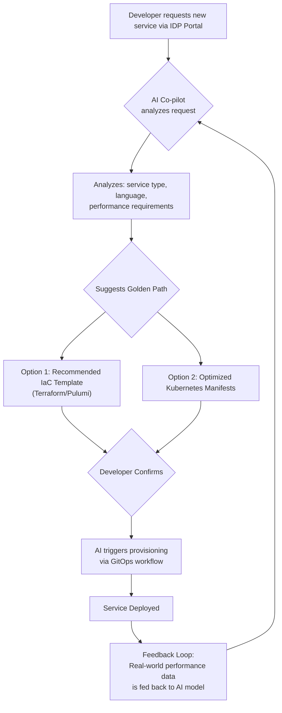

# Beyond DevOps: The Rise of AI-Powered Platform Engineering

Platform engineering is rapidly becoming the successor to the DevOps movement, aiming to tame cloud-native complexity by providing developers with a paved road to production. But as these platforms grow, a new catalyst is emerging to make them not just automated, but *intelligent*. This is the dawn of AI-powered platform engineering, a shift that promises to redefine efficiency, reliability, and the developer experience.

This article explores how Artificial Intelligence is transforming the core tenets of platform engineering. We'll move beyond the hype to examine practical applications that reduce toil, accelerate delivery, and empower engineers to build truly self-service, resilient systems.

### What You'll Get

*   **Core Concepts:** A clear breakdown of how AI integrates with platform engineering principles.
*   **Practical Applications:** Real-world examples of AI in infrastructure management, IDPs, and troubleshooting.
*   **Visual Aids:** A Mermaid diagram illustrating an AI-driven workflow.
*   **Code Snippet:** A conceptual example of AI for predictive analytics.
*   **Future Outlook:** Insights into the challenges and future direction of AI in this domain.

---

## The New Frontier: AI Meets the Internal Developer Platform

At its heart, platform engineering is about productizing infrastructure. The platform team builds and maintains an Internal Developer Platform (IDP) that offers infrastructure, CI/CD pipelines, and observability tooling as a streamlined, self-service product. This frees application developers from cognitive overhead, allowing them to focus on delivering business value.

AI amplifies this mission by injecting intelligence into every layer of the IDP. Instead of relying solely on pre-defined rules and configurations, an AI-powered platform can learn, predict, and adapt. It transitions the platform from being merely *automated* to being *autonomous*.

> **Info:** According to Gartner, "by 2026, 80% of software engineering organizations will establish platform engineering teams as internal providers of reusable services, components and tools for application delivery." AI is the force multiplier for these teams.

## Core Pillars of AI-Powered Platform Engineering

AI is not a single, monolithic solution. Its impact is felt across several key areas of platform engineering, each addressing a different aspect of the software delivery lifecycle.

### Predictive Infrastructure Management

Traditional infrastructure automation is reactive. A Kubernetes Horizontal Pod Autoscaler (HPA) scales pods up only *after* CPU or memory usage crosses a threshold. AI introduces a predictive, proactive layer.

By analyzing historical metrics, logs, and even external data (like marketing calendars or traffic forecasts), Machine Learning (ML) models can anticipate resource needs before they become critical.

*   **Predictive Scaling:** Forecast traffic spikes for an e-commerce site during a flash sale and pre-warm resources, preventing latency.
*   **Cost Optimization:** Analyze workload patterns to recommend right-sizing instances or transitioning specific services to spot instances during off-peak hours, directly impacting the bottom line.
*   **Anomaly Detection:** Identify subtle deviations from baseline performance that might indicate a looming failure or security threat, long before traditional alerts are triggered.

Here's a conceptual Python snippet using `scikit-learn` to show how an anomaly detection model might flag unusual CPU usage:

```python
import numpy as np
from sklearn.ensemble import IsolationForest

# Sample historical CPU usage data (in a real scenario, this comes from a monitoring system)
# Normal usage is between 10% and 60%
cpu_usage = np.array([25, 30, 45, 22, 35, 50, 28, 95, 33, 41]).reshape(-1, 1)

# Train a simple anomaly detection model
model = IsolationForest(contamination=0.1) # Expect ~10% anomalies
model.fit(cpu_usage)

# New data points to check
new_data_points = np.array([45, 85, 92, 55]).reshape(-1, 1)

# Predict which ones are anomalies (-1 for anomaly, 1 for inlier)
predictions = model.predict(new_data_points)

# Output: [ 1 -1 -1  1] -> The model flags 85% and 92% as unusual usage.
print(f"Predictions (1: normal, -1: anomaly): {predictions}")
```

This simple model demonstrates how a platform can learn "normal" behavior and automatically flag deviations that require investigation.

### AI-Driven Automation in IDPs

An IDP provides developers with "golden paths"—standardized templates and workflows for creating new services, setting up databases, or configuring deployment pipelines. AI makes these paths dynamic and intelligent.

When a developer initiates a request, an AI-enhanced IDP can:

1.  **Suggest Optimal Configurations:** Based on the service's language, expected load, and dependencies, the AI can recommend the best-fit infrastructure template, CI/CD pipeline, or security policy.
2.  **Generate Boilerplate Code:** AI can scaffold a new microservice with pre-configured observability hooks, database connectors, and Dockerfiles, saving hours of setup time.
3.  **Automate IaC Generation:** A developer could describe their needs in natural language (e.g., "I need a scalable web service with a Postgres database and a Redis cache"), and an AI agent could generate the corresponding Terraform or Pulumi code.

This flow transforms the developer experience from picking from a static catalog to having a conversation with an intelligent system.



### Intelligent Troubleshooting and Observability

Modern systems generate a firehose of telemetry data (logs, metrics, traces). AIOps (AI for IT Operations) is the practice of using AI to make sense of this data, and it's a perfect fit for platform engineering.

An intelligent observability layer integrated into the IDP can:

*   **Correlate Signals:** Automatically link a spike in API latency (metrics) to a specific bad deployment (events) and the resulting error messages (logs).
*   **Reduce Alert Fatigue:** Group hundreds of related, low-level alerts into a single, high-context incident, pointing directly to the likely root cause.
*   **Automate Root Cause Analysis:** Guide engineers through the debugging process by suggesting next steps or pinpointing the exact line of code or configuration change that caused an issue.

Here’s how AI changes the game:

| Aspect | Traditional Approach | AI-Powered Approach |
| :--- | :--- | :--- |
| **Alerting** | Static thresholds (e.g., `CPU > 90%`) | Dynamic baselining and anomaly detection |
| **Root Cause** | Manual correlation of dashboards and logs | Automated correlation and probable cause identification |
| **Resolution** | Following a runbook manually | AI-suggested remediation steps or automated rollbacks |
| **Data Volume** | Overwhelming; requires expert knowledge to parse | Manageable; AI surfaces only the relevant signals |

### Personalized Developer Experiences

The ultimate goal of a platform is to enhance developer experience (DevEx). AI can personalize this experience by providing context-aware assistance directly within a developer's workflow.

Imagine a CLI tool or IDE plugin powered by a large language model (LLM) trained on your platform's documentation, APIs, and runbooks. A developer could ask:

*   *"How do I expose my service on the internal network?"*
*   *"What's the right way to add a circuit breaker to my Java service using our platform's library?"*
*   *"My last deployment failed with error `ImagePullBackOff`. What are the common causes?"*

This is akin to having a senior platform engineer available 24/7, providing instant, accurate guidance and drastically reducing the time developers spend searching for information.

## Challenges and the Road Ahead

Adopting AI in platform engineering is not without its hurdles. Organizations must address:

*   **Data Quality:** AI models are only as good as the data they are trained on. High-quality, well-structured telemetry data is a prerequisite.
*   **Skill Gaps:** Platform teams will need to cultivate skills in MLOps, data science, and AI integration alongside their existing infrastructure expertise.
*   **Trust and Explainability:** Engineers must be able to trust the recommendations of an AI system. This requires models that can explain their reasoning ("explainable AI" or XAI).
*   **Cost of Implementation:** Developing, training, and running sophisticated AI models can be resource-intensive.

Despite these challenges, the trajectory is clear. The future is an **autonomous platform**—a self-healing, self-optimizing system that not only serves developers but actively anticipates their needs and protects the business from operational risk.

## Getting Started: The Path Forward

Embarking on this journey doesn't require a complete overhaul. Organizations can take incremental steps:

1.  **Start with Observability:** Implement an AIOps solution to get a handle on your existing telemetry data. This provides immediate value by reducing MTTR (Mean Time to Resolution) and lays the data foundation for future AI initiatives.
2.  **Enhance Your IDP:** Integrate small AI features into your existing developer portal, such as a natural language search for documentation or a recommender for service templates.
3.  **Focus on Data Collection:** Prioritize standardizing logs and metrics across all services. This structured data is the fuel for all future machine learning applications.

AI is not here to replace platform engineers. It's here to augment their capabilities, allowing them to shift from reactive firefighting to proactive, high-impact strategic work. By embracing AI, organizations can build platforms that are not just efficient and scalable, but truly intelligent—unlocking the next wave of productivity and innovation.


## Further Reading

- [https://platformengineering.org/blog/ai-and-platform-engineering](https://platformengineering.org/blog/ai-and-platform-engineering)
- [https://cloud.google.com/blog/topics/developers-practitioners/platform-engineering-what-it-is-and-why-it-matters](https://cloud.google.com/blog/topics/developers-practitioners/platform-engineering-what-it-is-and-why-it-matters)
- [https://www.infoq.com/articles/ai-driven-platform-engineering/](https://www.infoq.com/articles/ai-driven-platform-engineering/)
- [https://www.oreilly.com/ideas/the-future-of-platform-engineering/](https://www.oreilly.com/ideas/the-future-of-platform-engineering/)
- [https://docs.microsoft.com/azure/devops/learn/what-is-platform-engineering](https://docs.microsoft.com/azure/devops/learn/what-is-platform-engineering)
