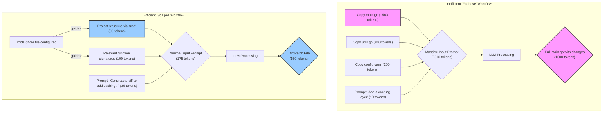

# Slash Your AI Coding Costs: A Guide to 80% Token Reduction

AI-powered coding assistants like Claude and other large language models (LLMs) are revolutionizing software development. They can draft boilerplate, debug complex issues, and even architect entire features. But this power comes at a cost—measured in tokens. Every piece of context you provide (input) and every line of code the model generates (output) consumes tokens, which can lead to surprisingly high bills and slower response times.

This guide provides a set of precise, actionable strategies to dramatically reduce your token usage—potentially by up to 80%—without sacrificing the quality of the AI's assistance. We'll move beyond simple prompt tweaks and into structured, repeatable workflows that make your AI collaborator faster, cheaper, and more effective.

### What You'll Get

*   **Project-Level Context Control:** How to use ignore files to prevent the AI from seeing irrelevant code.
*   **Precision Prompting:** Techniques to provide maximum context with minimum tokens.
*   **Output Optimization:** How to force the AI to generate only the exact changes you need, not entire files.
*   **A Step-by-Step Workflow:** A practical, repeatable process for using these techniques on a real-world coding task.
*   **Clear Visuals:** A Mermaid diagram illustrating the token-efficient workflow.

## The Token Problem: Firehose vs. Scalpel

The most common mistake developers make is treating the AI as a black box. They dump entire files or even whole directories into the prompt, hoping the model will "figure it out." This "firehose" approach is incredibly inefficient and expensive.

A better approach is to act as the AI's architect, providing a curated, minimal-yet-sufficient context—using a scalpel, not a firehose.

Here’s a comparison of the two workflows:



The difference is stark. The efficient workflow reduces input tokens by over 90% and output tokens by over 90% for a combined, massive reduction.

## Mastering Input Control: The 80/20 of Token Reduction

The biggest savings come from shrinking your input. An AI can't use tokens on code it never sees. Here's how to surgically control the context.

### 1. Curate Your Context with `.codeignore`

Just as `.gitignore` tells Git what to ignore, a dedicated ignore file for your AI assistant can prevent it from ingesting irrelevant files. This is the single most effective way to reduce context size on any non-trivial project.

Create a file named `.codeignore` or `.claudeignore` in your project's root directory. The agent or script you use to gather context should be programmed to respect this file.

**Action:** Create a `.codeignore` file in your repository root.

Here's a sample `.codeignore` for a typical web project:

```
# Dependencies and build artifacts
node_modules/
dist/
build/
*.lock
yarn.lock
package-lock.json

# Git and OS files
.git/
.DS_Store

# Documentation and assets (usually not needed for code changes)
docs/
*.md
assets/
images/

# Test data and large files
test/fixtures/
*.sql
*.csv
```

> **Pro Tip:** Your global `.gitignore` is a great starting point for your `.codeignore` file. You can often copy it and then add project-specific documentation or asset folders you want the AI to skip.

### 2. Provide Structure, Not Clutter

Instead of pasting entire files, give the AI a high-level map of your project and only the specific code snippets it needs.

**Action:** Use the `tree` command (or a similar utility) to show the project structure.

```bash
# Install tree if you don't have it (macOS)
brew install tree
```

Run `tree` with a limited depth to avoid excessive output:

```bash
$ tree -L 2 -I "node_modules|dist|.git"
.
├── .codeignore
├── package.json
├── src
│   ├── api
│   ├── components
│   └── utils
└── vercel.json

4 directories, 3 files
```

This 50-token output gives the AI a complete structural overview without the thousands of tokens from the file contents.

### 3. Focus on Signatures and Interfaces

Does the AI need to know the *implementation* of a utility function, or just its signature? Most of the time, the signature is enough.

**Action:** Instead of pasting a whole dependency file, extract just the function signatures.

**Inefficient (Pasting all of `db.js`):**
```javascript
// db.js - 50 lines, 800 tokens
import { Pool } from 'pg';
// ... connection logic, error handling, etc. ...

export async function getUser(userId) {
  // ... complex SQL query ...
  return user;
}

export async function updateUser(userId, data) {
  // ... complex update logic ...
  return success;
}
```

**Efficient (Pasting only what's needed):**
```typescript
// Context for the prompt:
// The following functions are available from './db.js':
async function getUser(userId: string): Promise<User>;
async function updateUser(userId: string, data: Partial<User>): Promise<boolean>;
```

This tiny snippet provides all the necessary type information and function names for the AI to correctly use the module, saving over 90% of the tokens.

## Optimizing AI Output: Get What You Need, Nothing More

Controlling output is just as important. The goal is to get a concise, machine-readable change, not a long-winded explanation and a complete rewrite of your file.

### 1. The Power of Patches: Requesting Diffs

This is the holy grail of output reduction. Instead of asking the AI to "rewrite the file," instruct it to **generate a patch** in the `diff` format. This changes the output from the entire file to *only the lines that changed*.

**Action:** Frame your request specifically for a diff.

**Inefficient Prompt:**
> "Here is my file `server.js`. Add a new `/status` endpoint that returns `{ok: true}`."

**Efficient Prompt:**
> "Analyze the attached `server.js` file. Generate a `diff -u` patch to add a new `/status` endpoint that returns a JSON object `{ "status": "ok" }`."

The AI's output will be radically different:

```diff
--- a/server.js
+++ b/server.js
@@ -25,6 +25,11 @@
   res.json({ message: `Hello, ${name}!` });
 });
 
+app.get('/status', (req, res) => {
+  res.json({ status: 'ok' });
+});
+
 app.listen(port, () => {
   console.log(`Server listening on port ${port}`);
 });

```

This output is not only tiny (around 50 tokens vs. 500+ for the whole file), but it can also be directly applied using the `patch` command:

```bash
patch < server.js.patch
```

### 2. Mandate Brevity and Structure

Finally, be explicit about what you *don't* want. Instruct the AI to omit explanations, apologies, and conversational fluff.

*   "Respond with only the code block."
*   "Do not include any explanation in your response."
*   "Provide the output in a JSON object with the key 'code'."

This ensures the output is clean, predictable, and devoid of unnecessary tokens.

## A Practical Workflow: The Token-Saving Method

Let's apply these techniques to a common task: adding a feature to an existing project.

**Goal:** Add a new API endpoint `/users/{id}` to a simple Express.js server.

| Step | Naive "Firehose" Method | Optimized "Scalpel" Method | Token Impact |
| :--- | :--- | :--- | :--- |
| **1. Gather Context** | Copy `server.js`, `routes/user.js`, and `utils/db.js` entirely. | 1. Run `tree -L 2`. <br> 2. Get function signature for `db.getUser()`. <br> 3. Provide `routes/user.js` content. | **Input: ~2500 vs. ~400 tokens** |
| **2. Craft Prompt** | "Add a new endpoint to get a user by ID in `routes/user.js` using the `db.js` file." | "Based on this project structure and DB signature, generate a `diff` patch for `routes/user.js` to add a `GET /users/:id` endpoint." | **Prompt: ~40 vs. ~50 tokens** |
| **3. AI Output** | AI returns the full, rewritten `routes/user.js` file with a lengthy explanation. | AI returns a small, clean `diff` patch. | **Output: ~800 vs. ~100 tokens** |
| **Total Tokens** | **~3340 tokens** | **~550 tokens** | **~83% Reduction** |

By following this disciplined approach, you achieve the same result while using a fraction of the resources.

## Summary: Key Takeaways for Token Efficiency

Thinking about token efficiency isn't just about saving money; it's about making your AI interactions faster and more precise.

*   **Be a Gatekeeper:** Use a `.codeignore` file to aggressively filter out irrelevant context. Your `node_modules` directory should never be seen by the AI.
*   **Summarize, Don't Dump:** Provide project structure with `tree` and function signatures instead of full file contents.
*   **Demand Patches, Not Files:** The single biggest output saver is requesting changes in `diff` format. This is non-negotiable for efficient workflows.
*   **Command, Don't Converse:** Be direct in your prompts. Tell the AI to skip the pleasantries and deliver only the code or data you need.

By adopting these habits, you transform your AI assistant from a verbose, expensive firehose into a precise, cost-effective surgical tool.
