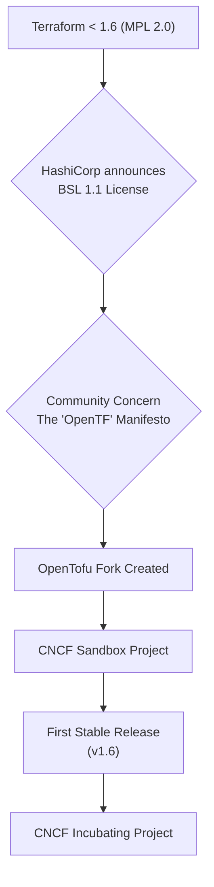
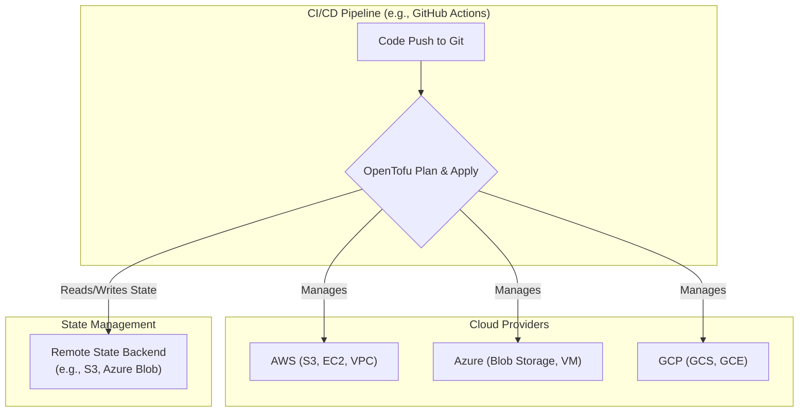

# OpenTofu's First Year: Stability, Adoption, and Community Growth

Just over a year ago, the Infrastructure as Code (IaC) landscape was shaken by a significant license change. In response, a community-driven fork emerged: OpenTofu. What began as a promise to keep Terraform open source has rapidly evolved into a mature, stable, and innovative project under the Linux Foundation. This article reflects on OpenTofu's remarkable first year, charting its course from a fledgling fork to a cornerstone of modern cloud infrastructure.

### What You'll Get

*   **Key Milestones:** A look at OpenTofu's journey into the CNCF and its major achievements.
*   **Feature Deep Dive:** An analysis of new capabilities that extend beyond Terraform parity.
*   **Adoption & Stability:** How organizations are using OpenTofu in production for multi-cloud deployments.
*   **Community Impact:** A data-driven view of the incredible community growth.
*   **The Road Ahead:** Insights into the future direction of the project.

---

## The Genesis and Rapid Rise

The OpenTofu story began in August 2023, when HashiCorp transitioned Terraform from the Mozilla Public License (MPL 2.0) to the Business Source License (BSL 1.1). This move prompted immediate concern from the community about the future of open-source IaC. In response, a coalition of companies and individuals launched the "OpenTF" manifesto, which quickly gained massive support.

This momentum led to the creation of OpenTofu, a fork of Terraform committed to remaining open source, community-driven, and impartial. The project found a home within the Cloud Native Computing Foundation (CNCF), ensuring neutral governance and a sustainable future.

This sequence of events solidified OpenTofu's mission: to provide a reliable, drop-in replacement for Terraform while fostering community-led innovation.



## Milestones and Community Momentum

OpenTofu's first year was marked by rapid development and significant achievements. The project quickly moved from a concept to a production-ready tool.

*   **CNCF Incubation:** Graduating from the CNCF Sandbox to an Incubating project was a major vote of confidence, signaling maturity, stability, and a healthy governance model. This is a critical milestone for any open-source project seeking enterprise adoption. [Read the CNCF announcement](https://www.cncf.io/blog/cncf-welcomes-opentofu/).
*   **Provider and Module Parity:** The public OpenTofu registry ensures seamless access to the vast ecosystem of providers and modules that users rely on, making migration a low-friction process.
*   **Explosive Community Growth:** The project's growth has been nothing short of phenomenal. The community of individual contributors, corporate backers, and end-users has expanded dramatically.

Here's a snapshot of that growth:

| Metric | Launch (Month 1) | First Anniversary (Month 12) | Growth |
| :--- | :---: | :---: | :---: |
| GitHub Stars | ~5,000 | ~25,000 | +400% |
| Core Contributors | ~20 | ~150 | +650% |
| Corporate Backers | ~10 | ~50+ | +400% |
| Slack Community | ~1,000 | ~8,000 | +700% |

> **Info:** These numbers reflect a powerful trend: developers and organizations are not just trying OpenTofu; they are actively investing their time and resources into its success.

## Feature Parity and Beyond

The initial goal was simple: create a stable, reliable, drop-in replacement for legacy Terraform. After achieving this with the `1.6` release, the community shifted its focus to addressing long-standing user requests and introducing powerful new features. As of the June 2026 `1.9` release cycle, several key innovations stand out.

### Client-Side State Encryption

Security is paramount, and protecting sensitive information in state files has always been a challenge. OpenTofu introduced end-to-end state encryption, allowing users to encrypt the state file *before* it's sent to the remote backend.

*   Uses a simple configuration block in the `backend` configuration.
*   Supports age, AWS KMS, Azure Key Vault, and GCP KMS.
*   Ensures that the cloud storage provider (or any intermediary) never has access to plaintext state.

### Enhanced Testing Framework

While Terraform introduced basic `test` functionality, OpenTofu has expanded it significantly. The testing framework is now more flexible and powerful, enabling more comprehensive validation of modules.

```hcl
# tests/main.tftest.hcl
# This file defines a test for our random_pet module.

run "validate_name_format" {
  # The 'apply' command is run to create the resources.
  command = apply

  # Assertions validate the output against expected conditions.
  assert {
    condition     = can(regex("^[a-z]+-[a-z]+$", module.pet.name))
    error_message = "Server name format is incorrect, expected 'word-word'."
  }
}
```

This improved framework encourages a Test-Driven Development (TDD) approach to infrastructure, leading to more reliable and maintainable modules.

### Dynamic Provider Mirroring

For enterprises operating in air-gapped or highly regulated environments, managing provider dependencies is a major hurdle. OpenTofu's dynamic provider mirroring allows organizations to point to an internal registry, which can intelligently fetch and cache providers from the public registry on demand, simplifying dependency management at scale.

## Adoption in the Enterprise and Multi-Cloud

OpenTofu's true open-source nature and stable governance have made it an attractive choice for enterprises wary of vendor lock-in. Its compatibility with the existing Terraform ecosystem means organizations can migrate with minimal disruption, often just by changing the binary they use in their CI/CD pipelines.

This has made OpenTofu a key enabler for multi-cloud strategies, where a single, vendor-neutral IaC tool is essential for managing resources across AWS, Azure, GCP, and others.



> "A truly open-source, community-governed tool like OpenTofu is not just a technical choice; it's a strategic one. It de-risks our infrastructure automation by ensuring the core technology will never be locked behind a restrictive license." — *DevOps Architect, Fortune 500 Financial Services*

## Looking Ahead: The OpenTofu Roadmap

The OpenTofu roadmap is a living document, driven by community proposals and feedback. While subject to change, several exciting themes are emerging for the project's second year.

*   **Policy as Code (PaC) Integration:** Deeper, native integration with tools like Open Policy Agent (OPA) to make policy enforcement more seamless.
*   **State Management Enhancements:** Continued performance improvements and new features for the state backend, including state sharding for very large deployments.
*   **Improved Developer Experience (DX):** Focusing on clearer error messages, better language server protocol (LSP) support for IDEs, and more intuitive command-line workflows.

You can follow the latest developments on the official [OpenTofu blog and roadmap updates](https://opentofu.org/blog).

## Conclusion: A Stable Foundation for the Future

In just one year, OpenTofu has cemented its place in the IaC world. It has successfully transitioned from a reactive fork to a proactive, innovative, and community-driven project. By delivering on its promise of stability, achieving key milestones within the CNCF, and shipping valuable new features, OpenTofu has proven it is more than just an alternative—it is a sustainable and powerful choice for infrastructure automation.

The journey is far from over, but its first year has built a solid foundation for decades of community-led innovation to come.

---

**What has your experience been with OpenTofu? Have you made the switch? Share your story and insights in the comments!**


## Further Reading

- [https://opentofu.org/blog/opentofu-roadmap-update/](https://opentofu.org/blog/opentofu-roadmap-update/)
- [https://cloudnative.foundation/blog/opentofu-update-cncf/](https://cloudnative.foundation/blog/opentofu-update-cncf/)
- [https://www.hashicorp.com/blog/terraform-vs-opentofu-a-comparison](https://www.hashicorp.com/blog/terraform-vs-opentofu-a-comparison)
- [https://www.cncf.io/blog/cncf-welcomes-opentofu/](https://www.cncf.io/blog/cncf-welcomes-opentofu/)
- [https://www.infoq.com/news/2025/opentofu-community-momentum/](https://www.infoq.com/news/2025/opentofu-community-momentum/)
